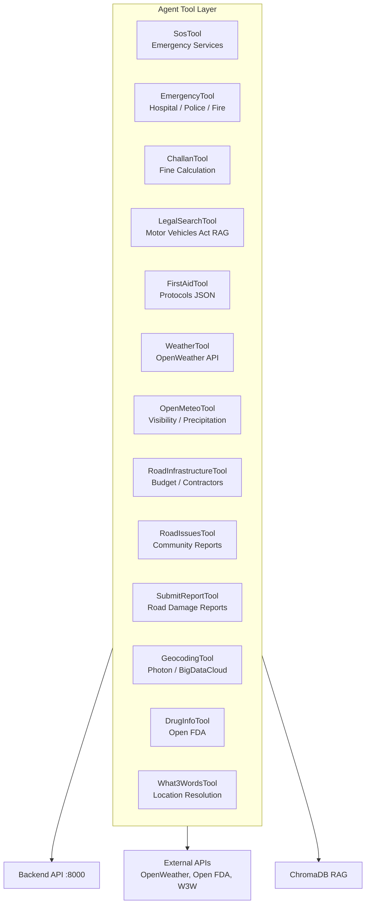

# AI Capabilities

> Version 1.0 | 2026-07-29

## Agent Execution Pipeline

```mermaid
flowchart TD
    User[User Message] --> SC[SafetyChecker<br/>Harm & PII Detection]
    SC -->|Blocked| Block[Return Warning<br/>"Call 112 immediately"]
    SC -->|Passed| ID[IntentDetector<br/>9 Intent Classes]

    ID --> INTENT{Intent Type}

    INTENT -->|emergency| CA_E[ContextAssembler<br/>Emergency Path]
    INTENT -->|first_aid| CA_FA[ContextAssembler<br/>First Aid Path]
    INTENT -->|challan| CA_C[ContextAssembler<br/>Challan Path]
    INTENT -->|legal| CA_L[ContextAssembler<br/>Legal Research Path]
    INTENT -->|road_weather| CA_RW[ContextAssembler<br/>Road Weather Path]
    INTENT -->|safe_route| CA_SR[ContextAssembler<br/>Safe Route Path]
    INTENT -->|road_infrastructure| CA_RI[ContextAssembler<br/>Road Infra Path]
    INTENT -->|road_issue| CA_RI2[ContextAssembler<br/>Issue Report Path]
    INTENT -->|general| CA_G[ContextAssembler<br/>General Chat Path]

    CA_E --> Tools[Tool Execution Layer<br/>13 Agent Tools]
    CA_FA --> Tools
    CA_C --> Tools
    CA_L --> Tools
    CA_RW --> Tools
    CA_SR --> Tools
    CA_RI --> Tools
    CA_RI2 --> Tools
    CA_G --> Tools

    Tools --> RAG[ChromaDB Vector Search<br/>LocalHashEmbedding 384d]
    Tools --> API[Backend API Calls<br/>Emergency / Challan / Weather]
    Tools --> Static[Static Knowledge<br/>First Aid JSON Protocols]

    RAG --> CTX[Context Assembly<br/>System + Tool + RAG Context]
    API --> CTX
    Static --> CTX

    CTX --> PR[ProviderRouter<br/>LLM Generation with Timeout]
    PR --> LED[Language Detection]
    LED -->|Indian Language| Sarvam[Sarvam AI<br/>30B / 105B Indic]
    LED -->|English| Fallback[Fallback Chain<br/>Groq → Cerebras → Gemini → ...]
    Sarvam --> Response[Chat Response]
    Fallback --> Response

    Response --> CMS[ConversationMemoryStore<br/>Redis 24h TTL]
    CMS --> Final[Response to User]
```

## 10-Provider Fallback Chain

```mermaid
graph LR
    Start[LLM Request] --> LANG{Language}
    LANG -->|Indian Lang| S1[Sarvam-30B]
    LANG -->|Indian + Legal| S2[Sarvam-105B]
    LANG -->|English| G1[Groq<br/>300+ tok/s]

    G1 -->|Rate Limit / Error| G2[Cerebras]
    G2 -->|Rate Limit / Error| G3[Gemini]
    G3 -->|Rate Limit / Error| G4[GitHub Models]
    G4 -->|Rate Limit / Error| G5[NVIDIA NIM]
    G5 -->|Rate Limit / Error| G6[OpenRouter]
    G6 -->|Rate Limit / Error| G7[Mistral]
    G7 -->|Rate Limit / Error| G8[Together]
    G8 -->|Rate Limit / Error| G9[TemplateProvider<br/>Deterministic Fallback]

    S1 -->|Fail| S2
    S2 -->|Fail| G1

    G9 --> Done((Response))
```



## 13 Agent Tools



## 9 Intent Classes

- emergency (accident, ambulance, police, SOS)
- first_aid (bleeding, CPR, fracture, burn)
- challan (fine, helmet, seatbelt, drunk driving)
- legal (motor vehicles act, right of way)
- road_report (pothole, repair, streetlight)
- bystander (witness, report incident)
- weather (rain, road conditions)
- general_query (fallback)
- offline (Phi-3 Mini when no connectivity)

## Safety

12 injection pattern guards. Medical responses always begin "Call 112 immediately".

## Offline AI

- Phi-3 Mini 2.2GB (4-bit) for browser inference
- YOLOv8n 15MB ONNX for pothole detection
- DuckDB-Wasm ~5MB for offline challan calculation
- 20 WHO first-aid articles in HNSW index
