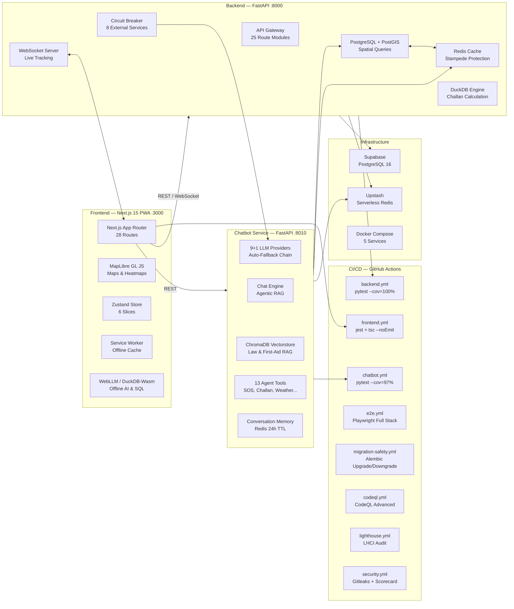

# SafeVixAI — Architecture

> **Last Updated:** 2026-07-29

SafeVixAI is a full-stack, AI-powered road safety PWA for the IIT Madras Road Safety Hackathon 2026.
Solves 3 problem statements: Emergency Locator, AI Chatbot (traffic law + first aid), Challan Calculator, and Road Reporter.
Total infra cost: ₹0. All free/open-source.

## System Architecture



## Service Responsibilities

| Service | Language | Port | Key Dependencies |
|---------|----------|------|------------------|
| **Frontend** | TypeScript / Next.js 15 | 3000 | MapLibre GL, Zustand, Tailwind CSS |
| **Backend** | Python / FastAPI | 8000 | SQLAlchemy, GeoAlchemy2, Redis, DuckDB |
| **Chatbot** | Python / FastAPI | 8010 | ChromaDB, httpx, 9 LLM SDKs |

## Quick Summary

SafeVixAI is a 3-service monorepo:

```
SafeVixAI/
├── frontend/         Next.js 15 + React 19 PWA (Port 3000)
├── backend/          FastAPI + PostgreSQL/PostGIS + Redis (Port 8000)
└── chatbot_service/  FastAPI + ChromaDB + 10-provider LLM fallback (Port 8010)
```

Key architecture decisions are documented in [docs/adr/](docs/adr/).

For deployment architecture, see [docs/Deployment.md](docs/Deployment.md).

## Related

- [docs/ARCHITECTURE.md](docs/ARCHITECTURE.md) — Full architecture documentation
- [SYSTEM_DESIGN.md](SYSTEM_DESIGN.md) — Detailed system design and component specs
- [OBSERVABILITY.md](OBSERVABILITY.md) — Logging, metrics, traces, alerting
- [MONITORING.md](MONITORING.md) — Metrics dashboards and uptime monitoring
