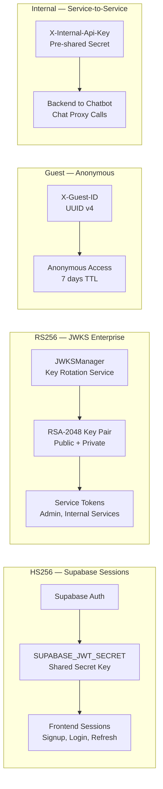
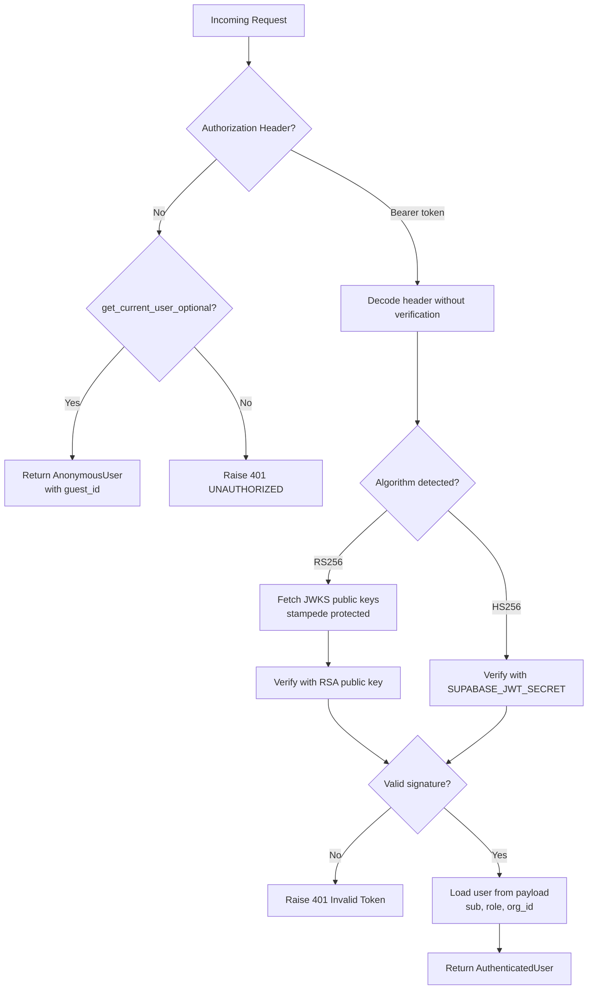
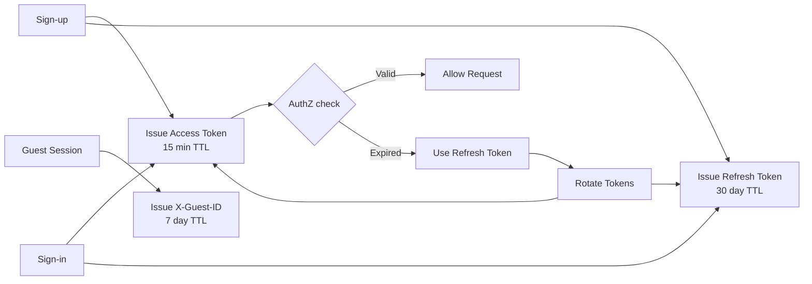

# Authentication

> Version 1.0.0 | Last updated: 2026-07-29

## Dual-Key Auth System



## Token Validation Flow



## Token Lifecycle



## Token Types

### Access Token (JWT)

| Property | Value |
|----------|-------|
| Format | JWT (JSON Web Token) |
| Algorithm | HS256 (Supabase), RS256 (JWKS) |
| Header | `Authorization: Bearer <token>` |
| TTL | 15 minutes (configurable) |
| Payload | `sub` (UUID), `role`, `org_id`, `iat`, `exp`, `jti` |

### Refresh Token

| Property | Value |
|----------|-------|
| Format | Opaque string (SHA-256 hashed) |
| Storage | Redis with 30-day TTL |
| Rotation | Old token invalidated on refresh |

### Guest Token (X-Guest-ID)

| Property | Value |
|----------|-------|
| Format | UUID v4 |
| Header | `X-Guest-ID` |
| TTL | 7 days |
| Use Case | Anonymous road reports, temporary SOS contacts |

### Internal API Key (X-Internal-Api-Key)

| Property | Value |
|----------|-------|
| Format | Pre-shared secret |
| Header | `X-Internal-Api-Key` |
| Use Case | Service-to-service calls (frontend-backend-chatbot) |

## Supabase Integration

The frontend uses `@supabase/supabase-js` for sign-up/sign-in; the backend verifies tokens independently via `get_current_user` dependency. The `SUPABASE_JWT_SECRET` env var must match the Supabase project's JWT secret.

```
Client to Supabase: signup/login to { access_token, refresh_token }
Client to Backend: Bearer token to get_current_user to allow/deny
```

## JWKS Key Rotation

RS256 tokens use a JWKS endpoint for public key distribution:

1. `JWKSManager.start()` fetches keys with stampede protection
2. New RSA-2048 key pairs are rotated via admin endpoint
3. Old keys remain valid for a 24-hour grace period
4. Tokens remain valid until `exp` - no forced re-login

## Frontend AuthGuard

- Protects authenticated routes (all except `/landing`, `/login`, `/signup`, `/forgot-password`, `/reset-password`, `/privacy`, `/terms`)
- E2E bypass: `localStorage.setItem('__E2E_SKIP_AUTH__', 'true')`
- Session restore from IndexedDB via Supabase SSR

## Public Endpoints

Endpoints using `get_current_user_optional` return the user if authenticated or `None` if not:
- `GET /api/v1/emergency/nearby`
- `GET /api/v1/roads/issues`
- `POST /api/v1/roads/report` (anonymous reports accepted)
- `GET /api/v1/public/*`

## Rate Limiting by Endpoint

| Endpoint | Limit | Scope |
|----------|-------|-------|
| Login/Signup | 5 req/min | IP |
| Token Refresh | 10 req/min | IP |
| SOS | 3 req/min | IP |
| General API | 100 req/min | IP |
