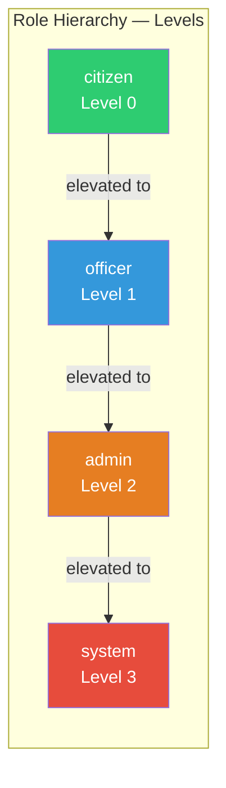
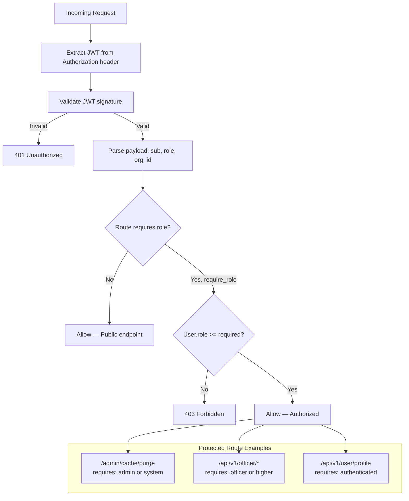

# Authorization

> Version 1.0.0 | Last updated: 2026-07-29

## Role Hierarchy



## Permission Check Flow



## Route Access Map

```mermaid
flowchart LR
    subgraph Public["Public — No Auth Required"]
        LAND["/landing"]
        LOGIN["/login"]
        SIGNUP["/signup"]
        FORGOT["/forgot-password"]
        RESET["/reset-password"]
        PRIV["/privacy"]
        TERMS["/terms"]
    end

    subgraph Authenticated["Authenticated — Any Valid JWT"]
        SOS["/sos"]
        PROFILE["/profile"]
        SETTINGS["/settings"]
        CHALLAN["/challan"]
        EMERGENCY["/emergency"]
        ASSISTANT["/assistant"]
        GUIDE["/guide"]
        BYSTANDER["/bystander"]
        TRACKING["/tracking"]
        OFFICER["/officer"]
        REPORT["/report"]
        LOCATOR["/locator"]
        CMD_CENTER["/command-center"]
    end

    subgraph Admin["Admin — admin/system role"]
        ADMIN_PANEL["/admin/*"]
    end

    Public --> Authenticated --> Admin
```



## Role Permissions Table

| Role | Level | Description |
|------|-------|-------------|
| `citizen` | 0 | Default authenticated user |
| `officer` | 1 | Traffic/field officer |
| `admin` | 2 | System administrator |
| `system` | 3 | Internal service account |

## Permission Model

### Backend (FastAPI dependencies)

```python
# Protected endpoint
@router.get("/api/v1/user/profile")
async def get_profile(user = Depends(get_current_user)):
    ...

# Role-gated endpoint
@router.post("/api/v1/admin/cache/purge")
async def purge_cache(user = Depends(require_role(["admin", "system"]))):
    ...

# Public-optional endpoint (returns None if unauthenticated)
@router.get("/api/v1/emergency/nearby")
async def nearby_services(user = Depends(get_current_user_optional)):
    ...
```

### Frontend (AuthGuard)

- `AuthGuard` component wraps authenticated routes
- Checks for valid JWT in localStorage/Zustand
- Redirects to `/landing` if unauthenticated
- Bypassed in E2E via `__E2E_SKIP_AUTH__` flag

## Tenant Isolation

The tenant isolation middleware automatically filters database queries by `org_id`:

```python
request.state.tenant_id = await get_tenant_id(request)
# All queries filtered by tenant_id
```

## Internal API Access

Service-to-service calls use `X-Internal-Api-Key` header. Each service has its own key in environment variables. Keys are validated via constant-time comparison (`hmac.compare_digest`).

## Admin Endpoints

Protected by `ADMIN_SECRET` env var. Admin-only operations include:
- `GET /api/v1/admin/health` - Full system health
- `GET /api/v1/admin/stats` - System statistics
- `GET /api/v1/admin/cache/status` - Cache status
- `POST /api/v1/admin/cache/purge` - Cache purge
- Various CRUD operations for system administration
