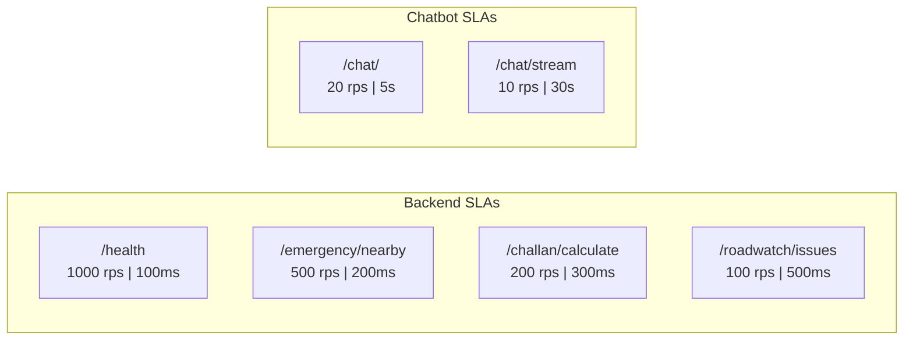

# Benchmarks

> **Performance benchmarks, latency targets, throughput measurements, and SLA commitments.**

Formal benchmarks for all SafeVixAI services, measured via k6 load testing and pytest performance tests.

---

## Quick Links

| Document | Description |
|----------|-------------|
| [`docs/PERFORMANCE_BENCHMARKS.md`](docs/PERFORMANCE_BENCHMARKS.md) | Detailed latency, throughput, resource benchmarks |
| [`k6/backend-smoke.js`](k6/backend-smoke.js) | k6 smoke test — 1 VU, all 25 endpoints |
| [`k6/backend-load.js`](k6/backend-load.js) | k6 load test — 100 VU, 5 min |
| [`k6/backend-stress.js`](k6/backend-stress.js) | k6 stress test — ramp to 500 VU |
| [`k6/chatbot-smoke.js`](k6/chatbot-smoke.js) | k6 chatbot — 20 VU chat, 10 VU stream |

---

## Service Level Targets



| Service | Endpoint | P95 Target | Throughput |
|---------|----------|------------|------------|
| Backend | `/health` | < 100ms | 1000 req/s |
| Backend | `/api/v1/emergency/nearby` | < 200ms | 500 req/s |
| Backend | `/api/v1/challan/calculate` | < 300ms | 200 req/s |
| Backend | `/api/v1/roadwatch/issues` | < 500ms | 100 req/s |
| Chatbot | `/api/v1/chat/` | < 5s | 20 req/s |
| Chatbot | `/api/v1/chat/stream` | < 30s (total) | 10 streams/s |

---

## Running Benchmarks

```bash
# k6 — requires k6 CLI
k6 run k6/backend-smoke.js
k6 run k6/backend-load.js
k6 run k6/backend-stress.js
k6 run k6/chatbot-smoke.js

# Python performance tests
cd backend && pytest tests/ -v -k "perf" --benchmark-only
```

---

## Test Results History

See [`docs/PERFORMANCE_BENCHMARKS.md`](docs/PERFORMANCE_BENCHMARKS.md) for historical benchmark data and regression tracking.

---

## Related

- [`docs/MONITORING_SETUP.md`](docs/MONITORING_SETUP.md) — production monitoring
- [`docs/SCALING_GUIDE.md`](docs/SCALING_GUIDE.md) — horizontal scaling
