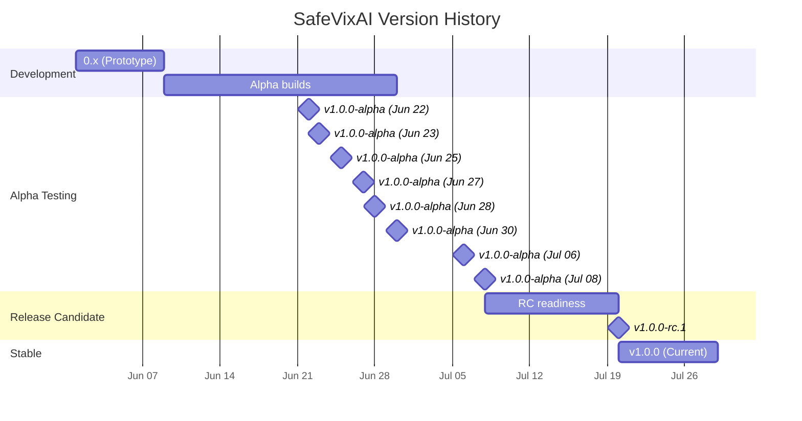
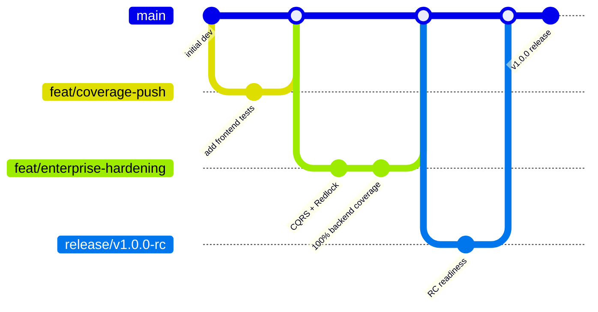

# Changelog

All notable changes to SafeVixAI are documented here in [Keep a Changelog](https://keepachangelog.com/) format.

## Release Timeline

## Release Branch Strategy

## [1.0.0] — 2026-07-20

### Added
- Final v1.0 release — production-ready, enterprise-grade road safety PWA
- Standard open-source files: FAQ, TROUBLESHOOTING, NOTICE, STYLE_GUIDE, VERSIONING, SUPPORTED_VERSIONS, ARCHITECTURE.md
- 9 Architecture Decision Records: CQRS, Redlock, Offline SOS, DuckDB-Wasm, MapLibre, JWKS, Service Worker, WebSocket, ChromaDB RAG
- Incident response severity matrix and escalation procedure
- Operations environment configuration and maintenance guides
- ADOPTERS.md with IIT Madras listing
- RC Readiness Report with Go/No-Go assessment
- Supply chain security: SLSA provenance, license scan, reproducible builds, SECURITY-INSIGHTS
- Open Source Audit: CODEOWNERS, .prettierignore, env template consolidation
- Community docs: CONTRIBUTING, CODE_OF_CONDUCT, SECURITY
- Terraform README (18-module AWS infra)
- K8s README (15 manifests via kustomize)
- Cross-reference deploy/ configs in monitoring runbook

### Fixed
- Frontend build "hours" issue: `output: 'standalone'` gated behind `STANDALONE=true`
- three.js/r3f/drei moved back to `dependencies` (broken by devDeps change)
- SPDX license headers placed after `'use client'` directive in 150+ files
- `EnterpriseClientAppHooks.tsx` `'use client'` position fixed
- ESLint double-run in CI (standalone build `eslint.ignoreDuringBuilds`)
- Jest CI memory limits configured
- Backend Dockerfile STANDALONE build arg
- Cosign matrix variable bug in release.yml
- docker-compose.yml: Added security banner, no default production passwords
- TESTING_POLICY.md: Updated coverage numbers to current values (frontend 87.22%, backend 100%, chatbot 97%+)
- ADR-001: Deduplicated (removed ADR-002/003 sections now in separate files)

## [1.0.0-alpha] — 2026-07-08

### Added
- 2835 frontend tests, 248 suites, 0 failures
- 2750 backend tests, 100% coverage threshold
- 1613 chatbot tests, 97% coverage threshold
- SOS interaction tests (hold-to-activate, offline queue, geolocation)
- Emergency page with category filter, protocol cards
- Tracking page with live WebSocket state
- Route page coverage expansion (privacy, terms, offline, guide)
- lib/ test expansions (intl-formatters, validate-upload, india-locations, provider-api, live-tracking)
- Route page coverage expansion (officer, report-track, bystander, tracking)
- Istanbul ignores for SSR/hardware guards (navigator, geolocation, clipboard)
- Coverage thresholds: frontend 86/72/80/85

### Fixed
- Backend: haversine_km import, ChallanQuery schema, violation codes MVA_185
- Backend: PIL made optional in roadwatch_photos
- Backend: contract validation tests aligned with enterprise schema
- Frontend: RAF synchronous mock for SOS hold tests
- Frontend: 3 failing suites re-enabled (accessibility, bystander, ProvidersPage)

## [1.0.0-alpha] — 2026-07-06

### Added
- 7 landing component test files (55 tests)
- Coverage thresholds raised: 80→85 lines, 66→70 branches, 73→79 functions
- jset-axe accessibility tests (8 tests, 5 components + 3 pages)
- Service worker unit tests (12 tests, caching/fetch/push/lifecycle)
- Route page expansions (guide-slug, privacy, terms, offline)
- 9 route page Istanbul ignores (SSR/hardware guards)
- lib/ test expansions (+25 tests across 6 files)

### Fixed
- flaky multimodal-ai-chat-input timeout (30MB File → 1 byte, 1049ms→85ms)
- jest.setup.js polyfills (matchMedia, Response, Request, PushEvent)
- usePageEntry test prefersReducedMotion assertion

## [1.0.0-alpha] — 2026-06-30

### Added
- multimodal-ai-chat-input coverage 45%→92% lines (48 tests)
- Backend 100% coverage (6 new test files, 367 tests)
- Enterprise patterns: CQRS, Redlock, JWKS, Idempotency
- Backend test expansions: civic_intel API, command center, admin/authority
- ETL Scheduler tests, mutation testing config

### Fixed
- Backend module imports verified (all 38 service modules)
- Circuit breaker wired to all 8 external service calls
- safe_routing clock abstraction for deterministic testing
- Provider alias deduplication (3 redundant aliases removed)

## [1.0.0-alpha] — 2026-06-28

### Added
- 20 new component tests (FloatingSidebarControls, SOSButton, InstallPrompt, QREmergencyCard, LocationPickerInner)
- Coverage: 95.02% lines frontend
- Coverage expansion: DataTable, GpsConsent, RightSidebar, SentryInit
- ClientAppHooks test with dispatch/tracking/offline flows

### Fixed
- api.test.ts retry interceptor index mapping
- States pollution in EnterpriseClientAppHooks tests (shared mockStore)
- offline-sos-queue SyncManager and IndexedDB paths

## [1.0.0-alpha] — 2026-06-27

### Added
- 7 new tests (MapLibreDashboard, useLocatorSearch, useSplitTextEntry)
- 12 new tests (DataTable, GpsConsent, RightSidebar, SentryInit)
- DuckDB-Wasm offline challan test coverage: 75%→100%
- Coverage: 92.33% lines frontend

### Fixed
- Stale doc numbers in Agent.md, Architecture.md, API.md, Database.md, Deployment.md
- SPDX license headers on 31 files (backend + chatbot)

## [1.0.0-alpha] — 2026-06-25

### Added
- Route test expansions: login, sos, profile, settings, challan (36 tests)
- AuthGuard, CommandPalette, CrashCountdown, SystemHeader tests (10 tests)
- Deep-link, chat-history, VoiceInput expansion (8 tests)
- Coverage thresholds raised: 90/76/81/86
- Enterprise patterns: CSRF middleware, request ID middleware, security headers

### Fixed
- Security middleware chain ordering (CSRF before handlers)
- Sentry init DSN loading order
- CSP headers with proper nonce support

## [1.0.0-alpha] — 2026-06-23

### Added
- Coverage push: 72% lines (9 new test files, 4 expanded)
- live-tracking expansion: 8→20 tests, ~88% coverage
- Profile-storage, QREmergencyCard, ChallanCalculator expansion (33 tests)
- Modal, InstallPrompt, SWR-fetcher expansion (26 tests)

### Fixed
- ChallanCalculator closest('button') DOM traversal pattern
- window.indexedDB polyfill pattern isolation

## [1.0.0-alpha] — 2026-06-22

### Added
- 17 route test suites (60 total tests)
- 5 store slice tests (auth, map, settings, ui, data)
- 10 hook tests (all hooks now covered)
- 10 new lib test suites (257 tests)
- Coverage thresholds: 48/36/42/46

### Fixed
- 35 corrupted test files recovered
- 82 test files converted to function() syntax
- jest.setup.js restored after agent overwrite

## [1.0.0-alpha] — 2026-06-09

### Added
- 24 route-level SEO metadata layouts
- 28 route-level error.tsx boundaries
- Backend: security logging for JWT-in-URL
- Chatbot: 9-provider LLM fallback chain
- Infrastructure: Docker Compose, K8s manifests, Pre-commit hooks, Makefile
- Documentation: 5 docs with SNAPSHOT banners

### Fixed
- XSS vulnerability in useSplitTextEntry (innerHTML → safe DOM API)
- Profile data loss on refresh (IndexedDB rehydration)
- PostHog waits for GDPR consent
- backend REFESH → REFRESH typo
- JS-ism methods in i18n_middleware
- Redis connection leak (in-memory fallback)
- Chatbot: shared mutable httpx.AsyncClient → instance var
- Chatbot: 150 lines dead code removed
- Docker build: Buildx + GHCR caching
