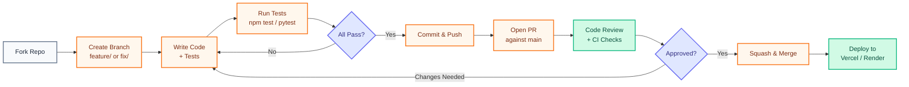
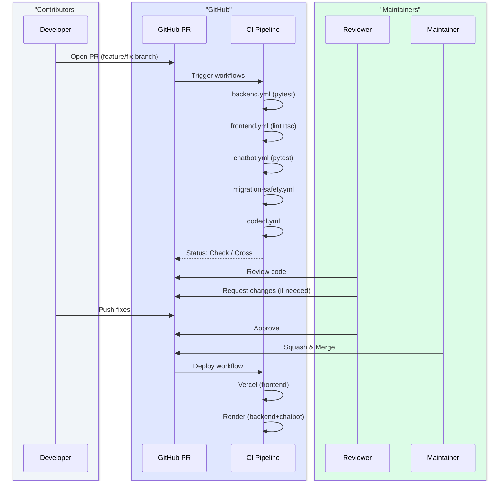

# Contributing to SafeVixAI

Thank you for contributing to SafeVixAI - an open-source, AI-powered road safety platform.

## Contribution Workflow



## PR Lifecycle



## Code of Conduct

This project follows the [Contributor Covenant v2.1](CODE_OF_CONDUCT.md). By participating, you agree to uphold it. Report violations to **safevixai@googlegroups.com**.

## Quick Start

```bash
git clone https://github.com/safevixai/safevixai.git
cd safevixai

# Backend
cd backend
python -m venv .venv && source .venv/bin/activate
pip install -r requirements.txt
cp .env.example .env

# Chatbot Service
cd ../chatbot_service
python -m venv .venv && source .venv/bin/activate
pip install -r requirements.txt
cp .env.example .env

# Frontend
cd ../frontend
npm ci
cp .env.local.example .env.local
```

## Development

Run the 3 services in separate terminals:

```bash
# Terminal 1: Backend (:8000)
cd backend && uvicorn main:app --reload --port 8000

# Terminal 2: Chatbot (:8010)
cd chatbot_service && uvicorn main:app --reload --port 8010

# Terminal 3: Frontend (:3000)
cd frontend && npm run dev
```

Verify: `curl http://localhost:8000/health` and `curl http://localhost:8010/health`

## Workflow

### Branch Naming
- `feature/<issue>-<desc>` — new features
- `fix/<issue>-<desc>` — bug fixes
- `docs/<desc>` — documentation
- `test/<desc>` — test additions
- `chore/<desc>` — tooling/CI

### Commits
Use [Conventional Commits](https://www.conventionalcommits.org/):
```
<type>(<scope>): <description>
```
Types: `feat`, `fix`, `docs`, `style`, `refactor`, `perf`, `test`, `build`, `ci`, `chore`
Scopes: `backend`, `chatbot`, `frontend`, `docs`, `infra`, `e2e`

### Pull Requests
1. Branch from `main`
2. Write tests for new code
3. Run lint + typecheck + tests locally
4. Open PR with clear description
5. CI must pass
6. One maintainer review required
7. Squash-merge to `main`

## Coding Standards

### Python
- PEP 8, Black (88 chars), Ruff linting
- Type hints required on public functions
- Google-style docstrings
- Async/await preferred

### TypeScript/React
- ESLint + Prettier
- Strict TypeScript mode
- Functional components + hooks
- Zustand for state (no Redux)
- Tailwind CSS (no inline styles)
- Lucide icons

### Testing

| Service | Framework | Thresholds |
|---------|-----------|------------|
| Backend | pytest (asyncio_mode=auto) | 100% lines/branches |
| Chatbot | pytest (asyncio_mode=strict) | 97% lines |
| Frontend | Jest + RTL | 86% lines / 72% branches |

```bash
# Backend
cd backend && pytest tests/ -v --cov

# Chatbot
cd chatbot_service && pytest tests/ -v --cov

# Frontend
cd frontend && npm test && npm run lint && npx tsc --noEmit
```

## Security

Report vulnerabilities to **security@safevixai.gov.in** - do not file public issues. See [SECURITY.md](SECURITY.md).

## Related

- [docs/CONTRIBUTING.md](CONTRIBUTING.md) — Full contribution guidelines
- [docs/STYLE_GUIDE.md](docs/developer-guide/STYLE_GUIDE.md) — Coding style conventions
- [TESTING.md](docs/developer-guide/TESTING.md) — Testing standards and coverage
- [docs/DEVELOPER_GUIDE.md](docs/developer-guide/DEVELOPER_GUIDE.md) — Developer onboarding and workflow
