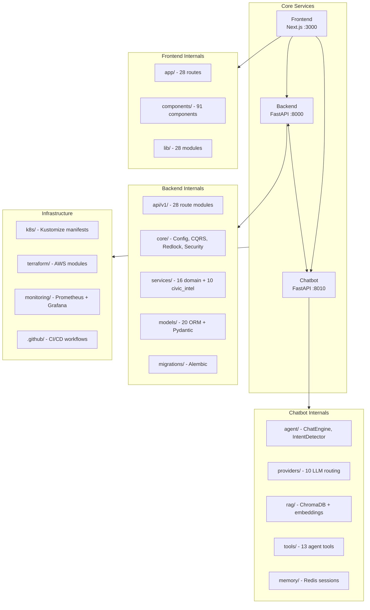
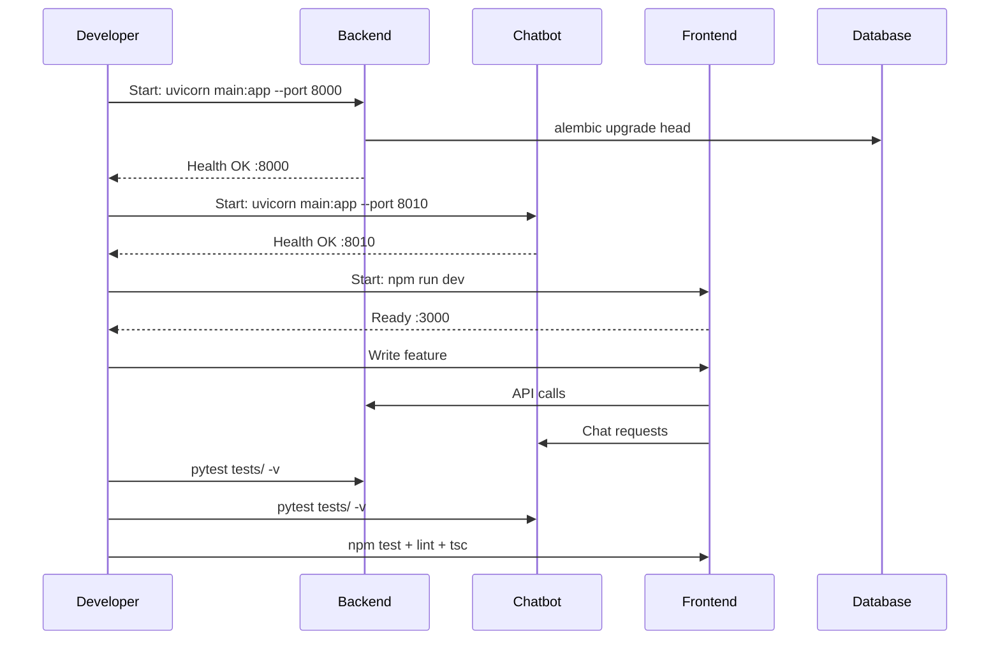

# Developer Guide

> Version 1.0.0 | Last updated: 2026-07-25

## Prerequisites

- Python 3.11+
- Node.js 20+
- Git
- Docker Desktop (optional, for local PostGIS/Redis)
- 8GB+ RAM recommended

## Repository Structure



## Development Workflow



## Local Setup

### 1. Backend
```bash
cd backend
python -m venv .venv
# Windows: .venv\Scripts\activate
# Linux/Mac: source .venv/bin/activate
pip install -r requirements.txt
cp .env.example .env
# Edit .env with your database URL and API keys
uvicorn main:app --reload --port 8000
```
Verify: `curl http://localhost:8000/health`

### 2. Chatbot Service
```bash
cd chatbot_service
python -m venv .venv
# Windows: .venv\Scripts\activate
# Linux/Mac: source .venv/bin/activate
pip install -r requirements.txt
cp .env.example .env
# Edit .env with LLM provider keys
uvicorn main:app --reload --port 8010
```
Verify: `curl http://localhost:8010/health`

### 3. Frontend
```bash
cd frontend
npm ci
cp .env.local.example .env.local
# Edit .env.local with API endpoints
npm run dev
```
Visit: `http://localhost:3000`

### 4. Database (Optional — Docker)
```bash
docker compose up -d postgres redis
cd backend
alembic upgrade head
python scripts/data/seed_violations.py
```

## Day-to-Day Workflow

```bash
# Terminal 1: Backend
cd backend && .venv\Scripts\activate && uvicorn main:app --reload --port 8000

# Terminal 2: Chatbot
cd chatbot_service && .venv\Scripts\activate && uvicorn main:app --reload --port 8010

# Terminal 3: Frontend
cd frontend && npm run dev

# Terminal 4: Tests
make test-backend  # or make test-frontend, make test-chatbot
```

## Code Review Checklist

- [ ] Tests pass (pytest, Jest, E2E)
- [ ] Lint passes (ruff, ESLint)
- [ ] TypeScript type-check passes (tsc --noEmit)
- [ ] Coverage thresholds maintained
- [ ] No secrets committed (gitleaks pre-commit hook)
- [ ] SPDX license header present on new files
- [ ] i18n keys added for UI text
- [ ] API changes documented in docs/API.md
- [ ] Error handling covers edge cases
- [ ] Backward compatible (unless MAJOR version)

## Common Gotchas

| Issue | Solution |
|-------|----------|
| `ST_MakePoint(lat, lon)` wrong | `ST_MakePoint(lon, lat)` — longitude first |
| `::geometry` in ST_DWithin | Use `::geography` — gives meters, not degrees |
| MapLibre SSR crash | Use `dynamic(() => import(...), { ssr: false })` |
| SW not working in dev | Use `npm run build && npm start` for SW |
| ChromaDB missing | Never delete `chatbot_service/data/chroma_db/` (committed) |
| Backend/chatbot venv mixup | Separate `.venv` — never share |
| Test TDZ errors | Use `var` not `let`/`const` in jest.mock factories |
| Async test in chatbot | Must use `@pytest.mark.asyncio` (strict mode) |
| HF_TOKEN needed? | Only for Sarvam HF fallback — core flow uses Groq/Gemini |

## How To: Add a New API Endpoint

1. Create router file in `backend/api/v1/` (e.g., `new_feature.py`)
2. Define Pydantic request/response models
3. Register router in `backend/api/v1/__init__.py` (add to `api_router`)
4. Add service logic in `backend/services/`
5. Write tests in `backend/tests/`
6. Run: `pytest tests/test_new_feature.py -v`
7. Document in `docs/API.md`

## How To: Add a New Frontend Route

1. Create directory in `frontend/app/` (e.g., `frontend/app/new-feature/`)
2. Create `page.tsx` (and optionally `loading.tsx`, `error.tsx`)
3. Add route to navigation (check `components/AppSidebar/`)
4. Create component in `frontend/components/`
5. Write tests in `frontend/__tests__/` or co-located `__tests__/`
6. Run: `npm test -- --testPathPattern="new-feature"`

## How To: Add a New Chatbot Tool

1. Create tool file in `chatbot_service/tools/` (e.g., `new_tool.py`)
2. Implement tool class with `async def execute(params) -> dict`
3. Register in `chatbot_service/agent/context_assembler.py` dispatch table
4. Add intent trigger in `chatbot_service/agent/intent_detector.py`
5. Write tests in `chatbot_service/tests/`

## Internationalization

See [INTERNATIONALIZATION.md](INTERNATIONALIZATION.md) for details on adding new languages.

## Testing

See [TESTING.md](TESTING.md) for comprehensive testing guide.
