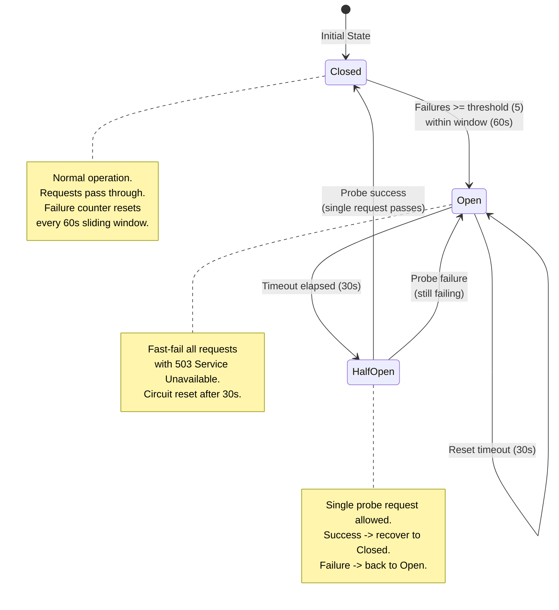
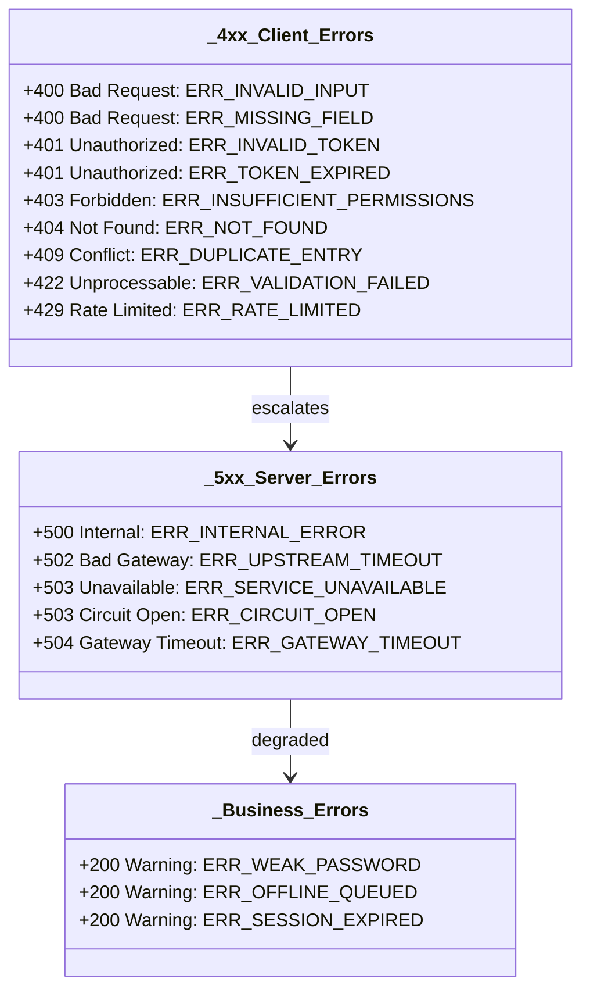

# Error Codes Reference

> Version 1.0 | 2026-07-29

## Circuit Breaker State Machine

## Error Codes by HTTP Status Group

## HTTP Status

- 200: Success
- 400: Validation error
- 401: Unauthenticated
- 403: Forbidden
- 404: Not found
- 409: Conflict
- 422: Pydantic validation
- 429: Rate limited
- 500: Internal error
- 503: Service unavailable

## Error Codes

| Code | HTTP | Meaning |
|------|------|---------|
| NOT_FOUND | 404 | Resource not found |
| VALIDATION_ERROR | 422 | Schema validation failed |
| UNAUTHORIZED | 401 | No valid auth |
| FORBIDDEN | 403 | Insufficient role |
| RATE_LIMITED | 429 | Too many requests |
| LLM_UNAVAILABLE | 503 | All providers failed |
| CIRCUIT_OPEN | 503 | Circuit breaker open |
| INVALID_TRANSITION | 400 | Invalid state transition |
| DUPLICATE_REQUEST | 409 | Idempotency replay |
| AUTH_EXPIRED | 401 | JWT expired |
| AUTH_INVALID | 401 | JWT invalid |

## Circuit Breaker

Closed - Open (30s) - Half-Open - Closed (probe success) or Open (probe fail)
