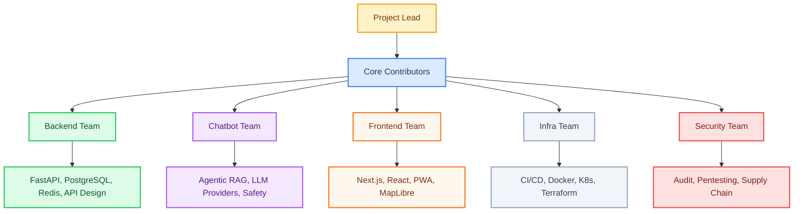

# SafeVixAI Governance

## Project Lead

The SafeVixAI project is led by a single **Project Lead** who has final authority on all decisions. The current Project Lead is the founding team.

## Core Contributors

Core Contributors are trusted individuals who have made significant, sustained contributions to the project. They are granted:
- Direct push access to the `main` branch
- Review authority on pull requests
- Voting rights on project decisions
- Access to private security discussions

**Becoming a Core Contributor:**
1. Have 5+ merged PRs across any service (backend, chatbot, frontend, infra, docs)
2. Have been active for 3+ months
3. Be nominated by an existing Core Contributor
4. Receive majority approval from existing Core Contributors

## Contributors

Anyone who submits a pull request that gets merged is a Contributor. Contributors are listed in the release notes and acknowledged in `ADOPTERS.md` if desired.

## Security Team

The **Security Team** is a sub-group of Core Contributors responsible for:
- Triaging and responding to vulnerability reports
- Reviewing security-related PRs and changes
- Maintaining security tooling and CI/CD security checks
- Managing the security disclosure and advisory process
- Performing quarterly security reviews
- Overseeing supply chain security (Dependabot, SBOM, provenance)

Members are nominated by the existing Security Team and approved by the Project Lead.

## Two-Factor Authentication

All Core Contributors, Security Team members, and anyone with write access to the repository **MUST** have two-factor authentication (2FA) enabled on their GitHub account. This is enforced through GitHub organization settings. Account recovery procedures are documented in the internal security runbook.

## Decision Making

### Consensus-based
Most decisions are made by lazy consensus among Core Contributors. A decision is reached unless a Core Contributor raises an objection within 72 hours.

### Voting
For contentious decisions (API changes, dependency additions, governance changes):
1. A Core Contributor calls a vote via GitHub Issue
2. Voting period: 7 days
3. Simple majority wins
4. Project Lead has veto power (must be exercised in writing with justification)

## Release Process

1. A Release Manager is assigned from Core Contributors
2. CHANGELOG is updated and frozen
3. All CI workflows pass (unit, E2E, security, load, chaos)
4. SBOM is generated (CycloneDX + SPDX) and attached to the release
5. Docker images are signed with cosign and pushed to GHCR
6. A Core Contributor creates a GitHub Release with tag `v*.*.*`
7. Release notes are auto-generated from CHANGELOG.md
8. Post-release smoke tests pass against deployed artifacts

## Code of Conduct Enforcement

The Project Lead is responsible for enforcing the Code of Conduct. Reports are sent to `safevixai@googlegroups.com` and are kept confidential.

## Security Advisory Process

1. Vulnerability reports are received via email or GitHub private reporting
2. Security Team triages within 48 hours
3. Fix is developed in a private fork
4. Advisory is drafted with severity, impact, and mitigation
5. Fix is merged, advisory is published, CVE is assigned if applicable
6. Reporter is credited (if desired)

## Sub-team Structure

## Access Continuity

The project is designed to continue with minimal interruption if any single person leaves:

1. **Source of truth:** All code, documentation, issues, and decisions are recorded in the GitHub repository.
2. **Service credentials:** CI/CD secrets and cloud provider credentials are stored in GitHub Secrets and can be transferred by organization admins.
3. **Domain and DNS:** Managed through GitHub organization accounts with shared access.
4. **Package publishing:** All artifacts are published through automated CI pipelines — no manual publishing dependency.
5. **Key person risk:** If the Project Lead becomes unavailable, Core Contributors will select an interim lead within 14 days. If all Core Contributors become unavailable, the project enters maintenance mode until new maintainers emerge from the contributor community.

## Bus Factor

The current bus factor is **1** (project relies on a single Project Lead). Efforts are underway to grow the Core Contributor team to achieve a bus factor of **2 or more** by Q4 2026.

## Governance Changes

Changes to this document require:
1. A GitHub Issue proposing the change
2. 14-day comment period
3. Approval from 2/3 of Core Contributors
4. Project Lead sign-off
