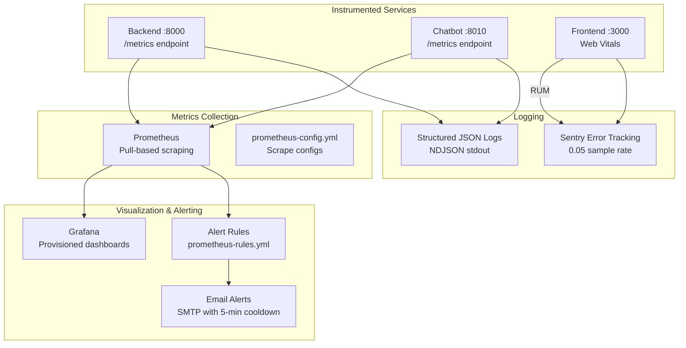
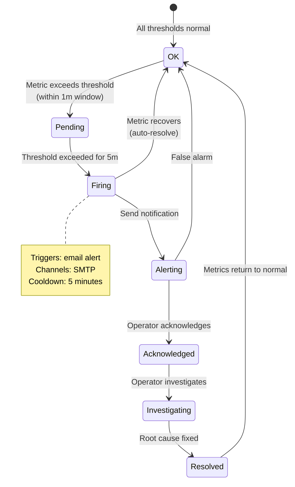

# Monitoring

> **Metrics collection, dashboard setup, uptime monitoring, and performance tracking.**

SafeVixAI uses Prometheus for metric collection and Grafana for visualization - both provisioned as code.

## Monitoring Stack

## Alert Lifecycle

---

## Quick Links

| Area | Documentation |
|------|---------------|
| Setup Guide | [`docs/MONITORING_SETUP.md`](docs/MONITORING_SETUP.md) |
| Grafana Dashboard | [`docs/observability/grafana-dashboard.json`](docs/observability/grafana-dashboard.json) |
| Prometheus Config | [`docs/observability/prometheus-config.yml`](docs/observability/prometheus-config.yml) |
| Alert Rules | [`docs/observability/alerts/`](docs/observability/alerts/) |
| Telemetry Guide | [`docs/TELEMETRY.md`](docs/TELEMETRY.md) |
| Performance Benchmarks | [`docs/PERFORMANCE_BENCHMARKS.md`](docs/PERFORMANCE_BENCHMARKS.md) |
| Observability Overview | [`OBSERVABILITY.md`](OBSERVABILITY.md) |

---

## Metrics Dashboard

The Grafana dashboard covers four golden signals for every service:

| Signal | Metric | Target |
|--------|--------|--------|
| Latency | `http_request_duration_seconds` | P95 < 500ms (backend), P95 < 5s (chatbot) |
| Traffic | `http_requests_total` | Per-endpoint rate |
| Errors | `http_requests_total{status=~"5.."}` | < 1% of total |
| Saturation | `memory_usage_bytes`, `db_connection_pool_size` | < 80% utilization |

---

## Alert Thresholds

| Alert | Threshold | Action |
|-------|-----------|--------|
| High Error Rate | > 5% 5xx in 5 min | Check runbook |
| High Latency | P95 > 2s (backend) | Scale up / optimize query |
| Circuit Breaker Open | Any breaker open for > 1 min | Investigate provider |
| DB Connection Pool | > 80% utilized | Increase pool / optimize |
| Memory | > 85% RSS | Restart / scale |

---

## Related

- [`OBSERVABILITY.md`](OBSERVABILITY.md) — logging, metrics, alerting
- [`OPERATIONS.md`](OPERATIONS.md) — deployment, scaling
- [`RUNBOOKS.md`](RUNBOOKS.md) — incident response
