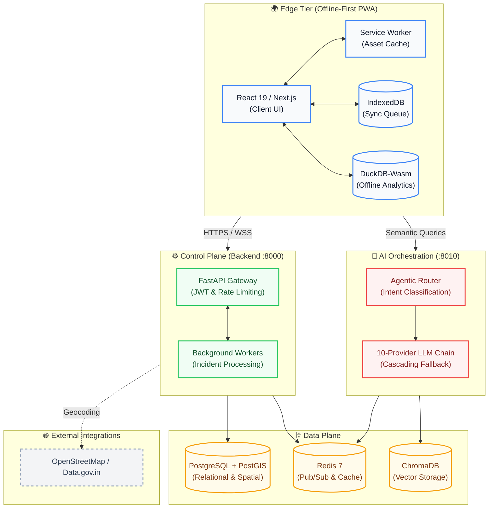

<!-- 
  SafeVixAI Enterprise README
  Inspired by top CNCF and modern OSS projects (Next.js, Supabase, FastAPI)
-->
<div align="center">
  <br />
  <h1>🛡️ SafeVixAI</h1>
  
  <p><strong>The Enterprise AI-Powered Road Safety & Emergency Response Platform</strong></p>
  
  [](https://github.com/SafeVixAI/SafeVixAI/actions/workflows/backend.yml) [](https://github.com/SafeVixAI/SafeVixAI/actions/workflows/codeql.yml) [](https://codecov.io/gh/SafeVixAI/SafeVixAI) [](https://safevixai.github.io/SafeVixAI/) [](https://scorecard.dev/viewer/?uri=github.com/SafeVixAI/SafeVixAI) [](LICENSE)<br>[](https://python.org) [](https://nextjs.org) [](https://docker.com) [](https://github.com/SafeVixAI/SafeVixAI/discussions)

  <p>
    <a href="#-project-vision">Vision</a> •
    <a href="#-key-features">Features</a> •
    <a href="#-technology-stack">Tech Stack</a> •
    <a href="#-quick-start">Quick Start</a> •
    <a href="#-system-architecture">Architecture</a> •
    <a href="https://safevixai.github.io/SafeVixAI/">Documentation</a>
  </p>

  <p><em>Built for the IIT Madras Road Safety Hackathon 2026. Offline-first PWA with zero-downtime AI fallback.</em></p>
</div>

---

**SafeVixAI** is a mission-critical, offline-first Progressive Web Application (PWA) designed to provide instant, life-saving road safety intelligence. When networks fail, SafeVixAI doesn't. Our zero-infrastructure architecture ensures that critical features—like deterministic MVA 2019 calculations and SOS emergency protocols—remain fully operational even without internet connectivity.

## 🎯 Project Vision

**Every second counts in a road emergency.** SafeVixAI puts life-saving information — nearest hospitals, traffic laws, first aid protocols — directly in the hands of citizens, officers, and first responders. 

- **Offline-First Resilience**: Ensures the system works when rural or disaster-struck networks fail.
- **Zero-Downtime AI**: A 10-provider LLM cascading chain ensures the AI never goes silent.
- **Open Source**: Infrastructure costs kept at zero—entirely free and accessible to government agencies and the public.

---

## ✨ Key Features

| Feature | Description | Enterprise Capabilities |
|---------|-------------|-------------------------|
| 🚨 **Emergency Locator** | Geospatial hospital, police, and fire station search. | PostGIS spatial indexing, 50ms latency routing. |
| 🤖 **AI Agentic Chatbot** | Traffic law, challan calculation, and first aid guidance. | Agentic RAG, 10-LLM fallback chain, ChromaDB vector store. |
| 🧾 **Challan Calculator** | Deterministic MVA 2019 fine calculation with overrides. | DuckDB-Wasm in-browser, zero-latency offline processing. |
| 📸 **Road Reporter** | Community-driven road damage reporting with geotagging. | IndexedDB sync queue, background sync via Service Workers. |
| 📡 **SOS + Live Tracking** | Hold-to-activate emergency alert with live location. | Secure WebSockets, encrypted payload streaming. |
| 📊 **Command Center** | Real-time agency dashboard with incident timelines. | Grafana integration, Prometheus metric scraping. |

---

## 🛠️ Technology Stack

SafeVixAI is built on a modern, cloud-native microservices architecture designed for extreme scale and fault tolerance.

| Layer | Technologies |
|-------|-------------|
| **Frontend (PWA)** | Next.js 15, React 19, TypeScript 5, Tailwind CSS 3, MapLibre GL, WebLLM, DuckDB-Wasm |
| **Backend Services** | FastAPI (Async), SQLAlchemy 2.0, PostGIS, Redis (hiredis), DuckDB, Overpass/Nominatim |
| **AI & Inference** | FastAPI, ChromaDB, 10 LLM Providers (Groq, Gemini, Sarvam AI, Cerebras, OpenAI, Anthropic, etc.) |
| **Infrastructure** | Docker Compose, Kubernetes (Kustomize), Terraform (AWS), Vercel, Render |
| **Observability** | Prometheus, Grafana, Sentry, Structured JSON Logging |
| **CI/CD** | GitHub Actions (41 active workflows covering tests, linting, SAST, and docs) |

---

## 🚀 Quick Start

SafeVixAI is containerized for rapid developer onboarding. Follow these steps to get a local instance running in minutes.

### Prerequisites
- **Docker & Docker Compose** (Recommended for full-stack)
- **Node.js 20+** & **Python 3.11+** (For bare-metal deployment)

### Containerized Deployment (Recommended)
Launch the entire stack (PostgreSQL, Redis, Backend, AI Service, Frontend) with a single command:
```bash
# Clone the repository
git clone https://github.com/SafeVixAI/SafeVixAI.git
cd SafeVixAI

# Boot the microservices
docker compose up --build -d
```
> **Note**: The frontend will be available at `http://localhost:3000`, backend API at `http://localhost:8000`, and the Chatbot LLM service at `http://localhost:8010`.

### Bare-Metal Local Development
<details>
<summary>Click to view step-by-step local compilation instructions</summary>

**1. Boot the Backend API**
```bash
cd backend
python -m venv .venv
source .venv/bin/activate
pip install -r requirements.txt
cp .env.example .env
uvicorn main:app --reload --port 8000
```

**2. Boot the AI Chatbot Service**
```bash
cd chatbot_service
python -m venv .venv
source .venv/bin/activate
pip install -r requirements.txt
cp .env.example .env
uvicorn main:app --reload --port 8010
```

**3. Boot the Frontend PWA**
```bash
cd frontend
npm ci
cp .env.local.example .env.local
npm run dev
```
</details>

---

## 🏛️ System Architecture

SafeVixAI leverages a highly decoupled, cloud-native architecture. It strictly separates edge-client offline durability from heavy backend processing and AI orchestration, utilizing a rigorous data plane optimized for spatial indexing and vector retrieval.



---

## 📚 Comprehensive Documentation

SafeVixAI is exhaustively documented. Our enterprise documentation portal is built using MkDocs and hosted directly on GitHub Pages.

- 🏗️ **[System Architecture](docs/architecture/ARCHITECTURE.md)**: Deep dive into the system design, offline architecture, and data flow patterns.
- 👨‍💻 **[Developer Guide](docs/developer-guide/DEVELOPER_GUIDE.md)**: Coding standards, comprehensive testing policies, and local setup instructions.
- 🔌 **[API Reference](docs/api-reference/SDK_GUIDE.md)**: SDK integrations, OpenAPI schemas, and Webhook definitions for third-party consumers.
- 📈 **[SRE & Operations](docs/sre/OPERATIONS.md)**: Scaling guides, incident runbooks, and Grafana telemetry setup.
- 🛡️ **[Security & Compliance](docs/compliance-and-reports/PRIVACY.md)**: Threat modeling, CNCF audits, and Service Level Agreement (SLA) reports.
- 🗺️ **[Product Roadmap](docs/product-and-planning/ROADMAP.md)**: Upcoming features, feature matrices, and UX architectural plans.

---

## 🤝 Contributing

We believe in the power of open source to save lives. Whether you're optimizing a Postgres query, expanding the AI RAG corpus, or fixing a UI typo, your contributions are critical.

1. Review our **[Code of Conduct](docs/developer-guide/CODE_OF_CONDUCT.md)**.
2. Read the **[Contributing Guide](docs/developer-guide/CONTRIBUTING.md)** for Git workflow standards.
3. Check out the **[Good First Issues](https://github.com/SafeVixAI/SafeVixAI/labels/good%20first%20issue)** to jump right in.

---

## 🛡️ Security & Trust

Security is our top priority. The SafeVixAI platform utilizes strict SBOM (Software Bill of Materials) tracking, CodeQL static analysis, and regular dependency audits via Dependabot.

If you discover a security vulnerability, please refer to our **[Security Policy](docs/compliance-and-reports/SECURITY.md)** and report it directly to **security@safevixai.gov.in**. We adhere to responsible disclosure guidelines.

---

## 💬 Community & Support

Join the thousands of developers building a safer road ecosystem:

- **Discussions**: Join the architectural conversation on [GitHub Discussions](https://github.com/SafeVixAI/SafeVixAI/discussions).
- **Issues**: Report platform bugs or request robust features via [GitHub Issues](https://github.com/SafeVixAI/SafeVixAI/issues).
- **Support SLAs**: View enterprise support tiers in [SUPPORT.md](docs/compliance-and-reports/SUPPORT.md).

---

## ✨ Contributors

A massive thank you to everyone who has contributed to making SafeVixAI a reality. 

<a href="https://github.com/SafeVixAI/SafeVixAI/graphs/contributors">
  
</a>

## 📈 Star History

[](https://star-history.com/#SafeVixAI/SafeVixAI&Date)

---
<div align="center">
  <p>Built with ❤️ and extreme engineering by the <strong>SafeVixAI Team</strong> for a safer tomorrow.</p>
  <p>Released under the <a href="LICENSE">MIT License</a>.</p>
</div>
