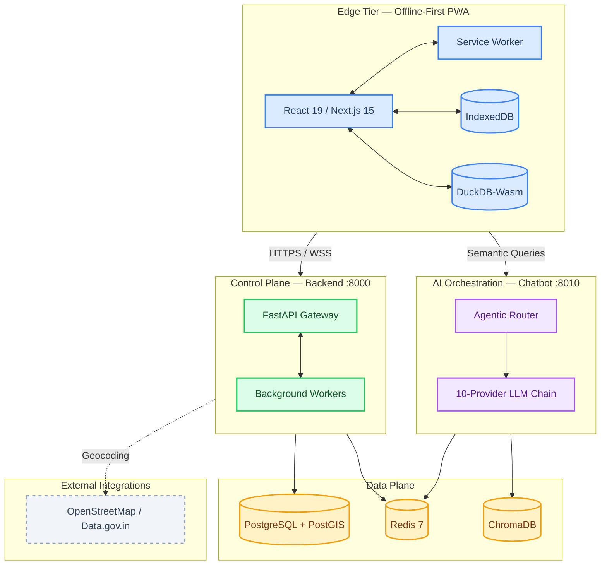
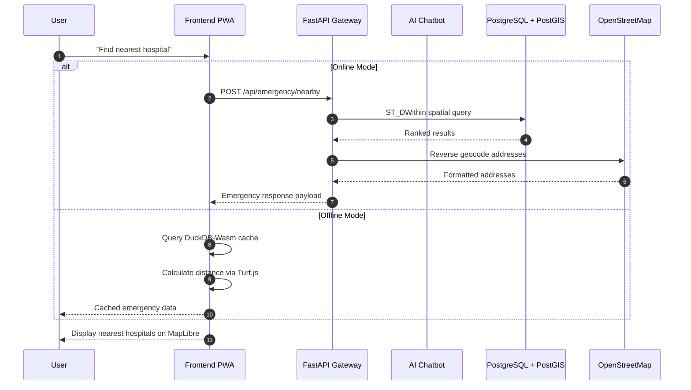

<!-- 
  SafeVixAI — Enterprise README
  AI-Powered Road Safety & Emergency Response Platform
  https://github.com/SafeVixAI/SafeVixAI
-->
<div align="center">
  <br />
  <h1>🛡️ SafeVixAI</h1>
  
  <p><strong>Enterprise AI-Powered Road Safety & Emergency Response Platform</strong></p>
  <p><em>Offline-first PWA · Zero-downtime AI · Zero infrastructure cost</em></p>

  <!-- CI & Quality Badges -->
  <p>
    <a href="https://github.com/SafeVixAI/SafeVixAI/actions/workflows/backend.yml"></a>
    <a href="https://github.com/SafeVixAI/SafeVixAI/actions/workflows/frontend.yml"></a>
    <a href="https://github.com/SafeVixAI/SafeVixAI/actions/workflows/chatbot.yml"></a>
    <a href="https://github.com/SafeVixAI/SafeVixAI/actions/workflows/codeql.yml"></a>
  </p>
  <p>
    <a href="https://codecov.io/gh/SafeVixAI/SafeVixAI"></a>
    <a href="https://safevixai.github.io/SafeVixAI/"></a>
    <a href="https://scorecard.dev/viewer/?uri=github.com/SafeVixAI/SafeVixAI"></a>
    <a href="LICENSE"></a>
  </p>
  <p>
    <a href="https://python.org"></a>
    <a href="https://nextjs.org"></a>
    <a href="https://fastapi.tiangolo.com"></a>
    <a href="https://docker.com"></a>
    <a href="https://github.com/SafeVixAI/SafeVixAI/discussions"></a>
  </p>

  <p>
    <a href="#-project-vision">Vision</a> •
    <a href="#-key-features">Features</a> •
    <a href="#-technology-stack">Tech Stack</a> •
    <a href="#-quick-start">Quick Start</a> •
    <a href="#-system-architecture">Architecture</a> •
    <a href="https://safevixai.github.io/SafeVixAI/">Full Documentation ↗</a>
  </p>

  <p><em>Built for the IIT Madras Road Safety Hackathon 2026. Offline-first PWA with zero-downtime AI fallback.</em></p>
</div>

---

## 🎯 Project Vision

**Every second counts in a road emergency.** SafeVixAI puts life-saving information — nearest hospitals, traffic laws, first aid protocols — directly in the hands of citizens, officers, and first responders.

<table>
<tr>
<td width="33%" align="center">

### 🔌 Offline-First
When rural or disaster-struck networks fail, SafeVixAI keeps working. DuckDB-Wasm + IndexedDB + Service Workers ensure full offline operation.

</td>
<td width="33%" align="center">

### 🧠 Zero-Downtime AI
A 10-provider LLM cascading chain with automatic fallback ensures the AI assistant **never goes silent**.

</td>
<td width="33%" align="center">

### 💰 Zero Cost
100% open source. Infrastructure runs on free tiers (Vercel, Render, Supabase, Upstash). Accessible to every government agency.

</td>
</tr>
</table>

---

## ✨ Key Features

| | Feature | Description | Enterprise Capabilities |
|:---:|---------|-------------|------------------------|
| 🚨 | **Emergency Locator** | Geospatial hospital, police, and fire station search | PostGIS spatial indexing, 50ms latency routing |
| 🤖 | **AI Agentic Chatbot** | Traffic law, challan calculation, and first aid guidance | Agentic RAG, 10-LLM fallback chain, ChromaDB vector store |
| 🧾 | **Challan Calculator** | Deterministic MVA 2019 fine calculation with overrides | DuckDB-Wasm in-browser, zero-latency offline processing |
| 📸 | **Road Reporter** | Community-driven road damage reporting with geotagging | IndexedDB sync queue, background sync via Service Workers |
| 📡 | **SOS + Live Tracking** | Hold-to-activate emergency alert with live location | Secure WebSockets, encrypted payload streaming |
| 📊 | **Command Center** | Real-time agency dashboard with incident timelines | Grafana integration, Prometheus metric scraping |
| 🗣️ | **Indian Language AI** | Hindi, Tamil, Telugu, Kannada + 10 Indian languages | Sarvam AI routing, IndicSeamless speech translation |
| 🩺 | **First Aid Protocols** | Step-by-step emergency medical guidance | Offline-available, category-filtered protocol cards |

---

## 🛠️ Technology Stack

SafeVixAI is built on a modern, cloud-native microservices architecture designed for extreme scale and fault tolerance.

| Layer | Technologies | Purpose |
|:------|:------------|:--------|
| **Frontend** | Next.js 15 · React 19 · TypeScript 5 · Tailwind CSS 3 · MapLibre GL 5 | PWA with offline-first architecture |
| **Offline Engine** | WebLLM (Phi-3 Mini) · DuckDB-Wasm · IndexedDB · Service Workers | Zero-network AI + SQL + data persistence |
| **Backend API** | FastAPI · SQLAlchemy 2.0 · PostGIS · Redis 7 · DuckDB | Emergency locator, challan calc, road reporting |
| **AI Service** | FastAPI · ChromaDB · 10 LLM Providers · Sarvam AI · IndicSeamless | Agentic RAG chatbot with Indian language support |
| **Infrastructure** | Docker Compose · Kubernetes · Terraform (AWS) · Vercel · Render | Container orchestration and deployment |
| **Observability** | Prometheus · Grafana · Sentry · Structured JSON Logging | Metrics, alerts, error tracking, audit trails |
| **CI/CD** | GitHub Actions (34 workflows) · CodeQL · Dependabot · SLSA | Automated testing, security scanning, provenance |

---

## 🚀 Quick Start

SafeVixAI is containerized for rapid developer onboarding. Get a local instance running in minutes.

### Prerequisites
- **Docker & Docker Compose** (Recommended for full-stack)
- **Node.js 20+** & **Python 3.11+** (For bare-metal deployment)

### Containerized Deployment (Recommended)

Launch the entire stack — PostgreSQL, Redis, Backend, AI Service, Frontend — with a single command:

```bash
# Clone the repository
git clone https://github.com/SafeVixAI/SafeVixAI.git
cd SafeVixAI

# Boot the microservices
docker compose up --build -d
```

| Service | URL | Health Check |
|:--------|:----|:-------------|
| **Frontend** | `http://localhost:3000` | PWA available |
| **Backend API** | `http://localhost:8000` | `GET /health` |
| **Chatbot Service** | `http://localhost:8010` | `GET /health` |

### Bare-Metal Local Development

<details>
<summary><strong>Click to expand step-by-step instructions</strong></summary>

**1. Backend API (Port 8000)**
```bash
cd backend
python -m venv .venv
source .venv/bin/activate      # Windows: .venv\Scripts\activate
pip install -r requirements.txt
cp .env.example .env
uvicorn main:app --reload --port 8000
```

**2. AI Chatbot Service (Port 8010)**
```bash
cd chatbot_service
python -m venv .venv
source .venv/bin/activate      # Windows: .venv\Scripts\activate
pip install -r requirements.txt
cp .env.example .env
uvicorn main:app --reload --port 8010
```

**3. Frontend PWA (Port 3000)**
```bash
cd frontend
npm ci
cp .env.local.example .env.local
npm run dev
```

</details>

---

## 🏛️ System Architecture

SafeVixAI uses a highly decoupled, cloud-native architecture. It strictly separates edge-client offline durability from heavy backend processing and AI orchestration, with a rigorous data plane optimized for spatial indexing and vector retrieval.



### Data Flow — Emergency Query Lifecycle



---

## 📈 Test Coverage

SafeVixAI maintains enterprise-grade test coverage across all three services.

| Service | Tests | Coverage | Framework |
|:--------|------:|:--------:|:----------|
| **Backend** | 2,908 | 100% | pytest (asyncio) |
| **Chatbot** | 1,819 | 97%+ | pytest (asyncio) |
| **Frontend** | 2,956 | 87%+ | Jest + RTL |
| **E2E** | 55 | — | Playwright |
| **Total** | **7,738** | — | — |

---

## 📚 Documentation

SafeVixAI is exhaustively documented. Our enterprise documentation portal is built with MkDocs Material and hosted on GitHub Pages.

| | Section | Key Documents |
|:---:|:--------|:-------------|
| 🏗️ | **Architecture** | [System Design](docs/architecture/Architecture.md) · [Offline Architecture](docs/architecture/Offline_Architecture.md) · [Tech Stack](docs/architecture/TechStack.md) |
| 🧠 | **AI & Agents** | [AI System](docs/architecture/AI.md) · [RAG Pipeline](docs/architecture/RAG.md) · [Memory Architecture](docs/architecture/MEMORY.md) |
| 👨‍💻 | **Developer Guide** | [Setup](docs/developer-guide/SETUP.md) · [Testing](docs/developer-guide/TESTING.md) · [Style Guide](docs/developer-guide/STYLE_GUIDE.md) |
| 🔌 | **API Reference** | [SDK Guide](docs/api-reference/SDK_GUIDE.md) · [Error Codes](docs/api-reference/ERROR_CODES.md) · [Webhooks](docs/api-reference/WEBHOOKS.md) |
| 📈 | **SRE & Ops** | [Operations](docs/sre/OPERATIONS.md) · [Monitoring](docs/sre/MONITORING.md) · [Deployment](docs/sre/Deployment.md) |
| 🛡️ | **Security** | [Threat Model](docs/architecture/THREAT_MODEL.md) · [Privacy](docs/compliance-and-reports/PRIVACY.md) · [Auth](docs/architecture/AUTHENTICATION.md) |

> **📖 Full documentation portal**: [safevixai.github.io/SafeVixAI](https://safevixai.github.io/SafeVixAI/)

---

## 🤝 Contributing

We believe in the power of open source to save lives. Whether you're optimizing a PostGIS query, expanding the AI RAG corpus, or fixing a UI bug, your contributions are critical.

1. Review our **[Code of Conduct](CODE_OF_CONDUCT.md)**
2. Read the **[Contributing Guide](CONTRIBUTING.md)** for Git workflow standards
3. Check the **[Good First Issues](https://github.com/SafeVixAI/SafeVixAI/labels/good%20first%20issue)** to jump right in

---

## 🛡️ Security & Trust

Security is our top priority. SafeVixAI utilizes strict SBOM tracking, CodeQL static analysis, SLSA provenance, and regular dependency audits via Dependabot.

If you discover a vulnerability, please refer to our **[Security Policy](SECURITY.md)** and report it directly to **security@safevixai.gov.in**. We adhere to responsible disclosure guidelines.

---

## 💬 Community & Support

| Channel | Link |
|:--------|:-----|
| **Discussions** | [GitHub Discussions](https://github.com/SafeVixAI/SafeVixAI/discussions) |
| **Issues** | [GitHub Issues](https://github.com/SafeVixAI/SafeVixAI/issues) |
| **Support SLAs** | [SUPPORT.md](SUPPORT.md) |
| **Governance** | [GOVERNANCE.md](GOVERNANCE.md) |

---

## ✨ Contributors

<a href="https://github.com/SafeVixAI/SafeVixAI/graphs/contributors">
  
</a>

## 📈 Star History

[](https://star-history.com/#SafeVixAI/SafeVixAI&Date)

---

<div align="center">
  <p>Built with ❤️ and extreme engineering by the <strong>SafeVixAI Team</strong> for a safer tomorrow.</p>
  <p>Released under the <a href="LICENSE">MIT License</a>.</p>
</div>
