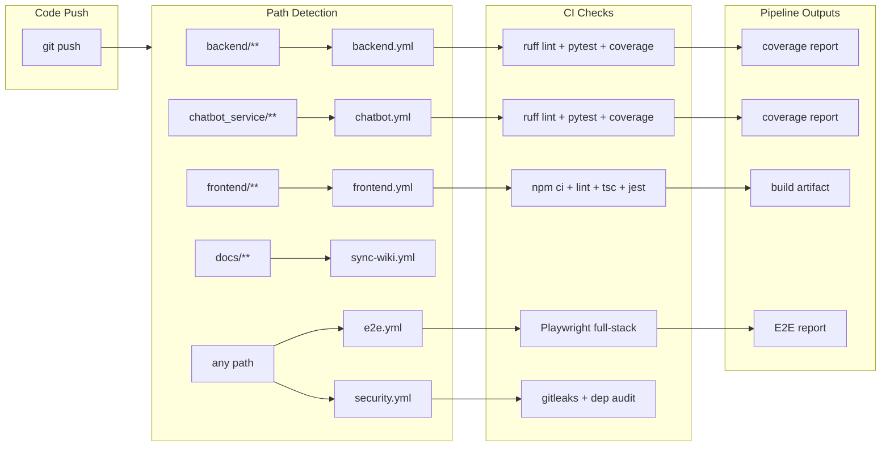
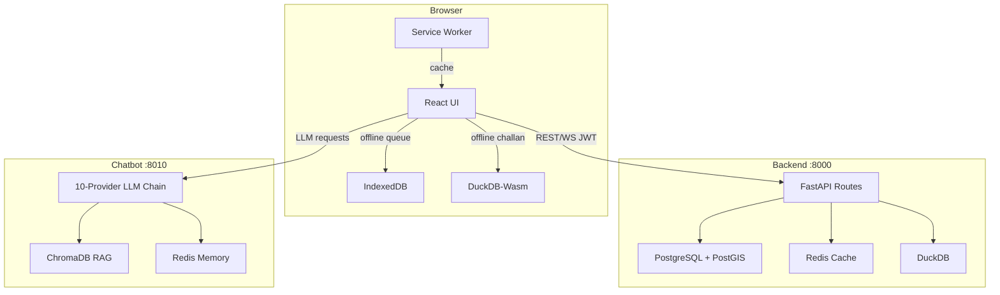
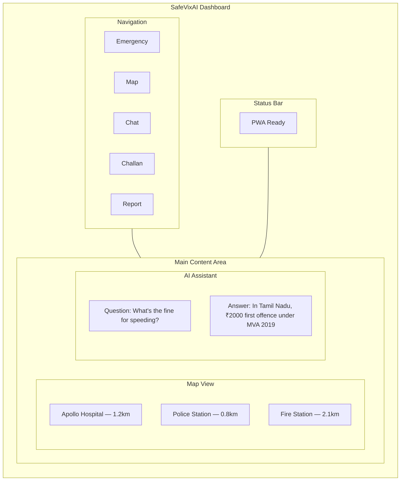

# SafeVixAI

<p align="center">
  <a href="LICENSE"></a>
  <a href="CODE_OF_CONDUCT.md"></a>
  <a href="https://github.com/SafeVixAI/SafeVixAI/issues"></a>
  <a href="https://github.com/SafeVixAI/SafeVixAI/stargazers"></a>
  <a href="https://github.com/SafeVixAI/SafeVixAI/releases"></a>
  <a href="https://github.com/SafeVixAI/SafeVixAI/actions/workflows/backend.yml"></a>
  <a href="https://github.com/SafeVixAI/SafeVixAI/security"></a>
  <a href="ROADMAP.md"></a>
  <a href="https://scorecard.dev/viewer/?uri=github.com/SafeVixAI/SafeVixAI"></a>
  <a href="https://github.com/SafeVixAI/SafeVixAI/actions/workflows/codeql.yml"></a>
  <a href="https://safevixai.github.io/SafeVixAI/"></a>
</p>

<p align="center">
  <strong>AI-powered road safety platform.</strong><br/>
  Emergency response · Traffic legal assistance · Road infrastructure reporting.<br/>
  Offline-first PWA with enterprise-grade security, resilience, and monitoring.<br/>
  Built for the IIT Madras Road Safety Hackathon 2026.
</p>

## CI/CD Pipeline



## Data Flow



## Vision

Every second counts in a road emergency. SafeVixAI puts life-saving information — nearest hospitals, traffic laws, first aid protocols — directly in the hands of citizens, officers, and first responders. Offline-first architecture ensures it works when networks fail. 10-provider LLM fallback ensures the AI never goes silent. Zero infrastructure cost — entirely free and open source.

| Metric | Value |
|--------|-------|
| Unit Tests | **7,687+ passing** — Frontend 2,956 / Backend 2,912 / Chatbot 1,819 |
| E2E Tests | 55/55 passing |
| LLM Providers | 10-provider fallback chain (+ Sarvam AI for Indian languages) |
| Services | 3 (frontend :3000, backend :8000, chatbot :8010) |
| Coverage | Backend 100% / Frontend 86% lines / Chatbot 97%+ |
| CI Workflows | 41 (security, load, chaos, E2E, migration, benchmark) |
| Lint Errors | 0 across all 3 services |
| License | MIT — free for all use |

---

## Screenshots

> Interactive demo: [safevixai.vercel.app](https://safevixai.vercel.app) — try the live app.



Key interfaces: **Emergency Locator** (geospatial hospital/police/fire search), **AI Chatbot** (traffic law + first aid + challan calculation), **Command Center** (real-time incident dashboard), **SOS** (hold-to-activate with WebSocket tracking), **Offline Mode** (PWA + DuckDB-Wasm + IndexedDB).

SafeVixAI is a three-service monorepo delivering real-time emergency response, AI-powered traffic legal assistance, and road infrastructure reporting through an offline-capable progressive web application.

| Module | Function | Offline |
|--------|----------|---------|
| Emergency Locator | Nearest hospital, police, ambulance via PostGIS geospatial queries | Yes — 25 Indian cities |
| AI Chatbot | Traffic law, challan calculation, first aid via agentic RAG with 10 LLM providers | Yes — Phi-3 Mini in-browser |
| Challan Calculator | Deterministic MVA 2019 fine calculation with 36 state/UT overrides | Yes — DuckDB-Wasm |
| Road Reporter | Submit pothole/damage reports with photo geotagging, routed to civic authorities | Yes — IndexedDB queue |
| SOS + Live Tracking | Hold-to-activate emergency alert with WebSocket-based family tracking | Yes — offline queue + flush |
| Command Center | Real-time agency dashboard with incident timeline, analytics, escalation | Dashboard (live data online) |

---

## Quick Start

### Prerequisites
- Python 3.11+
- Node.js 20+
- Git
- PostgreSQL 16 with PostGIS (optional — Supabase free tier works)
- Redis 7 (optional — in-memory fallback)

### 1. Clone & Setup Backend
```bash
git clone https://github.com/SafeVixAI/SafeVixAI.git
cd SafeVixAI/backend
python -m venv .venv
# Linux/Mac: source .venv/bin/activate
# Windows: .venv\Scripts\activate
pip install -r requirements.txt
cp .env.example .env
uvicorn main:app --reload --port 8000
```
Verify: `curl http://localhost:8000/health`

### 2. Setup Chatbot Service
```bash
cd ../chatbot_service
python -m venv .venv
source .venv/bin/activate
pip install -r requirements.txt
cp .env.example .env   # Add your LLM provider API keys
uvicorn main:app --reload --port 8010
```
Verify: `curl http://localhost:8010/health`

### 3. Setup Frontend
```bash
cd ../frontend
npm ci
cp .env.local.example .env.local   # Set API URLs
npm run dev
```
Open: `http://localhost:3000`

### Docker (Full Stack)
```bash
docker compose up --build   # Starts all 5 services
# postgres:5432  redis:6379  backend:8000  chatbot:8010  frontend:3000
```

### Configuration

| Service | Config File | Key Vars |
|---------|-------------|----------|
| Backend | `backend/.env` | `DATABASE_URL`, `REDIS_URL`, `OVERPASS_URLS`, `ADMIN_SECRET` |
| Chatbot | `chatbot_service/.env` | `DEFAULT_LLM_PROVIDER`, `DEFAULT_LLM_MODEL`, `CHROMA_PERSIST_DIR` |
| Frontend | `frontend/.env.local` | `NEXT_PUBLIC_BACKEND_URL`, `NEXT_PUBLIC_CHATBOT_URL` |

Full reference: [docs/Environment.md](docs/Environment.md), [docs/CONFIGURATION.md](docs/CONFIGURATION.md)

### CLI

```bash
# Health checks
curl http://localhost:8000/health
curl http://localhost:8010/health

# Database migrations
cd backend && alembic upgrade head

# Testing
cd backend && pytest tests/ -v --cov
cd frontend && npm test && npm run lint && npx tsc --noEmit

# Data pipeline
python backend/scripts/data/seed_violations.py
python chatbot_service/data/build_vectorstore.py
```

Full reference: [CLI_REFERENCE.md](CLI_REFERENCE.md)

---

## Architecture

```
┌─────────────────────────────────────────────────────────────┐
│  Frontend (Next.js 15 + React 19 + TypeScript PWA)         │
│  Port 3000 — MapLibre GL, WebLLM, DuckDB-Wasm, Zustand     │
└──────────────┬──────────────────────────┬───────────────────┘
               │ REST/WS (JWT Bearer)      │ REST (JWT Bearer)
┌──────────────▼─────────┐  ┌─────────────▼──────────────────┐
│  Backend (FastAPI)     │  │  Chatbot Service (FastAPI)     │
│  Port 8000             │  │  Port 8010                     │
│  PostgreSQL + PostGIS  │◄─┤  10-provider LLM fallback     │
│  Redis cache           │  │  ChromaDB RAG vector store     │
│  DuckDB (challan)      │  │  13 agent tools                │
│  Overpass/Nominatim    │  │  Redis conversation memory     │
│  WebSocket /tracking   │  │  Prompt injection defense      │
│  CQRS + Distributed    │  │  Speech translation            │
│  Locks + Idempotency   │  │  (14 Indian languages)         │
└────────────────────────┘  └────────────────────────────────┘
```

---

## Key Differentiators

### Enterprise-Grade Resilience
- **10-provider LLM fallback chain**: Groq → Cerebras → Gemini → GitHub Models → NVIDIA NIM → OpenRouter → Mistral → Together → Template (deterministic fallback) + Sarvam AI for Indian languages
- **Circuit breakers** on all 8 external API calls (3-failure threshold, 30s half-open)
- **Cache stampede protection** (SET NX EX mutex + stale-while-revalidate)
- **Redlock distributed locking** with in-memory fallback
- **CQRS event bus** for write-heavy operations
- **Idempotency keys** for critical POST endpoints

### Offline-First Architecture
- **PWA Service Worker** caches core assets for offline use
- **DuckDB-Wasm** runs SQL-based challan calculation entirely in-browser
- **IndexedDB** queues SOS alerts and road reports, auto-flushed on reconnect
- **WebLLM Phi-3 Mini** (2.2GB) downloadable for offline AI assistance
- **Offline-optimized maps** with pre-loaded GeoJSON for 25 Indian cities

### Security by Design
- **Blood group and emergency contacts** stored only in IndexedDB — never on server (privacy by architecture)
- **JWT RS256** authentication with JWKS atomic key fetching and rotation
- **CSRF tokens** on all state-changing requests
- **Content-Security-Policy**, HSTS, XFO, COOP, CORP, COEP headers
- **Prompt injection defense** — 12-pattern SafetyChecker on all LLM inputs
- **Host header validation**, rate limiting, CORS fail-fast in production
- **Gitleaks** pre-commit hook scanning for 18 custom provider patterns

### Observability
- **Structured JSON logging** with request_id, method, path, duration_ms
- **Prometheus metrics** per endpoint + Redis and Postgres exporters
- **Grafana dashboards** provisioned with resource, latency, error, saturation views
- **Email alerting** (SMTP with 5-min cooldown) for critical failures
- **Sentry** error tracking for frontend

### Supply Chain Security
- **SLSA Level 3** build provenance attestation per commit
- **Cosign** keyless container signing via GitHub OIDC
- **SBOM** generation (CycloneDX + SPDX) every build
- **Dependabot** weekly vulnerability scanning (pip ×2 + npm + actions)
- **OpenSSF Scorecard** passing
- **CodeQL** analysis on every push

---

## Project Structure

```
SafeVixAI/
├── backend/                FastAPI Python 3.11 — PostgreSQL/PostGIS, Redis, DuckDB
│   ├── api/v1/             25 route modules (28 files)
│   ├── core/               Config, security, caching, CQRS, Redlock, JWKS, idempotency
│   ├── services/           16 domain services + 10 civic_intel modules
│   ├── models/             20 SQLAlchemy ORM models + Pydantic schemas + value objects
│   └── migrations/         Alembic — 11 migration files
├── chatbot_service/        FastAPI — Agentic RAG, 10 LLM providers, ChromaDB
│   ├── agent/              ChatEngine, IntentDetector, SafetyChecker, ContextAssembler
│   ├── providers/          LLM routing, lang_detection, provider_registry (9 providers)
│   ├── rag/                ChromaDB vector store, retriever, LocalHashEmbeddingFunction
│   └── tools/              13 agent tools (SOS, Challan, Legal, FirstAid, Weather, etc.)
├── frontend/               Next.js 15 + React 19 + TypeScript PWA
│   ├── app/                28 routes with error boundaries + loading states
│   ├── components/         91 components across 13 domains (maps, chat, sos, etc.)
│   ├── lib/                28 modules — API client, Zustand state, offline AI, tracking
│   └── public/             manifest.json, icons (8 PWA sizes), offline data
├── docs/                   Full documentation site (MkDocs Material)
│   ├── adr/                12 Architecture Decision Records
│   ├── runbooks/           12+ incident response runbooks
│   ├── observability/      Monitoring configuration guides
│   └── wiki/               Auto-generated API documentation
├── monitoring/             Prometheus config + Grafana dashboards + alert rules
├── k8s/                    Kubernetes manifests (kustomize) + namespace + ingress
├── terraform/              AWS infrastructure (VPC, ECS, RDS, ElastiCache)
├── deploy/                 Deployment scripts and configurations
├── e2e/                    Playwright E2E tests (55 scenarios)
├── load-testing/           k6 load test scripts
├── scripts/                Data pipeline (DB seeders + standalone data fetchers)
└── .github/                41 CI/CD workflows
```

---

## Documentation

### Governance & Community
| Document | Description |
|----------|-------------|
| [CONTRIBUTING.md](CONTRIBUTING.md) | How to contribute — workflow, coding standards, PR process |
| [CODE_OF_CONDUCT.md](CODE_OF_CONDUCT.md) | Contributor Covenant v2.1 |
| [GOVERNANCE.md](GOVERNANCE.md) | Project governance, decision-making, release process |
| [MAINTAINERS.md](MAINTAINERS.md) | Current maintainers and contributor ladder |
| [SECURITY.md](SECURITY.md) | Vulnerability reporting, disclosure policy, security features |
| [SUPPORT.md](SUPPORT.md) | Support channels and response times |
| [ADOPTERS.md](ADOPTERS.md) | Organizations using SafeVixAI in production |
| [FAQ.md](FAQ.md) | Frequently asked questions |

### Technical Reference
| Document | Description |
|----------|-------------|
| [docs/Architecture.md](docs/Architecture.md) | System architecture, data flows, service design |
| [docs/API.md](docs/API.md) | Complete API reference with request/response examples |
| [docs/Database.md](docs/Database.md) | Database schema, PostGIS design, migration history |
| [docs/Deployment.md](docs/Deployment.md) | Deploy to Vercel, Render, Docker, Kubernetes |
| [docs/SETUP.md](docs/SETUP.md) | Detailed local setup guide |
| [docs/TechStack.md](docs/TechStack.md) | Technology choices and rationale |
| [docs/AI.md](docs/AI.md) | Chatbot architecture, 10-provider chain, safety system |
| [docs/MEMORY.md](docs/MEMORY.md) | Conversation memory architecture (IndexedDB, Zustand, Redis) |
| [docs/RAG.md](docs/RAG.md) | ChromaDB with LocalHashEmbeddingFunction |
| [docs/SDK_GUIDE.md](docs/SDK_GUIDE.md) | API integration, SDK usage, auth, rate limits |
| [docs/ERROR_CODES.md](docs/ERROR_CODES.md) | Complete error code reference |
| [docs/PRIVACY.md](docs/PRIVACY.md) | GDPR/DPDP compliance, data collection, privacy architecture |
| [BENCHMARKS.md](BENCHMARKS.md) | Performance benchmarks and k6 load testing |
| [TESTING.md](TESTING.md) | Testing standards and coverage across all services |

### Operations & Quality
| Document | Description |
|----------|-------------|
| [OPERATIONS.md](OPERATIONS.md) | Day-to-day operations, deployment, scaling |
| [MONITORING.md](MONITORING.md) | Metrics, dashboards, uptime monitoring |
| [OBSERVABILITY.md](OBSERVABILITY.md) | Logging, metrics, traces, alerting |
| [RUNBOOKS.md](RUNBOOKS.md) | Incident response runbooks |
| [docs/STARTER_GUIDE.md](docs/STARTER_GUIDE.md) | Getting started for absolute beginners |
| [docs/ADVANCED_SETUP.md](docs/ADVANCED_SETUP.md) | Production deployment, HA, multi-region, SSL, CDN |
| [docs/SCALING_GUIDE.md](docs/SCALING_GUIDE.md) | Horizontal scaling, caching, CQRS, replication |
| [docs/MONITORING_SETUP.md](docs/MONITORING_SETUP.md) | Prometheus, Grafana, Loki, alerting setup |
| [docs/BEST_PRACTICES.md](docs/BEST_PRACTICES.md) | API design, database, security, testing best practices |
| [docs/DEPLOYMENT_STRATEGIES.md](docs/DEPLOYMENT_STRATEGIES.md) | Blue-green, canary, rolling updates |
| [docs/PERFORMANCE_BENCHMARKS.md](docs/PERFORMANCE_BENCHMARKS.md) | Latency, throughput, and resource benchmarks |
| [docs/MIGRATION_GUIDE.md](docs/MIGRATION_GUIDE.md) | Version migration paths and procedures |
| [docs/UPGRADE_GUIDE.md](docs/UPGRADE_GUIDE.md) | Step-by-step upgrade instructions |
| [docs/TROUBLESHOOTING.md](docs/TROUBLESHOOTING.md) | Common issues and resolutions (not created yet) |
| [docs/TESTING_POLICY.md](docs/TESTING_POLICY.md) | Testing standards, coverage targets, CI integration |
| [docs/ERROR_CODE_REFERENCE.md](docs/ERROR_CODE_REFERENCE.md) | Complete error codes organized by domain |

### Examples
| Document | Description |
|----------|-------------|
| [examples/README.md](examples/README.md) | Example code and integration patterns |
| [examples/api-client/](examples/api-client/) | Python and TypeScript API client examples |
| [examples/emergency/](examples/emergency/) | Emergency locator and SOS integration |
| [examples/challan/](examples/challan/) | Challan calculation examples |
| [examples/chatbot/](examples/chatbot/) | Chatbot API integration patterns |
| [examples/cookbook/](examples/cookbook/) | Recipe-based integration cookbook |

### Development
| Document | Description |
|----------|-------------|
| [STYLE_GUIDE.md](STYLE_GUIDE.md) | Coding standards for Python, TypeScript, testing |
| [VERSIONING.md](VERSIONING.md) | Semantic versioning policy and lifecycle |
| [docs/INTEGRATION_GUIDE.md](docs/INTEGRATION_GUIDE.md) | Third-party integration, auth, SDK, webhooks |
| [docs/PLUGIN_SYSTEM.md](docs/PLUGIN_SYSTEM.md) | Plugin architecture and development guide |
| [docs/WEBHOOKS.md](docs/WEBHOOKS.md) | Webhook events, payloads, security |
| [docs/INTERNATIONALIZATION.md](docs/INTERNATIONALIZATION.md) | i18n guide for 14 Indian languages |
| [docs/CONTRIBUTORS_GUIDE.md](docs/CONTRIBUTORS_GUIDE.md) | Detailed contributor workflow |
| [docs/CODE_REVIEW_GUIDE.md](docs/CODE_REVIEW_GUIDE.md) | Code review process and checklist |
| [docs/DOCKER_COMPOSE_GUIDE.md](docs/DOCKER_COMPOSE_GUIDE.md) | Docker Compose for development and production |

### Runbooks
| Document | Description |
|----------|-------------|
| [docs/runbooks/all-llms-down.md](docs/runbooks/all-llms-down.md) | All LLM providers failed |
| [docs/runbooks/db-down.md](docs/runbooks/db-down.md) | Database outage |
| [docs/runbooks/redis-down.md](docs/runbooks/redis-down.md) | Redis cache outage |
| [docs/runbooks/service-restart.md](docs/runbooks/service-restart.md) | Service restart procedures |
| [docs/runbooks/high-error-rate.md](docs/runbooks/high-error-rate.md) | Elevated error rate response |
| [docs/runbooks/oom-kill-response.md](docs/runbooks/oom-kill-response.md) | Out-of-memory kill handling |
| [docs/runbooks/db-migration-rollback.md](docs/runbooks/db-migration-rollback.md) | Database migration rollback |
| [docs/runbooks/deployment-rollback.md](docs/runbooks/deployment-rollback.md) | Deployment rollback procedures |
| [docs/runbooks/api-key-rotation.md](docs/runbooks/api-key-rotation.md) | API key rotation |

---

## Data Intelligence

The SafeVixAI intelligence layer — pre-trained models, road damage datasets, and legal archives — is hosted on the Hugging Face Dataset Hub.

**[SafeVixAI Dataset Hub](https://huggingface.co/datasets/SafeVixAI/SafeVixAI-Dataset-Hub)**

Research notebooks (Colab-ready, free T4 GPU):
1. **YOLOv8 Pothole Detection** — ONNX road damage model training
2. **ChromaDB RAG Build** — Vector store for legal document retrieval
3. **Accident EDA & Hotspot Generator** — Blackspot seed CSV + heatmap
4. **Roads Data Processing** — PMGSY GeoJSON sampling
5. **Risk Model ONNX Training** — Risk scoring model

---

## Tech Stack

| Layer | Technologies |
|-------|-------------|
| Backend | FastAPI, SQLAlchemy (async), PostGIS, Redis (hiredis), DuckDB, Overpass/Nominatim |
| Chatbot | FastAPI, ChromaDB, 10 LLM providers (Groq, Gemini, Sarvam AI, Cerebras, etc.) |
| Frontend | Next.js 15, React 19, TypeScript 5, Tailwind CSS 3, MapLibre GL, WebLLM, DuckDB-Wasm |
| Infrastructure | Docker Compose, Kubernetes (kustomize), Terraform (AWS), Vercel, Render |
| Monitoring | Prometheus, Grafana, Sentry, structured JSON logging |
| CI/CD | GitHub Actions (41 workflows) |

---

## Testing

| Layer | Framework | Tests | Coverage |
|-------|-----------|-------|----------|
| Backend | pytest + hypothesis + testcontainers | 2,912 | 100% lines, 100% branches |
| Chatbot | pytest + pytest-httpx + ChromaDB integration | 1,819 | 97%+ lines |
| Frontend | Jest + React Testing Library + jest-axe | 2,956 | 86% lines, 72% branches |
| E2E | Playwright | 55 | — |
| Mutation | mutmut (backend) | — | CI (informational) |

**Run locally:**
```bash
# Backend
cd backend && pytest tests/ -v --cov

# Chatbot
cd chatbot_service && pytest tests/ -v --cov

# Frontend
cd frontend && npm test && npm run lint && npx tsc --noEmit
```

---

## FAQ

| Question | Answer |
|----------|--------|
| **Does it work offline?** | Yes. Critical features (SOS, challan calculation, first aid, emergency data) work offline via PWA service worker, DuckDB-Wasm, and IndexedDB queues. |
| **How much does it cost?** | Zero. All services use free tiers (Vercel, Render, Supabase, Upstash). Total infrastructure cost: ₹0. |
| **Is my data private?** | Blood group and emergency contacts are stored only on your device (IndexedDB). Location data is used only for requested services. See [PRIVACY.md](PRIVACY.md). |
| **Which Indian languages are supported?** | 14 languages via Sarvam AI + browser SpeechRecognition. |
| **Is this a real emergency service?** | No. Always call **112** in life-threatening situations. SafeVixAI is an informational aid, not a replacement for professional responders. |
| **Can I self-host?** | Yes. Docker Compose runs the full stack locally. See [docs/Deployment.md](docs/Deployment.md). |
| **What's the test coverage?** | Backend: 100% lines/branches. Frontend: 86% lines. Chatbot: 97%+. ~7,687 unit tests + 55 E2E. |
| **How do I report a bug?** | Open a [GitHub Issue](https://github.com/SafeVixAI/SafeVixAI/issues). |
| **How do I report a security issue?** | Email **security@safevixai.gov.in**. See [SECURITY.md](SECURITY.md). |

Full FAQ: [FAQ.md](FAQ.md)

## Troubleshooting

| Symptom | Likely Cause | Fix |
|---------|-------------|-----|
| Backend won't start | Database not running | Start PostgreSQL or check `DATABASE_URL` in `backend/.env` |
| Chatbot returns errors | Missing API key | Add `GROQ_API_KEY` or `GEMINI_API_KEY` in `chatbot_service/.env` |
| Frontend can't connect | Backend not running | Start backend: `cd backend && uvicorn main:app --reload --port 8000` |
| PWA not installing | Running in dev mode | Use `npm run build && npm start` for service worker |
| SOS doesn't trigger offline | IndexedDB blocked | Check browser storage permissions; verify offline queue in DevTools > Application > IndexedDB |
| LLM always falls back to template | All provider keys invalid | Check `chatbot_service/.env` for correct API keys |
| Docker build fails | Port conflict or ARM64 issue | Check `docker ps` for port conflicts; use `DOCKER_DEFAULT_PLATFORM=linux/amd64` on Apple Silicon |

Full troubleshooting: [TROUBLESHOOTING.md](TROUBLESHOOTING.md)

---

We welcome contributions of all sizes.

- Report bugs: [GitHub Issues](https://github.com/SafeVixAI/SafeVixAI/issues)
- Feature requests: [Feature Request Template](.github/ISSUE_TEMPLATE/feature_request.yml)
- Security vulnerabilities: [SECURITY.md](SECURITY.md)
- Governance: [GOVERNANCE.md](GOVERNANCE.md)
- Roadmap: [ROADMAP.md](ROADMAP.md)
- Support: [SUPPORT.md](SUPPORT.md)
- All contributions under [MIT License](LICENSE)

---

## Community

- **GitHub Discussions**: [github.com/SafeVixAI/SafeVixAI/discussions](https://github.com/SafeVixAI/SafeVixAI/discussions) — ask questions, share ideas
- **Issue Tracker**: [github.com/SafeVixAI/SafeVixAI/issues](https://github.com/SafeVixAI/SafeVixAI/issues) — report bugs, request features
- **Documentation**: [safevixai.github.io/SafeVixAI/](https://safevixai.github.io/SafeVixAI/) — full MkDocs site
- **Governance**: [GOVERNANCE.md](GOVERNANCE.md) — project structure, decision-making, maintainer ladder
- **Roadmap**: [ROADMAP.md](ROADMAP.md) — planned features and priorities
- **Adopters**: [ADOPTERS.md](ADOPTERS.md) — organizations using SafeVixAI in production
- **Support**: [SUPPORT.md](SUPPORT.md) — all support channels and response times

## Contributing

We welcome contributions of all sizes — code, docs, tests, bug reports, feature ideas.

1. **Read the docs**: [CONTRIBUTING.md](CONTRIBUTING.md), [STYLE_GUIDE.md](STYLE_GUIDE.md), [CODE_OF_CONDUCT.md](CODE_OF_CONDUCT.md)
2. **Pick an issue**: [Good First Issues](https://github.com/SafeVixAI/SafeVixAI/issues?q=is%3Aissue+is%3Aopen+label%3A%22good+first+issue%22)
3. **Fork & branch**: `git checkout -b feat/your-feature`
4. **Code**: Follow existing patterns. Run tests. Keep coverage.
5. **PR**: Open against `main`. CI checks lint, tests, coverage, build.
6. **Review**: All PRs reviewed by at least one maintainer.

See [CONTRIBUTING.md](CONTRIBUTING.md) for detailed workflow, [CODE_OF_CONDUCT.md](CODE_OF_CONDUCT.md) for community standards.

## License

MIT License — see [LICENSE](LICENSE) for details.

<p align="center">
  <sub>Built with ❤️ for the IIT Madras Road Safety Hackathon 2026 · Centre of Excellence for Road Safety (CoERS)</sub>
</p>
