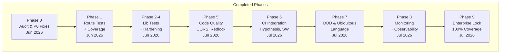
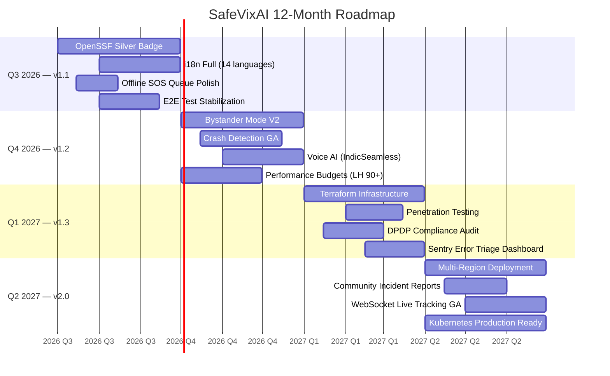

# SafeVixAI Roadmap

> **Last updated:** 2026-07-29

## Completed Phases

## 12-Month Roadmap

---

## Completed (Initial Release)

- **Phase 1-6:** All core features built and hardened — see [`docs/Roadmap.md`](docs/Roadmap.md) for full build history.
- **25/25 Features:** Emergency Locator, AI Chatbot RAG, Challan Calculator, Road Reporter, Offline Mode, PWA, Voice/ASR, Live Tracking, and more.
- **OpenSSF Best Practices Badge:** Passing tier achieved (Silver in progress).

---

## Next 12 Months (2026 Q3 - 2027 Q2)

### Q3 2026 (Jul-Sep)
| Milestone | Details |
|-----------|---------|
| v1.1 Release | Bug fixes, performance improvements, accessibility audit |
| OpenSSF Silver Badge | Complete all Silver criteria: threat model, security requirements, 80% coverage |
| Accessibility Pass | WCAG 2.1 AA compliance audit and fixes |
| i18n Expansion | Add Tamil, Hindi, Telugu UI translations (beyond existing speech support) |
| Load Testing Results | Publish k6 benchmarks and capacity planning guide |

### Q4 2026 (Oct-Dec)
| Milestone | Details |
|-----------|---------|
| v1.2 Release | New features from community feedback |
| OpenSSF Gold Badge | Complete reproducible builds, branch coverage >=80%, CI integration |
| Crash Detection Refinement | Accelerometer-based detection with fewer false positives |
| Bystander Mode V2 | Real-time incident sharing, witness coordination |
| Offline AI v2 | WebLLM model quantization for faster local inference |

### Q1 2027 (Jan-Mar)
| Milestone | Details |
|-----------|---------|
| v1.3 Release | Enterprise features, API stability guarantee |
| Terraform GA | Infrastructure-as-Code for production AWS deployment |
| Penetration Test | Third-party security audit |
| Performance Budget | Lighthouse scores >=90 across all categories |

### Q2 2027 (Apr-Jun)
| Milestone | Details |
|-----------|---------|
| v2.0 Release | Major release with breaking API changes if needed |
| Multi-Region Support | EU data residency option for GDPR compliance |
| Community Growth | 20+ external contributors, 500+ GitHub stars |
| Sustainability Report | Infra cost analysis, funding strategy, grant applications |

---

## How to Contribute

See [`CONTRIBUTING.md`](CONTRIBUTING.md) for contribution guidelines and [`TESTING_POLICY.md`](TESTING_POLICY.md) for test requirements.

---

## Feature Requests

Submit feature requests via [GitHub Issues](https://github.com/SafeVixAI/SafeVixAI/issues/new/choose) using the feature request template.
