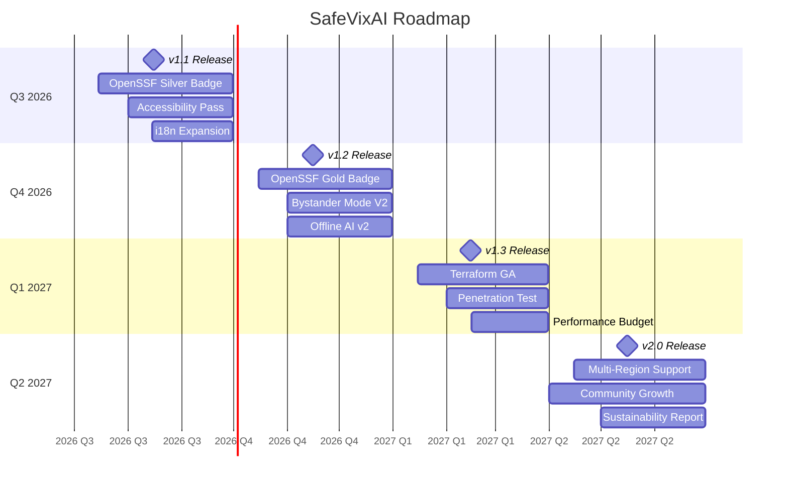

# SafeVixAI Roadmap

> **Last updated:** 2026-06-17

---

## Completed (Initial Release)

- **Phase 1-6:** All core features built and hardened — see [`docs/Roadmap.md`](docs/Roadmap.md) for full build history.
- **25/25 Features:** Emergency Locator, AI Chatbot RAG, Challan Calculator, Road Reporter, Offline Mode, PWA, Voice/ASR, Live Tracking, and more.
- **OpenSSF Best Practices Badge:** Passing tier achieved (Silver in progress).

---

## Next 12 Months (2026 Q3 – 2027 Q2)

---

## How to Contribute

See [`CONTRIBUTING.md`](CONTRIBUTING.md) for contribution guidelines and [`TESTING_POLICY.md`](TESTING_POLICY.md) for test requirements.

---

## Feature Requests

Submit feature requests via [GitHub Issues](https://github.com/SafeVixAI/SafeVixAI/issues/new/choose) using the feature request template.
