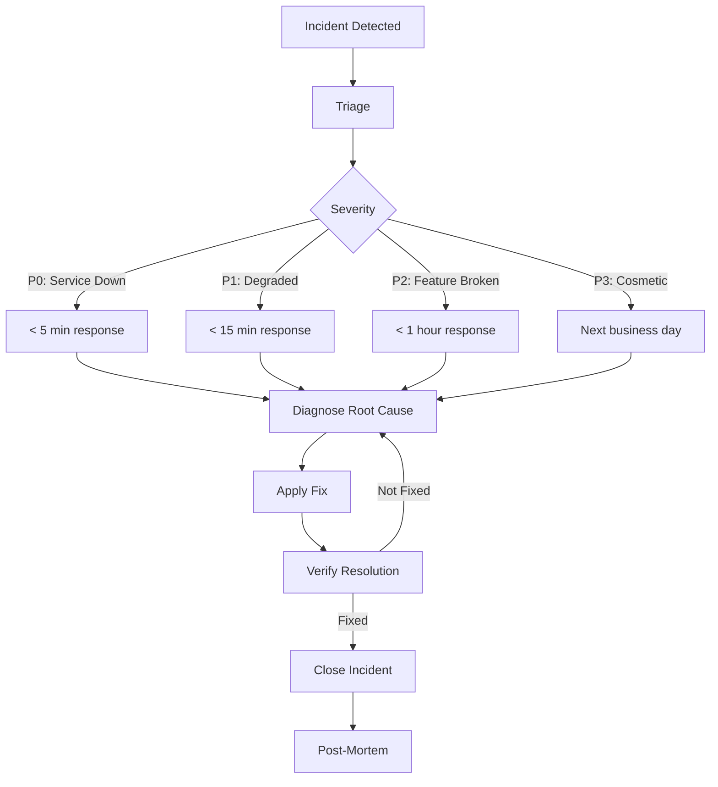
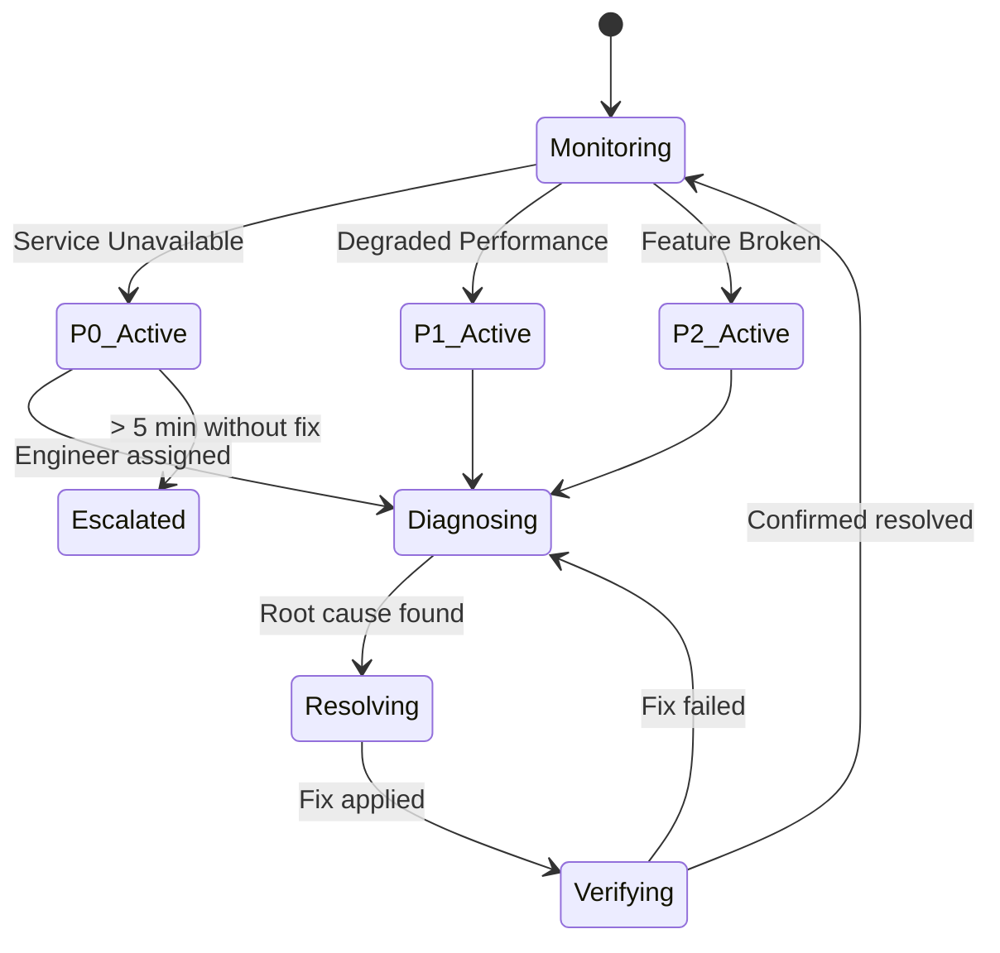

# Runbooks

> **Incident response and operational runbooks for SafeVixAI services.**

Comprehensive runbooks covering common failure scenarios, recovery procedures, and operational tasks.

---

## Quick Links

| Runbook | Description |
|---------|-------------|
| [All LLMs Down](docs/runbooks/all-llms-down.md) | All 9 LLM providers failed |
| [Database Down](docs/runbooks/db-down.md) | PostgreSQL/PostGIS outage |
| [Redis Down](docs/runbooks/redis-down.md) | Redis cache outage |
| [Redis Recovery](docs/runbooks/redis-recovery.md) | Restoring Redis from persistence |
| [Service Restart](docs/runbooks/service-restart.md) | Graceful service restart |
| [High Error Rate](docs/runbooks/high-error-rate.md) | Elevated error rate response |
| [OOM Kill](docs/runbooks/oom-kill-response.md) | Out-of-memory kill handling |
| [DB Migration Rollback](docs/runbooks/db-migration-rollback.md) | Reverting schema migrations |
| [Deployment Rollback](docs/runbooks/deployment-rollback.md) | Rolling back a deployment |
| [API Key Rotation](docs/runbooks/api-key-rotation.md) | Rotating API keys |
| [ChromaDB Rebuild](docs/runbooks/chromadb-rebuild.md) | Rebuilding vector store |
| [Disaster Recovery](docs/runbooks/disaster-recovery.md) | Full disaster recovery plan |
| [Smoke Tests](docs/runbooks/smoke-tests.md) | Post-deployment verification |
| [Monitoring Setup](docs/runbooks/monitoring-setup.md) | Configuring monitoring stack |
| [LLM Outage RB-001](docs/runbooks/RB-001-llm-outage.md) | LLM provider chain failure |
| [DB Failover RB-002](docs/runbooks/RB-002-db-failover.md) | Database failover procedure |
| [Rollback RB-005](docs/runbooks/RB-005-rollback.md) | Standard rollback procedure |

---

## Incident Response Flow

## Severity State Diagram

## Runbook Template

Each runbook follows the same format:

1. **Symptoms** — How to detect this incident
2. **Severity** — P0/P1/P2 classification
3. **Immediate Actions** — First 5-minute response
4. **Diagnosis Steps** — How to identify root cause
5. **Resolution Steps** — How to fix
6. **Verification** — How to confirm resolution
7. **Post-Mortem** — What to document after

---

## Incident Severity Levels

| Level | Definition | Response Time |
|-------|------------|---------------|
| P0 | Service unavailable / data loss | < 5 min |
| P1 | Degraded performance | < 15 min |
| P2 | Non-critical feature broken | < 1 hour |
| P3 | Cosmetic / non-urgent | Next business day |

---

## Related

- [`OPERATIONS.md`](OPERATIONS.md) — deployment, scaling
- [`OBSERVABILITY.md`](OBSERVABILITY.md) — monitoring, alerting
- [`MONITORING.md`](MONITORING.md) — dashboard setup
