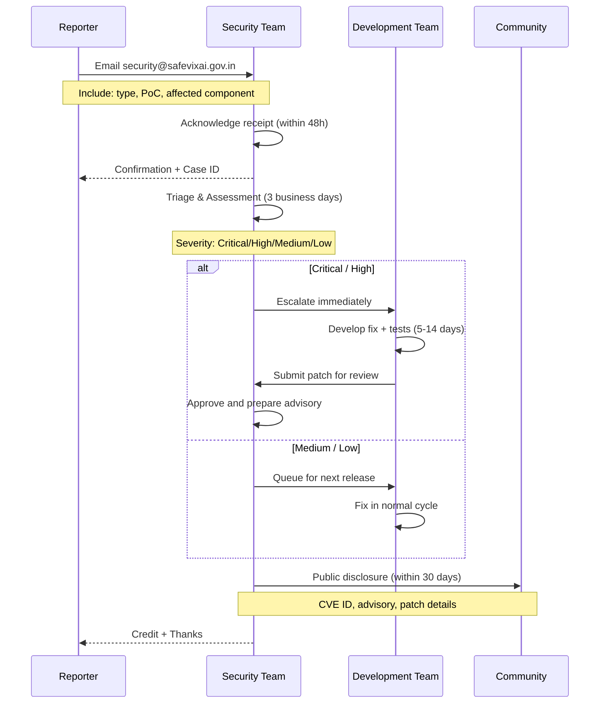

# Security Policy

## Security Architecture

```mermaid
flowchart TD
    subgraph Transport["Transport Layer"]
        T1[HTTPS / TLS 1.3<br/>All communications]
        T2[HSTS Preload<br/>HTTP Strict Transport Security]
        T3[CSP Headers<br/>Content Security Policy]
    end

    subgraph Auth["Authentication Layer"]
        A1[JWT RS256 + HS256<br/>Dual-key system]
        A2[JWKS Key Rotation<br/>24h grace period]
        A3[Guest UUID v4<br/>7 day TTL]
        A4[Internal API Keys<br/>Constant-time comparison]
    end

    subgraph API_Security["API Security Layer"]
        S1[Rate Limiting<br/>TokenBucket per IP]
        S2[CORS Validation<br/>Restricted origins]
        S3[Host Header Validation<br/>Prevent host injection]
        S4[CSRF Tokens<br/>State-changing requests]
        S5[Request ID Tracking<br/>Full audit trail]
    end

    subgraph Data["Data Protection Layer"]
        D1[IndexedDB Only<br/>Blood group, contacts]
        D2[TLS for Redis<br/>rediss:// protocol]
        D3[Secrets in .env<br/>gitignored, CI secrets]
        D4[Data Retention Scheduler<br/>Auto-purge old records]
    end

    subgraph LLM["LLM Security Layer"]
        L1[SafetyChecker<br/>Prompt injection guard]
        L2[Harmful Output Filter<br/>"Call 112" enforcement]
        L3[9-Provider Fallback<br/>No single point of failure]
        L4[PII Redaction<br/>Before LLM context]
    end

    Transport --> Auth
    Auth --> API_Security
    API_Security --> Data
    Data --> LLM
```

## Vulnerability Disclosure Workflow



## Supported Versions

| Version | Supported |
|---------|-----------|
| 1.0.x (current) | Security patches |
| < 1.0 (pre-release) | No support |

## Reporting a Vulnerability

**DO NOT file a public GitHub issue for security vulnerabilities.**

Report vulnerabilities to **security@safevixai.gov.in**.

You should receive an acknowledgment within 48 hours. We will work with you to understand the scope, develop a fix, and coordinate disclosure.

### What to include

- Type of issue (XSS, SQLi, RCE, privilege escalation, etc.)
- Full reproduction steps or proof of concept
- Affected component (backend, chatbot, frontend)
- Suggested fix (if available)

### Disclosure Timeline

| Phase | Duration |
|-------|----------|
| Acknowledgment | Within 48 hours |
| Triage & Assessment | 3 business days |
| Fix & Testing | 5-14 business days (depends on severity) |
| Public Disclosure | After fix is released |

We aim to disclose vulnerabilities within 30 days of receiving the report.

## Security Features

### Authentication
- JWT-based authentication (RS256) with JWKS rotation
- Auth tokens never passed in URLs
- Session tokens with configurable TTL

### Data Protection
- Blood group and emergency contacts stored only in IndexedDB (never on server)
- All API traffic over HTTPS/TLS
- Redis connections support TLS (`rediss://`)
- Secrets managed via environment variables (gitignored)

### API Security
- Rate limiting on all endpoints
- CORS restricted to known origins
- Host header validation
- Content-Security-Policy headers
- Request ID tracking for audit trails

### LLM Security
- Prompt injection defense via SafetyChecker
- All LLM output validated for harmful content
- 9-provider fallback chain prevents single-point failure

## Bug Bounty

This project operates on a **responsible disclosure** basis - no bug bounty program is currently offered.

## Contact

- **Security issues:** security@safevixai.gov.in
- **General inquiries:** safevixai@googlegroups.com

## Related

- [docs/SECURITY.md](SECURITY.md) — Security features and hardening
- [docs/AUTHENTICATION.md](docs/architecture/AUTHENTICATION.md) — Auth flows and JWT validation
- [docs/AUTHORIZATION.md](docs/architecture/AUTHORIZATION.md) — RBAC and permission model
- [docs/THREAT_MODEL.md](docs/architecture/THREAT_MODEL.md) — Threat modeling and risk assessment
