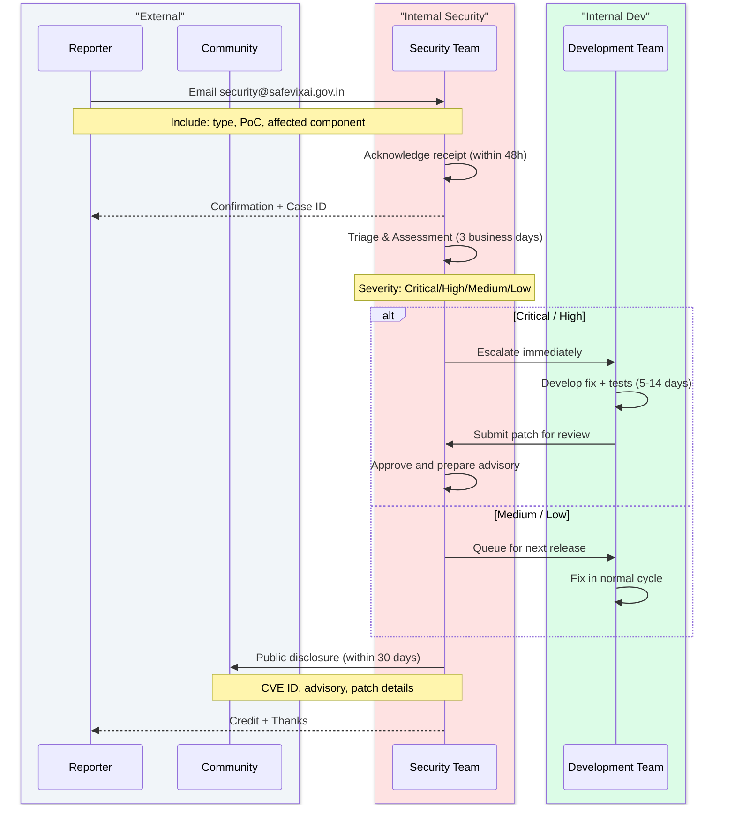

# Security Policy

## Security Architecture

```mermaid
flowchart TD
    subgraph Transport["Transport Layer"]
        T1["HTTPS / TLS 1.3\nAll communications"]
        T2["HSTS Preload\nHTTP Strict Transport Security"]
        T3["CSP Headers\nContent Security Policy"]
    end

    subgraph Auth["Authentication Layer"]
        A1["JWT RS256 + HS256\nDual-key system"]
        A2["JWKS Key Rotation\n24h grace period"]
        A3["Guest UUID v4\n7 day TTL"]
        A4["Internal API Keys\nConstant-time comparison"]
    end

    subgraph API_Security["API Security Layer"]
        S1["Rate Limiting\nTokenBucket per IP"]
        S2["CORS Validation\nRestricted origins"]
        S3["Host Header Validation\nPrevent host injection"]
        S4["CSRF Tokens\nState-changing requests"]
        S5["Request ID Tracking\nFull audit trail"]
    end

    subgraph Data["Data Protection Layer"]
        D1["IndexedDB Only\nBlood group, contacts"]
        D2["TLS for Redis\nrediss:// protocol"]
        D3["Secrets in .env\ngitignored, CI secrets"]
        D4["Data Retention Scheduler\nAuto-purge old records"]
    end

    subgraph LLM["LLM Security Layer"]
        L1["SafetyChecker\nPrompt injection guard"]
        L2["Harmful Output Filter\n'Call 112' enforcement"]
        L3["9-Provider Fallback\nNo single point of failure"]
        L4["PII Redaction\nBefore LLM context"]
    end

    Transport --> Auth
    Auth --> API_Security
    API_Security --> Data
    Data --> LLM

    classDef transport fill:#f1f5f9,stroke:#94a3b8,stroke-width:2px,color:#334155
    classDef auth fill:#dbeafe,stroke:#3b82f6,stroke-width:2px,color:#1e3a5f
    classDef api fill:#dcfce7,stroke:#22c55e,stroke-width:2px,color:#14532d
    classDef data fill:#fef3c7,stroke:#f59e0b,stroke-width:2px,color:#78350f
    classDef llm fill:#f3e8ff,stroke:#a855f7,stroke-width:2px,color:#581c87

    class T1,T2,T3 transport
    class A1,A2,A3,A4 auth
    class S1,S2,S3,S4,S5 api
    class D1,D2,D3,D4 data
    class L1,L2,L3,L4 llm
```

## Vulnerability Disclosure Workflow

## Supported Versions

| Version | Supported |
|---------|-----------|
| 1.0.x (current) | Security patches |
| < 1.0 (pre-release) | No support |

## Reporting a Vulnerability

**DO NOT file a public GitHub issue for security vulnerabilities.**

Report vulnerabilities to **security@safevixai.gov.in**.

You should receive an acknowledgment within 48 hours. We will work with you to understand the scope, develop a fix, and coordinate disclosure.

### What to include

- Type of issue (XSS, SQLi, RCE, privilege escalation, etc.)
- Full reproduction steps or proof of concept
- Affected component (backend, chatbot, frontend)
- Suggested fix (if available)

### Disclosure Timeline

| Phase | Duration |
|-------|----------|
| Acknowledgment | Within 48 hours |
| Triage & Assessment | 3 business days |
| Fix & Testing | 5-14 business days (depends on severity) |
| Public Disclosure | After fix is released |

We aim to disclose vulnerabilities within 30 days of receiving the report.

## Security Features

### Authentication
- JWT-based authentication (RS256) with JWKS rotation
- Auth tokens never passed in URLs
- Session tokens with configurable TTL

### Data Protection
- Blood group and emergency contacts stored only in IndexedDB (never on server)
- All API traffic over HTTPS/TLS
- Redis connections support TLS (`rediss://`)
- Secrets managed via environment variables (gitignored)

### API Security
- Rate limiting on all endpoints
- CORS restricted to known origins
- Host header validation
- Content-Security-Policy headers
- Request ID tracking for audit trails

### LLM Security
- Prompt injection defense via SafetyChecker
- All LLM output validated for harmful content
- 9-provider fallback chain prevents single-point failure

## Bug Bounty

This project operates on a **responsible disclosure** basis - no bug bounty program is currently offered.

## Contact

- **Security issues:** security@safevixai.gov.in
- **General inquiries:** safevixai@googlegroups.com

## Related

- [docs/SECURITY.md](SECURITY.md) — Security features and hardening
- [docs/AUTHENTICATION.md](docs/architecture/AUTHENTICATION.md) — Auth flows and JWT validation
- [docs/AUTHORIZATION.md](docs/architecture/AUTHORIZATION.md) — RBAC and permission model
- [docs/THREAT_MODEL.md](docs/architecture/THREAT_MODEL.md) — Threat modeling and risk assessment
