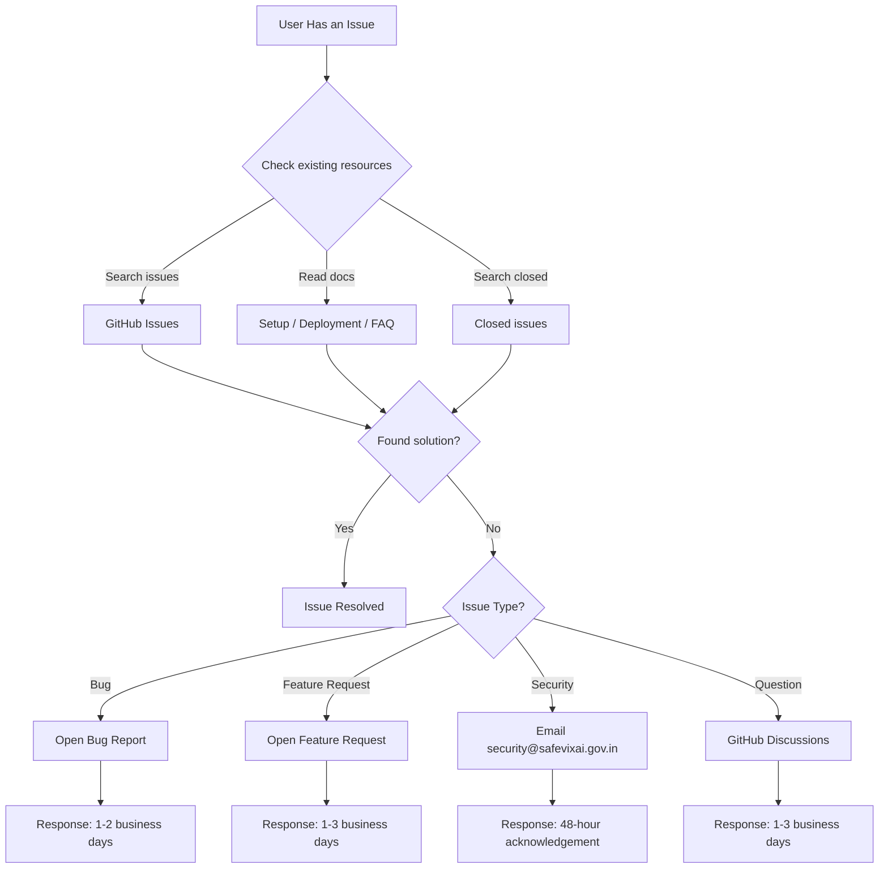

# SafeVixAI Support

## Support Workflow

## Community Support (Free)

| Channel | Where | Typical Response Time |
|---------|-------|----------------------|
| GitHub Issues | [github.com/SafeVixAI/SafeVixAI/issues](https://github.com/SafeVixAI/SafeVixAI/issues) | 1-2 business days |
| GitHub Discussions | [github.com/SafeVixAI/SafeVixAI/discussions](https://github.com/SafeVixAI/SafeVixAI/discussions) | 1-3 business days |

## Security Issues

Do **not** open a public GitHub issue. See [SECURITY.md](SECURITY.md) for responsible disclosure.

**Contact:** `safevixai@googlegroups.com` — 48-hour acknowledgement SLA.

## Bug Reports

1. Search [existing issues](https://github.com/SafeVixAI/SafeVixAI/issues) first
2. Use the bug report template (`ISSUE_TEMPLATE/bug_report.md`)
3. Include: environment, steps to reproduce, expected vs actual behavior, logs/screenshots

## Feature Requests

1. Search [existing issues](https://github.com/SafeVixAI/SafeVixAI/issues) first
2. Use the feature request template (`ISSUE_TEMPLATE/feature_request.md`)
3. Describe the problem, proposed solution, and alternatives considered

## Before Asking

- Read [SETUP.md](docs/developer-guide/SETUP.md) for installation issues
- Read [docs/Deployment.md](docs/developer-guide/chatbot/deployment.md) for deployment issues
- Check [docs/TechStack.md](docs/architecture/TechStack.md) for version compatibility
- Search closed issues for solutions

## Service Status

- Frontend: [safevixai.vercel.app](https://safevixai.vercel.app)
- Backend API: [safevixai-api.onrender.com/docs](https://safevixai-api.onrender.com/docs)
- Status page: TBD
