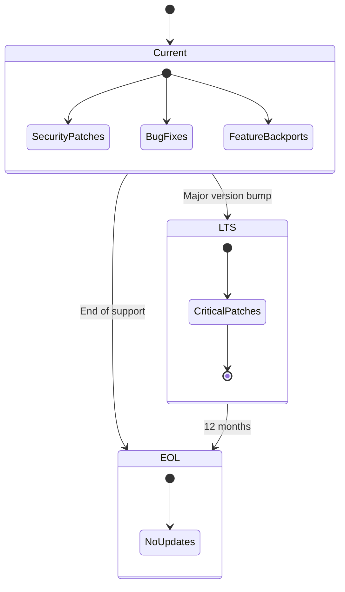

# Supported Versions

> **Last updated:** 2026-07-26

| Version | Status | Security Patches | Bug Fixes | Features |
|---------|--------|-----------------|-----------|----------|
| 1.0.x | ✅ Current (Full Support) | ✅ | ✅ | ✅ |
| < 1.0 | ❌ End of Life | ❌ | ❌ | ❌ |

---

## Version Lifecycle

## Support Policy

- **Current releases** receive security patches, bug fixes, and feature backports.
- **EOL releases** receive no updates. Users must upgrade to a supported version.
- Security patches are backported to the previous MAJOR version for 12 months after a new MAJOR release.
- Bug fixes are only applied to the current MINOR release.

---

## Upgrade Path

| From | To | Recommended Timeline |
|------|----|--------------------|
| 0.x | 1.0.x | Immediately |
| 1.0.x | 1.x.x | Within 90 days of release |

See [UPGRADE_GUIDE.md](./docs/UPGRADE_GUIDE.md) for detailed upgrade instructions.

---

## End of Life Timeline

| Version | Release Date | EOL Date |
|---------|-------------|----------|
| 1.0.0 | 2026-07-20 | TBD |
