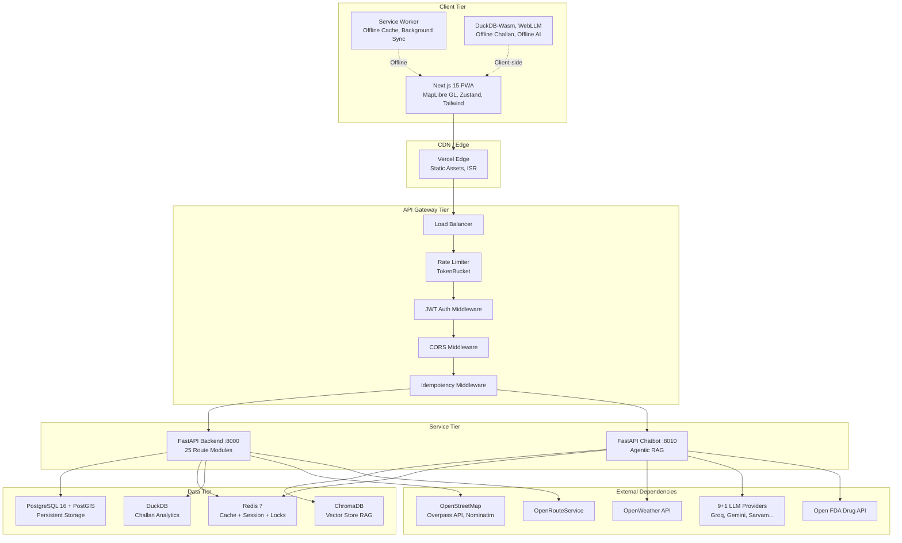
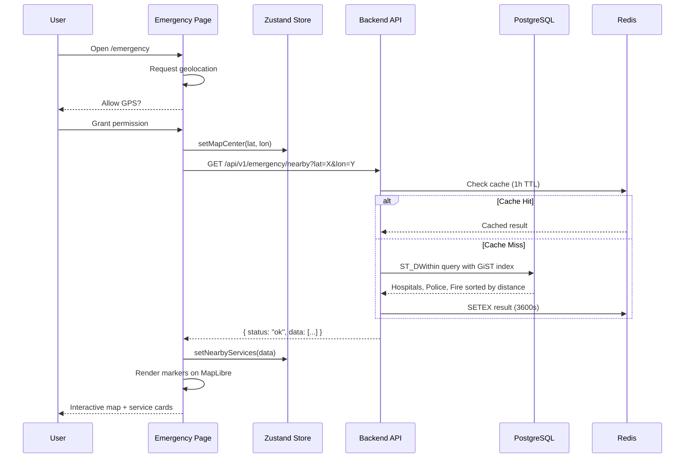
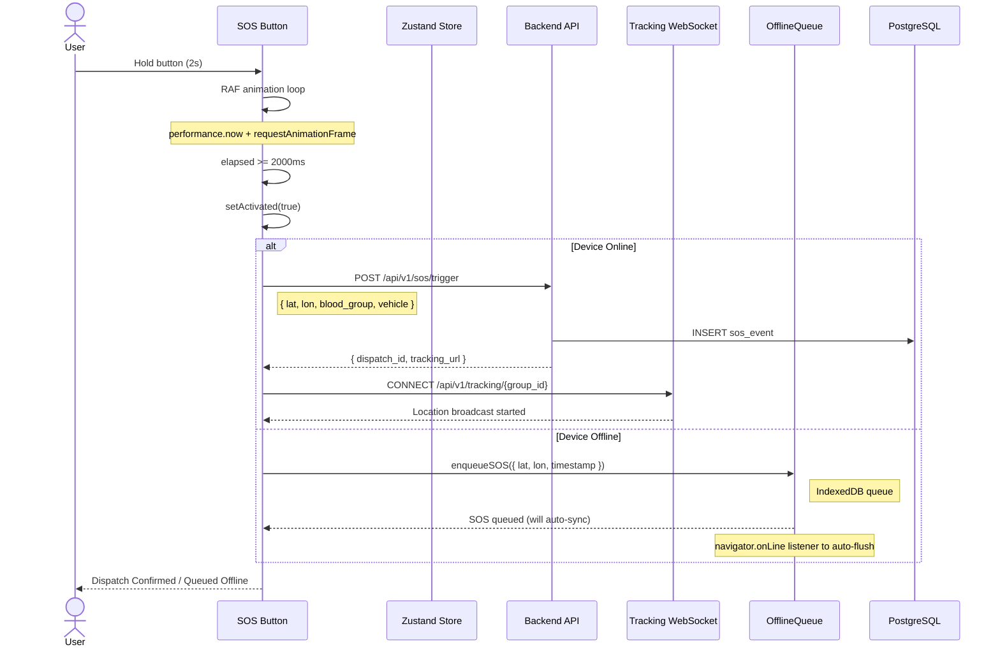
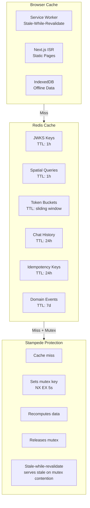

# System Design

> Version 1.0.0 | Last updated: 2026-07-29

## Architecture Overview

SafeVixAI is a 3-service monorepo delivering real-time emergency response, AI-powered traffic legal assistance, and road infrastructure reporting.



## Data Flow

### Emergency Locator Flow



### Chatbot Flow

```
User to Frontend to /assistant to POST /api/v1/chat/ (or /chat/stream SSE)
  to Backend proxy to Chatbot Service
  to SafetyChecker.evaluate() - 12-pattern prompt injection guard
  to IntentDetector.detect() - 9 intent classes (<1ms)
  to ContextAssembler.assemble() - invoke tools + ChromaDB RAG search
  to ProviderRouter.generate() - 10-provider fallback chain
  to ConversationMemoryStore.append() - Redis (24h TTL)
  to Response: answer, intent, sources, model_used, latency_ms
```

### SOS Activation Flow



## Caching Strategy



### Redis Cache Layers
- **Query Cache**: Emergency results, geocoding, routes - 3600-86400s TTL
- **Session Cache**: Chat conversations - 86400s TTL
- **Rate Limiting**: Sliding window counters - TTL varies
- **Distributed Locks**: Redlock pattern - 5-30s TTL
- **JWKS Cache**: Public keys - 3600s TTL with stampede protection

### Stampede Protection
`get_json_with_stampede_protection()`:
1. Check cache - return if hit
2. Acquire mutex (SET NX EX 5s)
3. If locked: wait 50ms, retry cache (stale-while-revalidate)
4. If stale served: background refresh
5. Recalculate, store, release mutex

## Resilience Patterns

```mermaid
flowchart TD
    subgraph CircuitBreaker["Circuit Breaker"]
        CB1[Closed<br/>Normal Operation]
        CB2[Open<br/>Fail Fast<br/>30s timeout]
        CB3[Half-Open<br/>Probe Request]
        CB1 -->|5 failures| CB2
        CB2 -->|30s elapsed| CB3
        CB3 -->|Success| CB1
        CB3 -->|Failure| CB2
    end

    subgraph Retry["Retry with Backoff"]
        R1[Attempt 1<br/>0s delay]
        R2[Attempt 2<br/>1s delay]
        R3[Attempt 3<br/>2s delay]
        R4[Attempt 4<br/>4s delay]
        R5[Attempt 5<br/>8s delay to Fail]
        R1 -->|Error| R2
        R2 -->|Error| R3
        R3 -->|Error| R4
        R4 -->|Error| R5
    end

    subgraph Fallback["LLM Provider Fallback"]
        F1[Primary: Groq]
        F2[Cerebras]
        F3[Gemini]
        F4[... 9 providers]
        F5[Template<br/>Deterministic]
        F1 -->|Fail| F2
        F2 -->|Fail| F3
        F3 -->|Fail| F4
        F4 -->|Fail| F5
    end

    subgraph Alert["Alert System"]
        A1[Service Failure Detected]
        A2[Check Cooldown<br/>5 min window]
        A3[Send Email Alert<br/>3 Diagnostic Solutions]
        A1 --> A2
        A2 --> A3
    end
```



## Component Interactions

| Interaction | Protocol | Auth | Notes |
|-------------|----------|------|-------|
| Frontend to Backend | REST (axios) | JWT Bearer | All data API calls |
| Frontend to Backend | WebSocket | JWT (handshake) | Live tracking |
| Frontend to Chatbot | REST/SSE | JWT Bearer | Chat messages |
| Backend to Chatbot | REST (httpx) | Internal API Key | Chat proxy |
| Backend to PostgreSQL | asyncpg | Password | Connection pool |
| Backend to Redis | redis-py (hiredis) | Password | Cache + locks |
| Chatbot to LLM APIs | HTTP | API Keys | 10 providers |
| Backend to Overpass | HTTP (httpx) | None | OpenStreetMap data |
| Backend to Nominatim | HTTP (httpx) | User-Agent | Geocoding |

## Service Boundaries

| Service | Owns | Does Not Own |
|---------|------|-------------|
| Frontend | UI rendering, offline AI, PWA caching, client state (Zustand + IndexedDB) | Business logic, data persistence, LLM calls |
| Backend | REST API, geospatial queries, challan calc, auth, file uploads, WebSocket tracking, caching, MCP server | UI rendering, heavy ML, real-time LLM inference |
| Chatbot | LLM provider routing, RAG, intent detection, tool execution, speech translation, conversation memory | User management, persistent storage, geospatial processing |

## Security Architecture

- **Auth**: JWT (RS256 + HS256), JWKS rotation, guest UUID, internal API keys
- **Transport**: HTTPS/TLS, HSTS preload, CSP headers
- **API Security**: Rate limiting, CORS origin validation, host header validation, CSRF tokens
- **Data**: Blood group/contacts in IndexedDB only (never server), data retention scheduler
- **LLM**: Prompt injection guard, output validation, "Call 112" enforcement for injuries
- **Audit**: Request ID tracking, domain event bus, CSP violation collector

## Offline Architecture

| Component | Technology | Scope |
|-----------|-----------|-------|
| Service Worker | Cache-first for static assets, network-first for API | PWA caching |
| IndexedDB | User profile, offline SOS queue, road report queue | Privacy-critical data |
| WebLLM (Phi-3 Mini) | 2.2GB 4-bit quantized, on-demand download | Offline AI chat |
| DuckDB-Wasm | Client-side SQL for challan calculation | Offline challans |
| YOLOv8n (ONNX) | 15MB, browser-based pothole detection | Offline road reports |

## Monitoring Stack

| Component | Purpose | Configuration |
|-----------|---------|--------------|
| Prometheus | Metrics collection | /metrics endpoint, custom metrics |
| Grafana | Dashboard visualization | Provisioned dashboards in monitoring/ |
| Sentry | Error tracking | DSN config, 0.05 sample rate |
| Structured Logging | JSON NDJSON stdout | request_id, duration_ms, method, path |
| Health Check | Dependency status | GET /health, DB+Redis+Chatbot checks |
| Email Alerts | Critical failures | SMTP with 5-min cooldown |
