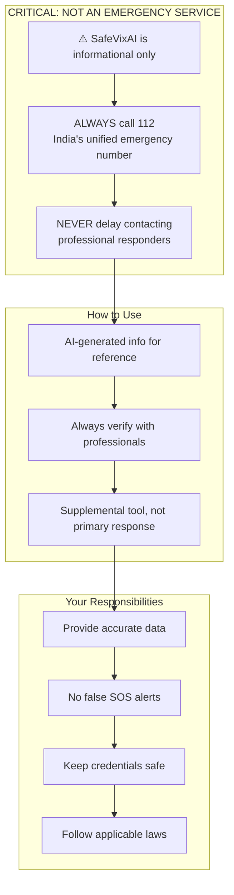

# Terms of Service

**Last Updated:** 2026-07-27

## 1. Acceptance

By using SafeVixAI ("the Service"), you agree to these Terms of Service. If you do not agree, do not use the Service.

## 2. Service Description

SafeVixAI provides:
- Emergency locator services (hospitals, police, fire stations)
- AI-powered traffic legal assistance and challan calculation
- Road infrastructure reporting and civic integration
- SOS alerting and live family tracking
- First aid guidance and emergency protocols

## 3. NOT AN EMERGENCY SERVICE

**SafeVixAI is NOT a replacement for professional emergency services.** Always call **112** (India's unified emergency number) in life-threatening situations. The Service provides informational tools and should never delay contacting professional responders.

## 4. AI Disclaimer

AI-generated responses about traffic laws, fines, first aid, and legal matters are for **informational purposes only**. They may contain errors or inaccuracies. Always verify legal information with qualified professionals.

## 5. User Obligations

- Provide accurate location data for emergency services
- Do not misuse the SOS feature (false alerts may be reported)
- Do not submit abusive, fraudulent, or illegal road reports
- Keep your account credentials secure
- Do not reverse-engineer, abuse, or overload the Service

## 6. Privacy

Your use of the Service is governed by our [Privacy Policy](PRIVACY.md). Key privacy commitments:
- Blood group and emergency contacts stored only on your device (IndexedDB)
- Location data used only for requested services
- No data shared with third parties for marketing
- See [PRIVACY.md](PRIVACY.md) for full details

## 7. Limitation of Liability

To the maximum extent permitted by law, SafeVixAI and its contributors are not liable for:
- Any damages arising from use or inability to use the Service
- Reliance on AI-generated information
- Delayed or failed emergency response due to technical issues
- Data loss from offline queue failures

## 8. Open Source

SafeVixAI is open-source under the [MIT License](LICENSE). You may self-host, modify, and distribute the software subject to the license terms.

## 9. Governing Law

These terms are governed by the laws of India. Disputes shall be subject to the exclusive jurisdiction of courts in Chennai, Tamil Nadu.

## 10. Changes

We may update these terms. Continued use after changes constitutes acceptance. Material changes will be notified via the Service.

## 11. Contact

- **Email:** legal@safevixai.gov.in
- **GitHub:** [github.com/SafeVixAI/SafeVixAI](https://github.com/SafeVixAI/SafeVixAI)
