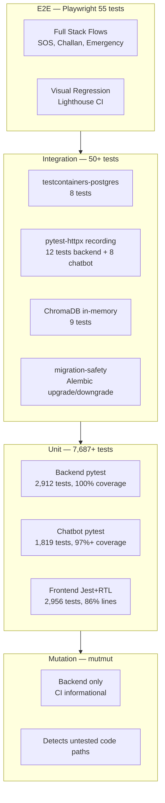

# Testing

> **Testing standards, coverage targets, and CI integration across all 3 services.**

SafeVixAI maintains 7,687+ unit tests across backend, chatbot, and frontend with enterprise-grade coverage thresholds.

## Test Pyramid



## CI Pipeline Flow

```mermaid
flowchart LR
    PUSH[git push] --> BRANCH{Branch?}

    BRANCH -->|main / PR| TRIGGERS{Detect Changes}

    TRIGGERS -->|backend/**| BE[backend.yml]
    TRIGGERS -->|chatbot_service/**| CB[chatbot.yml]
    TRIGGERS -->|frontend/**| FE[frontend.yml]
    TRIGGERS -->|any| CI_OTHER[Other Workflows]

    BE --> BE_STEPS
    subgraph BE_STEPS["Backend CI"]
        BE1[pip install]
        BE2[ruff lint + fix]
        BE3[pytest --cov=100%]
        BE4[mutation (info)]
    end

    CB --> CB_STEPS
    subgraph CB_STEPS["Chatbot CI"]
        CB1[pip install]
        CB2[ruff lint + fix]
        CB3[pytest --cov=97%]
    end

    FE --> FE_STEPS
    subgraph FE_STEPS["Frontend CI"]
        FE1[npm ci]
        FE2[ESLint]
        FE3[tsc --noEmit]
        FE4[jest --coverage]
    end

    CI_OTHER --> OTHER_STEPS
    subgraph OTHER_STEPS["Other CI"]
        O1[e2e.yml — Playwright Full Stack]
        O2[migration-safety.yml]
        O3[lighthouse.yml — LHCI]
        O4[codeql.yml — CodeQL]
        O5[security.yml — Gitleaks]
    end

    BE_STEPS --> RESULT{All Pass?}
    CB_STEPS --> RESULT
    FE_STEPS --> RESULT
    OTHER_STEPS --> RESULT

    RESULT -->|Yes| MERGE[Ready to Merge]
    RESULT -->|No| FIX[Fix and Push Again]
    FIX --> PUSH
```

---

## Quick Links

| Area | Documentation |
|------|---------------|
| Testing Policy | [`TESTING_POLICY.md`](TESTING_POLICY.md) |
| Testing Policy (detailed) | [`docs/TESTING_POLICY.md`](docs/TESTING_POLICY.md) |
| Code Review Guide | [`docs/CODE_REVIEW_GUIDE.md`](docs/CODE_REVIEW_GUIDE.md) |
| Style Guide | [`STYLE_GUIDE.md`](STYLE_GUIDE.md) |
| CI Workflows | [`.github/workflows/`](.github/workflows/) |

---

## Test Counts

| Service | Framework | Tests | Coverage Threshold |
|---------|-----------|-------|--------------------|
| Backend | pytest + hypothesis + testcontainers | 2,912 | 100% lines, 100% branches |
| Chatbot | pytest + pytest-httpx + ChromaDB | 1,819 | 97%+ lines |
| Frontend | Jest + RTL + jest-axe | 2,956 | 86% lines, 72% branches |
| E2E | Playwright | 55 | — |
| Mutation | mutmut (backend) | — | CI (informational) |

---

## Running Tests

```bash
# Backend (asyncio_mode = auto)
cd backend && pytest tests/ -v --cov

# Chatbot (asyncio_mode = strict — requires @pytest.mark.asyncio)
cd chatbot_service && pytest tests/ -v --cov

# Frontend
cd frontend && npm test && npm run lint && npx tsc --noEmit
```

---

## Related

- [`CONTRIBUTING.md`](CONTRIBUTING.md) — how to write and run tests
- [`CI/CD workflows`](.github/workflows/) — automation in CI
- [`STYLE_GUIDE.md`](STYLE_GUIDE.md) — coding standards
