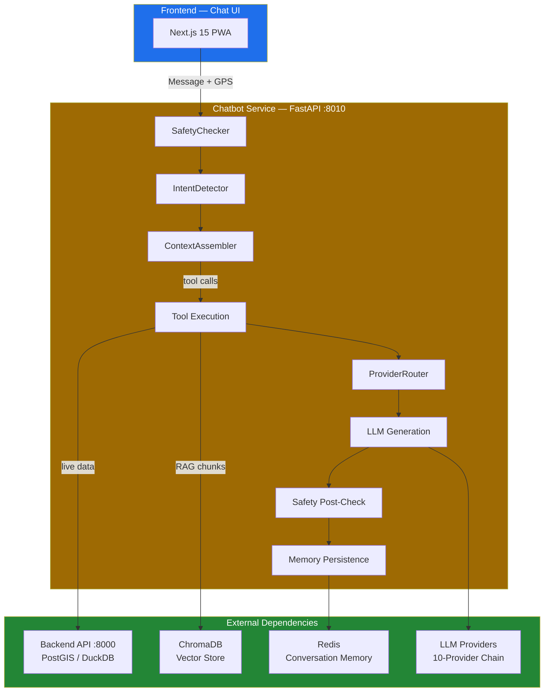

# SafeVixAI Chatbot — Architecture

The SafeVixAI AI chatbot is a **separate Python service** (port 8010) that connects the frontend to advanced LLM behavior and real-time backend data.

## System Components
1. **Frontend (Next.js 15)**: Provides the Chat UI and API interface.
2. **Main Backend (FastAPI :8000)**: Manages PostgreSQL, PostGIS, and user data.
3. **Chatbot Service (FastAPI :8010)**: Independently manages the AI agent pipeline.
4. **Vectorstore (ChromaDB)**: Houses indexed legal and first-aid documents for retrieval.
5. **Memory (Redis)**: Stores conversation history for session-based persistence.

## Data Flow

## Reliability: 10-provider Fallback Chain

To maintain maximum uptime, the service automatically cycles through **nine** LLM providers:

| Order | Provider | Speed | Specialty |
|-------|----------|-------|-----------|
| 1 | **Groq** | 300+ tok/s | Primary English (default: llama-3.1-8b-instant) |
| 2 | **Cerebras** | 2000+ tok/s | Speed overflow |
| 3 | **Gemini** | Varies | Large context (1M tokens) |
| 4 | **GitHub Models** | Varies | Free with GitHub account |
| 5 | **NVIDIA NIM** | Varies | GPU-optimized inference |
| 6 | **OpenRouter** | Varies | Gateway to 20+ models |
| 7 | **Mistral** | Varies | 1B tokens/month free |
| 8 | **Together** | Varies | $25 free credit bank |
| 9 | **Template** | Instant | Deterministic fallback — always works |

## Indian Language Path (Separate — Not in Fallback Chain)

| Condition | Provider | Model |
|-----------|----------|-------|
| Indian language input (Hindi, Tamil, Telugu, etc.) | Sarvam AI (direct API) | sarvam-30b |
| Legal/challan + Indian language | Sarvam AI (direct API) | sarvam-105b |
| Sarvam API key missing | HF Inference API (via HF_TOKEN) | sarvam-30b/105b |

> **14 Indian languages** supported via regex Unicode script range detection. Sarvam is auto-routed — it bypasses the main fallback chain entirely.
