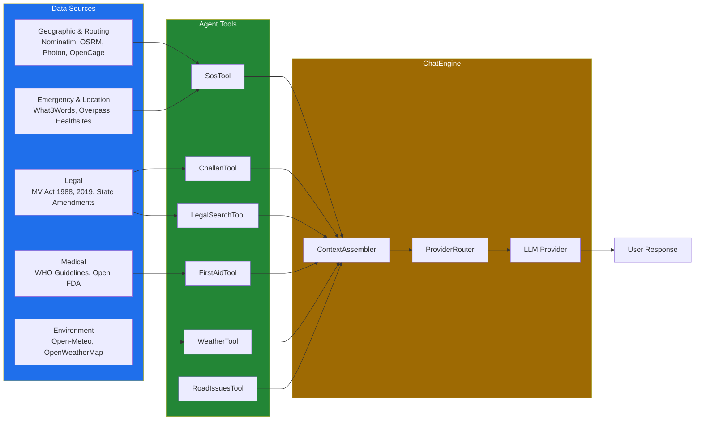

# Data Sources Reference

The SafeVixAI Chatbot relies on high-quality, authoritative data for legal, emergency, and medical accuracy.

## Geographic & Routing Data
- **Nominatim (OpenStreetMap)**: Free, primary reverse geocoding to find road and city names from coordinates.
- **OpenCage**: Standby geocoding fallback, optimizing address resolution for tier-2 Indian cities (requires `OPENCAGE_API_KEY`).
- **BigDataCloud**: Free, client-side reverse geocoding API to resolve coordinates natively in the browser without backend exposure.
- **Photon (Komoot)**: Search autocomplete, heavily biased towards Indian locations using strict bounding box configurations.
- **OSRM (Open Source Routing Machine)**: Free, open-source routing API to generate driving navigation polyline traces.

## Emergency & Location Services
- **What3Words**: High-precision 3-word coordinate resolution (e.g., `///filled.count.soap`) to ensure unambiguous emergency dispatch (requires `W3W_API_KEY`).
- **ip-api.com**: IP-based state and city detection used primarily to enforce dynamic regulatory defaults for legal computations.
- **Overpass API**: Primary engine for querying nearby hospitals, police stations, and fire stations dynamically based on user radius thresholds.
- **Healthsites.io**: Global health facility registry providing supplemental hospital and trauma center seed data via manual extraction pipelines.

## Environment & Context
- **Open-Meteo**: Free, unlimited weather API providing current risk-factors including precipitation probability and visibility.
- **OpenWeatherMap**: Standby fallback for environmental risks, ensuring continuous weather insights (requires `OPENWEATHER_API_KEY`).

## Legal Data
- **Motor Vehicles Act 1988**: Full text, all 217 sections indexed for the RAG pipeline.
- **Motor Vehicles Amendment Act 2019**: Complete gazette notification included.
- **State-specific Amendments**: PDFs indexed for state-level geo-fenced fine queries.
- **MoRTH**: Monitored monthly for updated traffic regulation notifications.

## Medical Data (First Aid)
- **WHO Trauma Care Guidelines**: Official first-aid procedures for emergency response.
- **Open FDA API**: Pharmaceutical lookup referencing official FDA drug labels to evaluate indications and dosages interactively.
- **Static Knowledge base**: `first_aid.json` containing 20 pre-bundled articles for offline RAG capability.

## Real-Time Data Injection
On every message, context is enriched with:
- **GPS Coordinates**: User's current location (lat, lon).
- **Reverse Geocoding**: City and state name for local regulation lookup (via Nominatim/OpenCage).
- **What3Words**: 3-word location summary appended to SOS requests.
- **Road Condition Events**: Recent incidents within a 5km radius of the user.
