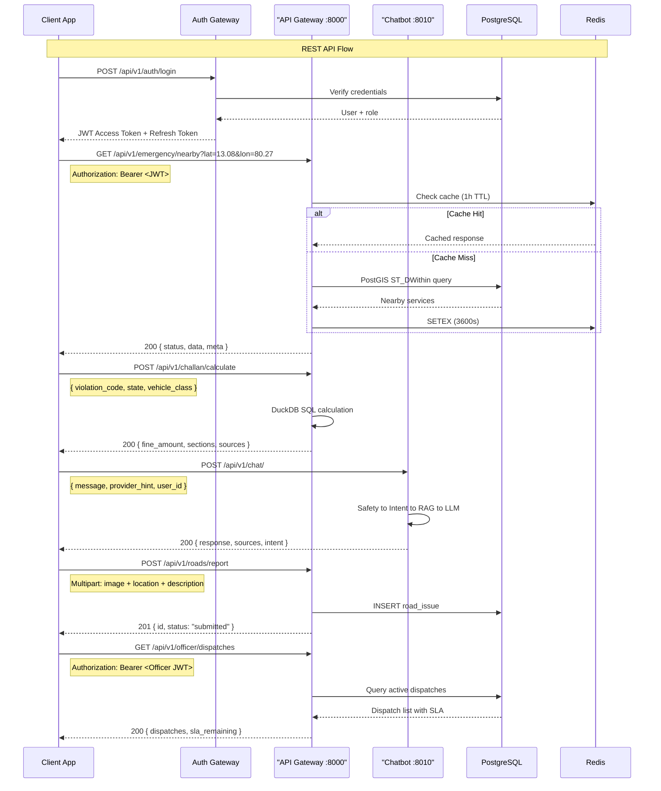
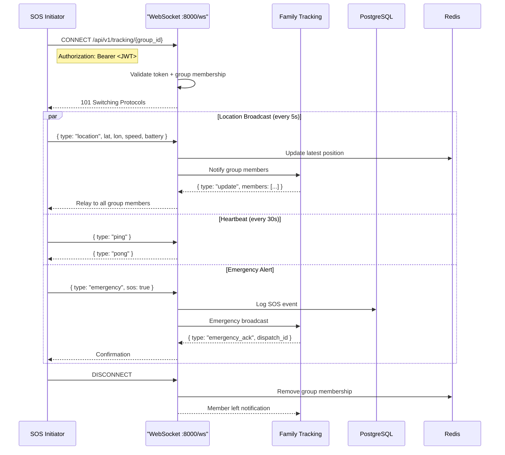

# SDK Guide — API Integration

> Version 1.0 | 2026-07-29

## API Call Flow



## WebSocket Tracking Lifecycle



## Base URLs

- Development: `http://localhost:8000` (backend), `http://localhost:8010` (chatbot)
- Production: Render/Vercel URLs

## Auth

JWT Bearer token in `Authorization` header.

## Response Envelope

```json
{"success": true, "data": {...}, "error": null, "meta": {"timestamp": "...", "request_id": "..."}}
```

## Rate Limits

- General: 100/min
- Chat: 30/min
- SOS: 3/min

## Key Endpoints

- `GET /api/v1/emergency/nearby?lat=13.0827&lon=80.2707` — Nearby hospitals/police
- `POST /api/v1/challan/calculate` — Fine calculation
- `POST /api/v1/chat` — Chat (blocking)
- `POST /api/v1/chat/stream` — Chat (SSE streaming)
- `POST /api/v1/roads/report` — Submit road issue
- `POST /api/v1/emergency/sos` — Trigger SOS

## WebSocket

`ws://host/api/v1/tracking/{group_id}` — Live family tracking
