# Webhooks

> **Version:** 1.0  
> **Last updated:** 2026-07-26  
> **Cross-references:** [INTEGRATION_GUIDE.md](INTEGRATION_GUIDE.md), [API.md](API.md), [Security.md](../architecture/Security.md)

---

## Overview

SafeVixAI can send webhook notifications for important events. Webhooks are delivered via HTTP POST to a configured URL.

```mermaid
sequenceDiagram
    participant App as SafeVixAI
    participant WH as Webhook Endpoint
    participant Handler as Event Handler

    rect rgb(40, 60, 40)
        Note over App,Handler: SOS Activated
        App->>WH: POST /webhook
        WH->>Handler: Process sos.activated event
        Handler-->>WH: 200 OK
    end

    rect rgb(60, 40, 40)
        Note over App,Handler: Report Submitted
        App->>WH: POST /webhook
        WH->>Handler: Process report.submitted event
        Handler-->>WH: 200 OK
    end

    rect rgb(40, 40, 60)
        Note over App,Handler: Issue Resolved
        App->>WH: POST /webhook
        WH->>Handler: Process issue.resolved event
        Handler-->>WH: 200 OK
    end
```



---

## Events

| Event | Trigger | Payload |
|-------|---------|---------|
| `sos.activated` | User activates SOS | SOS ID, location, user info, timestamp |
| `report.submitted` | Road issue report submitted | Report ID, category, location, photos |
| `issue.resolved` | Road issue marked resolved | Issue ID, resolution notes, timestamp |
| `user.registered` | New user registration | User ID, role, timestamp |
| `tracking.started` | Live tracking session starts | Session ID, user ID, start location |
| `tracking.ended` | Live tracking session ends | Session ID, duration, end location |
| `challan.calculated` | Challan calculation performed | Violation code, amount, state (anonymized) |

---

## Payload Schema

All webhook payloads follow a standard envelope:

```json
{
  "event": "sos.activated",
  "id": "evt_abc123",
  "created_at": "2026-07-26T10:00:00Z",
  "data": {
    "sos_id": "sos_xyz789",
    "user_id": "user_def456",
    "location": { "lat": 13.0827, "lon": 80.2707 },
    "emergency_contacts_notified": 3
  }
}
```

---

## Delivery Guarantees

- **At-least-once delivery**: Events may be delivered more than once — use idempotency keys
- **Retry with exponential backoff**: 5 retries at 1m, 5m, 15m, 30m, 1h intervals
- **Dead letter queue**: After 5 retries, events are logged and no longer retried
- **Timeout**: HTTP request must complete within 10 seconds

---

## Security

### HMAC Signature
Each webhook request includes an `X-Webhook-Signature` header:

```
X-Webhook-Signature: t=1721984400,v1=abc123def456...
```

Verification:
```python
import hmac, hashlib

def verify_webhook(payload: bytes, signature: str, secret: str) -> bool:
    parts = dict(p.split("=") for p in signature.split(","))
    expected = hmac.new(
        secret.encode(),
        payload,
        hashlib.sha256,
    ).hexdigest()
    return hmac.compare_digest(parts["v1"], expected)
```

### IP Allowlisting
Webhook requests originate from a fixed IP range. Configure your firewall to allowlist:
```
203.0.113.0/24
```

### Secret Rotation
Rotate webhook secrets every 90 days via the Admin API.

---

## Managing Webhooks

### Create Webhook
```
POST /api/v1/admin/webhooks
Content-Type: application/json
Authorization: Bearer <admin_token>

{
  "url": "https://your-server.com/webhooks/safevixai",
  "events": ["sos.activated", "report.submitted"],
  "secret": "your-webhook-secret"
}
```

### List Webhooks
```
GET /api/v1/admin/webhooks
```

### Delete Webhook
```
DELETE /api/v1/admin/webhooks/{webhook_id}
```

### Test Webhook
```
POST /api/v1/admin/webhooks/{webhook_id}/test
```
Sends a test event with `event: test.ping` to verify connectivity.

---

## Rate Limits

- Maximum 10 webhook endpoints per organization
- Each endpoint receives at most 100 events/minute
- If an endpoint responds with 429, retry interval doubles

---

## Best Practices

1. **Return 200 quickly** — Process webhooks asynchronously (queue the event, return 200)
2. **Verify signatures** — Always validate the HMAC signature before processing
3. **Use idempotency keys** — The `id` field is unique per event — use it for deduplication
4. **Handle gracefully** — Webhook failures don't affect core platform operations
5. **Monitor delivery** — Failed deliveries are logged for observability
6. **Timeouts** — Keep response time under 10 seconds
