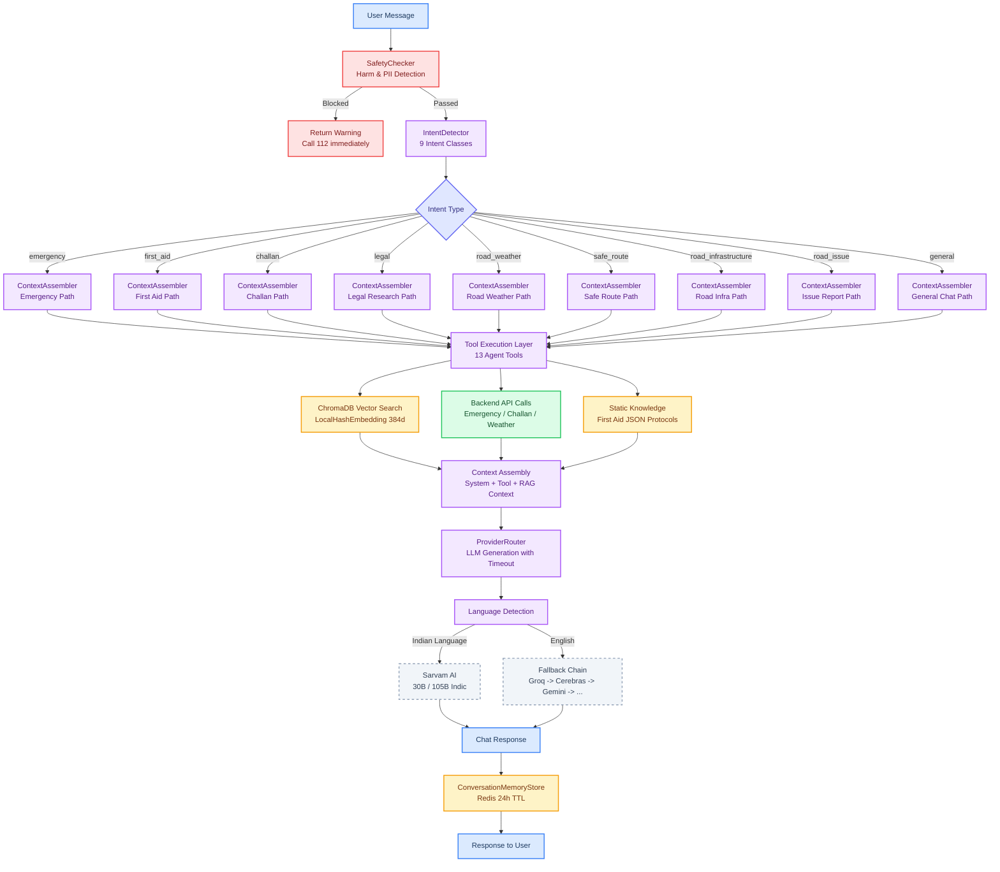
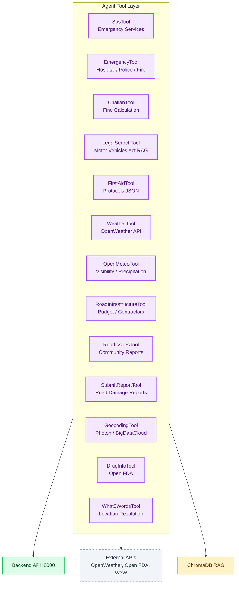

# AI Capabilities

> Version 1.0 | 2026-07-29

## Agent Execution Pipeline

## 10-Provider Fallback Chain

```mermaid
graph LR
    classDef edge fill:#dbeafe,stroke:#3b82f6,stroke-width:2px,color:#1e3a5f
    classDef control fill:#dcfce7,stroke:#22c55e,stroke-width:2px,color:#14532d
    classDef ai fill:#f3e8ff,stroke:#a855f7,stroke-width:2px,color:#581c87
    classDef data fill:#fef3c7,stroke:#f59e0b,stroke-width:2px,color:#78350f
    classDef security fill:#fee2e2,stroke:#ef4444,stroke-width:2px,color:#7f1d1d
    classDef external fill:#f1f5f9,stroke:#94a3b8,stroke-width:2px,stroke-dasharray:5 5,color:#334155
    classDef decision fill:#e0e7ff,stroke:#6366f1,stroke-width:2px,color:#312e81
    classDef success fill:#d1fae5,stroke:#10b981,stroke-width:2px,color:#064e3b

    Start["LLM Request"]:::ai --> LANG{"Language"}:::decision
    LANG -->|"Indian Lang"| S1["Sarvam-30B"]:::external
    LANG -->|"Indian + Legal"| S2["Sarvam-105B"]:::external
    LANG -->|"English"| G1["Groq<br/>300+ tok/s"]:::external

    G1 -->|"Rate Limit / Error"| G2["Cerebras"]:::external
    G2 -->|"Rate Limit / Error"| G3["Gemini"]:::external
    G3 -->|"Rate Limit / Error"| G4["GitHub Models"]:::external
    G4 -->|"Rate Limit / Error"| G5["NVIDIA NIM"]:::external
    G5 -->|"Rate Limit / Error"| G6["OpenRouter"]:::external
    G6 -->|"Rate Limit / Error"| G7["Mistral"]:::external
    G7 -->|"Rate Limit / Error"| G8["Together"]:::external
    G8 -->|"Rate Limit / Error"| G9["TemplateProvider<br/>Deterministic Fallback"]:::ai

    S1 -->|"Fail"| S2
    S2 -->|"Fail"| G1

    G9 --> Done(("Response")):::edge
```

## 13 Agent Tools

## 9 Intent Classes

- emergency (accident, ambulance, police, SOS)
- first_aid (bleeding, CPR, fracture, burn)
- challan (fine, helmet, seatbelt, drunk driving)
- legal (motor vehicles act, right of way)
- road_report (pothole, repair, streetlight)
- bystander (witness, report incident)
- weather (rain, road conditions)
- general_query (fallback)
- offline (Phi-3 Mini when no connectivity)

## Safety

12 injection pattern guards. Medical responses always begin "Call 112 immediately".

## Offline AI

- Phi-3 Mini 2.2GB (4-bit) for browser inference
- YOLOv8n 15MB ONNX for pothole detection
- DuckDB-Wasm ~5MB for offline challan calculation
- 20 WHO first-aid articles in HNSW index
