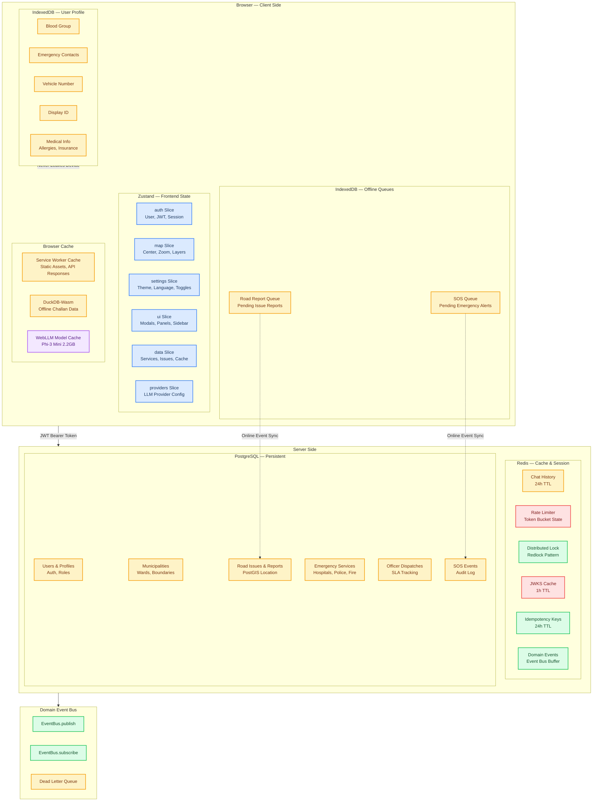

# Memory Systems

> Version 1.0 | 2026-07-29

## Complete Storage Architecture

## Data Locality Rules

| Data | Location | TTL | Privacy |
|------|----------|-----|---------|
| Blood Group | IndexedDB only | Permanent | Never leaves device |
| Emergency Contacts | IndexedDB only | Permanent | Never leaves device |
| Chat History | Redis | 24h | Auto-deleted |
| SOS Events | PostgreSQL | Permanent | Encrypted |
| Location | In-memory | Session | Not persisted |
| Analytics | PostHog | 90 days | Opt-in only |
| JWKS | Redis | 1h | Public keys |

## Conversation Memory

Redis-backed with in-memory fallback. TTL: 24h. Session key: `chat_session:{session_id}`.

## User Profile (IndexedDB)

Blood group, emergency contacts, medical conditions — never transmitted to server.

## Frontend State (Zustand)

6 slices: auth, map, settings, ui, data, providers. Persisted via localStorage.

## Offline Queues (IndexedDB)

- SOS Queue: flushes on `online` event
- Road Report Queue: auto-submits when connected

## Redis Cache Keys

- `emergency:{lat}:{lon}:{radius}` (1h)
- `geocode:search:{query}` (24h)
- `route:{start}:{end}:{profile}` (15m)
- `circuit_breaker:{name}` (∞)

## Event Bus (Domain Events)

Events: user.sos_triggered, user.report_submitted, user.challan_calculated, llm.fallback_triggered, cache.stampede, circuit_breaker.state_change
