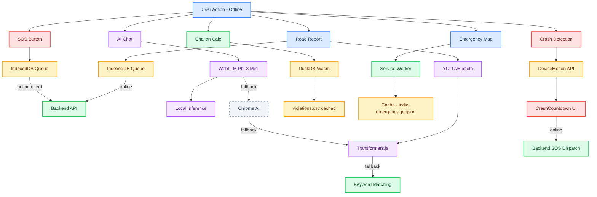

# SafeVixAI — Offline Architecture

> Last updated: 2026-06-09
> Covers actual implemented offline capabilities across all 3 services.

---

## Overview

SafeVixAI implements a **multi-layer offline architecture** that ensures core emergency features work from first visit without internet, progressively enhancing when connectivity is available. The architecture spans Service Worker caching, IndexedDB queues, client-side SQL/WASM databases, and browser-based ML inference.

---

## Layer 1: Service Worker (Production Only)

**Activation:** Service Worker is only active in production builds — `npm run build && npm start` (not `npm run dev`).

- Precache app shell (HTML, JS, CSS, fonts) at install time via Workbox
- Cache-first strategy for static assets and offline data bundles
- Network-first strategy for API calls with cache fallback
- Background Sync API for offline queue auto-submit when connectivity returns
- PWA manifest: `frontend/public/manifest.json` — 8 icon sizes, standalone display

---

## Layer 2: DuckDB-Wasm — Offline Challan Calculation

**Purpose:** Deterministic offline challan (traffic fine) calculation without network.

- File: `frontend/lib/duckdb-challan.ts`
- Uses `@duckdb/duckdb-wasm` (WebAssembly SQL engine)
- Loads `frontend/public/offline-data/violations.csv` and `state_overrides.csv`
- 3-tier fallback: DuckDB-Wasm → embedded JSON → error message
- Same SQL logic as server-side `backend/services/challan_service.py` but runs in-browser

---

## Layer 3: WebLLM Phi-3 Mini — Offline AI

**Purpose:** On-device LLM inference for AI chat when no backend is reachable.

- File: `frontend/lib/offline-ai.ts`
- Uses `@mlc-ai/web-llm` to load Phi-3 Mini (3.8B parameters, 4-bit quantized)
- **2.2 GB download** — on-demand, only downloads when user clicks "Use Offline AI"
- 3-tier fallback: Chrome built-in AI → Transformers.js → rule-based keyword matching
- Progress indicator and user consent required before download
- Works entirely client-side — no data leaves the device

---

## Layer 4: IndexedDB — Profile & SOS Queue

### Profile Storage
- **Blood group, emergency contacts, vehicle number stored in IndexedDB**
- Privacy by architecture: blood group **never leaves the device**
- Fields defined in `frontend/app/profile/page.tsx`

### Offline SOS Queue
- File: `frontend/lib/offline-sos-queue.ts`
- When offline, SOS events are queued in IndexedDB with minimal data:
  - `{ lat, lon, timestamp, userId? }`
  - No PII (no authToken, no bloodGroup, no emergencyContacts)
- Auto-flushes to backend on `online` event
- Clear user feedback: toast shows "SOS queued — will send when online"

---

## Layer 5: Offline Data Bundle

**Purpose:** Pre-packaged GeoJSON and CSV data for map rendering and emergency lookups.

- Endpoint: `GET /api/v1/offline/bundle` (backend)
- Files in `frontend/public/offline-data/`:
  - `india-emergency.geojson` — hospitals, police stations, fire stations across 25 cities (pre-compressed 93%: 5.4MB → 0.4MB)
  - `violations.csv` — traffic violation seed data for DuckDB-Wasm
  - City/state emergency bundles for granular offline coverage
- Service Worker precaches `india-emergency.geojson` at install time

---

## Layer 6: @huggingface/transformers — YOLOv8 Pothole Detection

**Purpose:** Client-side computer vision for pothole detection in road reports.

- File: `frontend/lib/offline-ai.ts` (same module as WebLLM)
- Uses `@huggingface/transformers` to run YOLOv8n ONNX model (~15MB)
- Runs entirely in browser via WebAssembly (no server round-trip)
- Triggers when user uploads a photo in the Road Reporter form
- Returns bounding box coordinates for detected potholes/cracks

---

## Layer 7: Browser APIs

- **Geolocation API** (`frontend/lib/geolocation.ts`): one-shot + continuous watch
- **DeviceMotion API** (`frontend/lib/crash-detection.ts`): crash detection (2.5G threshold, 10s cancel window, 30s cooldown, ignores below 10km/h)
- **Web Speech API** (`frontend/components/chat/VoiceInput.tsx`): voice input for AI assistant (14 Indian languages via language mapping in `frontend/lib/languages.ts`)
- **Speech Synthesis API** (`frontend/components/chat/VoiceOutput.tsx`): voice output (auto-read speed 0.9)
- **Cache Storage API**: browser cache for offline models and static assets

---

## Data Flow Diagram

---

## Production Notes

- Service Worker only activates in production (`npm run build && npm start`), not dev mode
- `copy-public.js` (run as part of `npm run build`) always re-copies static assets to `.next/standalone/`
- DuckDB-Wasm and WebLLM are loaded via Next.js WASM experiments in `next.config.js`
- All offline data files in `frontend/public/offline-data/` are versioned and cache-busted via Service Worker
