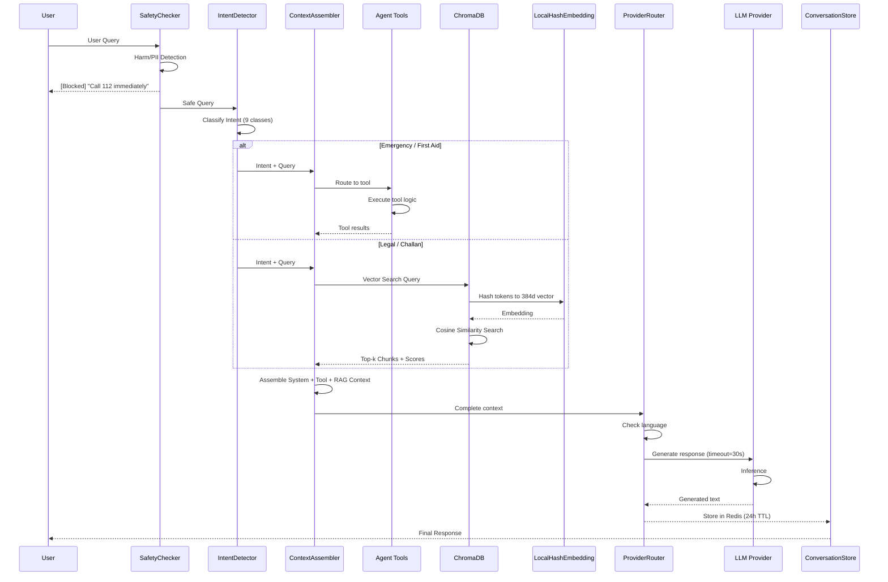
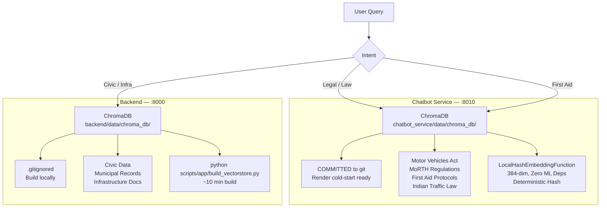

# RAG System

> Version 1.0 | 2026-07-29

## RAG Query Flow



## ChromaDB Instance Architecture



## Key Design Decisions

| Decision | Rationale |
|----------|-----------|
| **LocalHashEmbeddingFunction** | Zero ML dependencies; deterministic hash ensures reproducible results |
| **384-dimensional vectors** | Sufficient for legal/medical cosine similarity at 10% storage cost vs 1536d |
| **ChromaDB committed in chatbot** | Render cold-starts would take 10min+ to rebuild; committed copy starts instantly |
| **ChromaDB gitignored in backend** | Backend has fewer cold-starts; rebuild is acceptable |
| **Cosine similarity** | Better suited for sparse legal vectors than L2 distance |

## Architecture

Two ChromaDB instances: chatbot (committed, for LegalSearch + FirstAid) and backend (gitignored, future).

## Embedding Strategy

LocalHashEmbeddingFunction: SHA-256 → 384-dim histogram → unit vector. Zero ML dependencies, ~50x faster than transformers.

## Document Sources

- Motor Vehicles Act 1988: ~200 chunks
- MoRTH guidelines: ~50 chunks
- WHO First Aid: ~150 chunks

## Build

```bash
python scripts/app/build_vectorstore.py
```
