# Authentication

> **Version:** 1.0  
> **Last updated:** 2026-07-26  
> **Cross-references:** [Security.md](chatbot/security.md), [INTEGRATION_GUIDE.md](../api-reference/INTEGRATION_GUIDE.md), [API.md](chatbot/api.md)

---

## Overview

SafeVixAI uses JWT-based authentication with RS256 signatures and JWKS key rotation.

---

## Authentication Flows

```mermaid
sequenceDiagram
    participant U as User
    participant F as Frontend
    participant B as Backend API
    participant R as Redis

    rect rgb(40, 40, 60)
        Note over U,R: Login
        U->>F: Enter email + password
        F->>B: POST /api/v1/auth/login
        B->>B: Validate credentials
        B->>R: Store refresh token
        B-->>F: access_token + refresh_token
        F-->>U: Authenticated session
    end

    rect rgb(40, 60, 40)
        Note over U,R: Token Refresh
        U->>F: Expired access token
        F->>B: POST /api/v1/auth/refresh (Bearer refresh_token)
        B->>R: Verify refresh token
        B-->>F: New access_token + refresh_token
        F-->>U: Session refreshed
    end

    rect rgb(60, 40, 40)
        Note over U,R: Logout
        U->>F: Sign out
        F->>B: POST /api/v1/auth/logout
        B->>R: Invalidate refresh token
        B-->>F: 200 OK
        F-->>U: Signed out
    end
```



---

## Token Format

### Access Token
- **Algorithm**: RS256
- **Expiry**: 1 hour
- **Storage**: Client-side (memory/secure cookie)

Claims:
```json
{
  "sub": "user-uuid",
  "role": "citizen",
  "iat": 1721984400,
  "exp": 1721988000
}
```

### Refresh Token
- **Algorithm**: HS256 (symmetric, server-only)
- **Expiry**: 30 days
- **Storage**: Server-side (Redis) + client

---

## JWKS (JSON Web Key Set)

Public keys for RS256 verification are served at:

```
GET /.well-known/jwks.json
```

Keys are cached with distributed locking (see `core/jwks.py`) for 3600 seconds.

### Key Rotation
- Keys are rotated automatically on a schedule
- Old keys remain valid until expiry (overlap period)
- Rotation is managed by `core/security.py`

---

## Role-Based Access Control

| Role | Description | Access |
|------|-------------|--------|
| `citizen` | Regular user | Emergency, challan, reports, profile |
| `operator` | Municipal authority | Command center, report management |
| `admin` | System administrator | All endpoints, cache management, user admin |

See [AUTHORIZATION.md](AUTHORIZATION.md) for the complete RBAC matrix.

---

## Security Considerations

### Token Storage
- Access tokens stored in memory (not localStorage)
- Refresh tokens stored in secure httpOnly cookies
- No tokens in URLs (logged and rejected)

### Rate Limiting
- Login: 5 attempts per minute per IP
- Token refresh: 10 attempts per minute per user
- All auth endpoints: 30 attempts per minute per IP

### Best Practices
1. Always use HTTPS
2. Store tokens securely (never in localStorage for production)
3. Implement silent token refresh (refresh before expiry)
4. Log out server-side to invalidate refresh tokens
5. Use short-lived access tokens (1 hour default)
