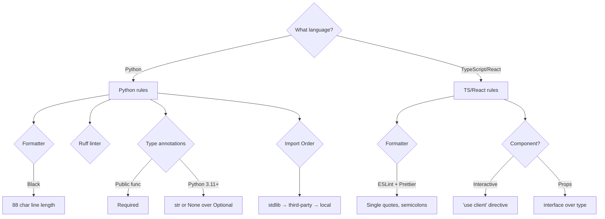
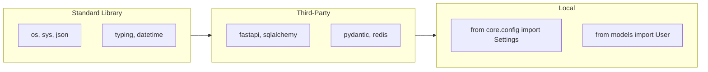

# Coding Style Guide

> **Version:** 1.0  
> **Last updated:** 2026-07-26

---

## Style Decision Tree



## Import Ordering Rules



## Python (Backend & Chatbot)

### Formatting
- **Black** with 88-character line length
- **Ruff** for linting (configured in `pyproject.toml`)
- Import ordering: standard library → third-party → local (Ruff I)
- Maximum nesting depth: 4 levels

```python
# Correct
from typing import Annotated

from fastapi import Depends, FastAPI
from sqlalchemy import select

from core.config import Settings
from models import User
```

### Type Annotations
- Required on all public functions and methods
- Use `from __future__ import annotations` in all files
- Prefer `|` over `Optional[]` (Python 3.11+)
- Use `Annotated` for FastAPI dependency injection

```python
from __future__ import annotations

from typing import Annotated

from fastapi import Depends, Query


def calculate_fine(
    violation_code: str,
    state: str | None = None,
    is_repeat: bool = False,
) -> dict[str, int | str]:
    ...
```

### Docstrings
- Google-style for all public modules, classes, and functions
- Required sections: `Args`, `Returns`, `Raises` (when applicable)

```python
def haversine_km(
    lat1: float,
    lon1: float,
    lat2: float,
    lon2: float,
) -> float:
    """Calculate great-circle distance between two points.

    Args:
        lat1: Latitude of point 1 in degrees.
        lon1: Longitude of point 1 in degrees.
        lat2: Latitude of point 2 in degrees.
        lon2: Longitude of point 2 in degrees.

    Returns:
        Distance in kilometers.
    """
    ...
```

### Async/Await
- Prefer `async def` for all I/O-bound functions
- Use `asyncio.wait_for()` for external service calls
- Never block the event loop with `time.sleep()` (use `asyncio.sleep()`)
- SQLAlchemy queries must use async session

### Error Handling
- Raise specific exceptions (not bare `Exception`)
- Use custom domain exceptions from `core/exception_handlers.py`
- Log with appropriate level (debug, info, warning, error)
- Never catch and silence without logging

```python
from core.exceptions import ResourceNotFoundError


async def get_user(user_id: str) -> User:
    user = await db.get(User, user_id)
    if not user:
        raise ResourceNotFoundError(f"User {user_id} not found")
    return user
```

### Naming Conventions
- Modules: `snake_case` (e.g., `roadwatch_service.py`)
- Classes: `PascalCase`
- Functions/Methods: `snake_case`
- Constants: `UPPER_SNAKE_CASE`
- Private: prefix with `_` (e.g., `_haversine_km`)
- Type variables: `_T` or descriptive like `_RequestT`

---

## TypeScript / React (Frontend)

### Formatting
- **ESLint** with project config (`.eslintrc.js`)
- **Prettier** for automatic formatting
- Semicolons required
- Single quotes preferred

### TypeScript Strict Mode
```json
// tsconfig.json — must include
{
  "compilerOptions": {
    "strict": true,
    "noUncheckedIndexedAccess": true,
    "noImplicitReturns": true,
    "noFallthroughCasesInSwitch": true
  }
}
```

### Component Patterns
- Functional components only (no class components)
- Use `'use client'` directive for interactive components
- Props typed with `interface`, not `type`

```tsx
'use client';

interface SosButtonProps {
  onActivate: (coords: GeolocationCoordinates) => void;
  disabled?: boolean;
}

export function SosButton({ onActivate, disabled = false }: SosButtonProps) {
  return <button disabled={disabled}>Activate SOS</button>;
}
```

### Hooks Rules
- Only call hooks at the top level
- Only call hooks from React functions or custom hooks
- Custom hooks should return typed values
- Use `useCallback` for function props, `useMemo` for derived data

### State Management (Zustand)
- Store slices are typed interfaces
- Actions are functions on the store, not separate modules
- Use `useShallow` for selective subscriptions
- No Redux, no Context for global state

```ts
interface AuthSlice {
  user: User | null;
  login: (email: string, password: string) => Promise<void>;
  logout: () => void;
}
```

### CSS / Tailwind
- Tailwind utility classes only (no inline styles)
- Extract repeated patterns into components, not CSS classes
- Use `cn()` utility from `lib/utils.ts` for conditional classes
- Dark mode via `dark:` prefix

### File Structure
```
ComponentName/
├── ComponentName.tsx        # Main component
├── ComponentName.test.tsx   # Tests (co-located or in __tests__/)
└── index.ts                # Barrel export
```

---

## Testing Conventions

### Backend (pytest)
```bash
cd backend && pytest tests/ -v --cov
```
- `asyncio_mode = auto` (async tests auto-detected)
- Fixtures in `conftest.py` at each level
- Factories for test data (avoid raw SQL in tests)
- Mock external services with `AsyncMock` / `pytest-httpx`

### Chatbot Service (pytest)
```bash
cd chatbot_service && pytest tests/ -v --cov
```
- `asyncio_mode = strict` (async tests need `@pytest.mark.asyncio`)
- ChromaDB integration tests use in-memory mode
- LLM calls mocked with `pytest-httpx`

### Frontend (Jest + RTL)
```bash
cd frontend && npm test
```
- Test with `screen` queries (not component instance methods)
- Prefer `findBy*` for async elements
- Mock browser APIs at module level
- Axios calls mocked via `__mocks__/axios.ts`

```tsx
import { render, screen } from '@testing-library/react';
import userEvent from '@testing-library/user-event';

it('activates SOS on hold', async () => {
  render(<SosButton onActivate={mockFn} />);
  await userEvent.pointer({ keys: '[MouseLeft]', target: screen.getByRole('button') });
  expect(mockFn).toHaveBeenCalled();
});
```

---

## Commit Conventions

Follow [Conventional Commits](https://www.conventionalcommits.org/):

```
<type>(<scope>): <description>

[optional body]

[optional footer]
```

**Types:** `feat`, `fix`, `docs`, `style`, `refactor`, `perf`, `test`, `build`, `ci`, `chore`
**Scopes:** `backend`, `chatbot`, `frontend`, `docs`, `infra`, `e2e`

Examples:
```
feat(backend): add SOS offline queue endpoint
fix(frontend): correct MapLibre marker positioning
docs(chatbot): update provider fallback chain
test(backend): add contract validation tests
```

---

## Branching Strategy

| Branch | Purpose | Base |
|--------|---------|------|
| `main` | Production-ready code | — |
| `feature/<issue>-<desc>` | New features | `main` |
| `fix/<issue>-<desc>` | Bug fixes | `main` |
| `docs/<desc>` | Documentation | `main` |
| `test/<desc>` | Test additions | `main` |
| `chore/<desc>` | Tooling/CI | `main` |

PRs squash-merge to `main` with the commit message matching the Conventional Commits format.

---

## Code Review Checklist

- [ ] Code follows style guide (Black, ESLint, Prettier)
- [ ] No commented-out code or debug artifacts
- [ ] Error handling covers failure paths
- [ ] Tests added/updated with adequate coverage
- [ ] No secrets committed (.env, credentials, tokens)
- [ ] Documentation updated (API docs, inline comments)
- [ ] Performance impact considered (N+1 queries, bundle size)
- [ ] Accessibility considered (ARIA labels, keyboard nav)
- [ ] Security implications reviewed (input validation, output encoding)
