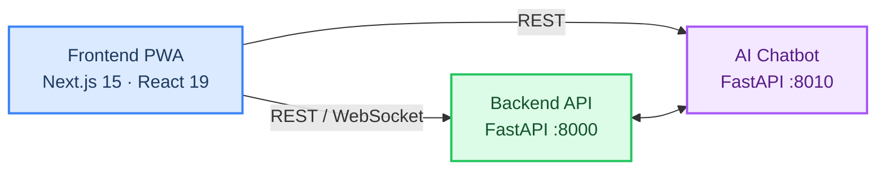

# SafeVixAI Documentation

<p align="center">
  <strong>Enterprise AI-Powered Road Safety & Emergency Response Platform</strong><br/>
  Emergency response · Traffic legal assistance · Road infrastructure reporting<br/>
  Offline-first PWA with enterprise-grade security, resilience, and monitoring
</p>

---

## Platform Overview



---

## Quick Navigation

| Section | Key Documents |
|:--------|:-------------|
| **Getting Started** | [Setup Guide](developer-guide/getting_started.md) · [Starter Guide](developer-guide/starter_guide.md) |
| **Architecture** | [System Architecture](architecture/system_overview.md) · [Tech Stack](architecture/tech_stack.md) · [Design](architecture/uiux_design_system.md) |
| **AI & Agents** | [AI Overview](spec/ai/fallback_chain.spec.md) · [Chatbot Pipeline](spec/ai/tools_matrix.spec.md) · [RAG](spec/ai/rag_vectorstore.spec.md) · [Memory](architecture/memory_architecture.md) |
| **API & SDK** | [API Reference](api-reference/api_overview.md) · [SDK Guide](api-reference/sdk_guide.md) · [Error Codes](spec/api/circuit_breaker.spec.md) |
| **Database** | [Schema](spec/data/database_schema.spec.md) |
| **Security** | [Security Policy](architecture/security_overview.md) · [Authentication](spec/security/authentication.spec.md) · [Authorization](spec/security/rbac_matrix.spec.md) · [Privacy](spec/security/privacy_boundary.spec.md) |
| **Operations** | [Operations Overview](sre/operations_manual.md) · [Monitoring](sre/monitoring_overview.md) · [Observability](sre/observability.md) · [Benchmarks](spec/engineering/performance_benchmarks.spec.md) |
| **Runbooks** | [Runbooks Overview](sre/runbooks_overview.md) |
| **Development** | [Contributing](developer-guide/contributing_guide.md) · [Style Guide](developer-guide/style_guide.md) · [Testing](developer-guide/testing_guide.md) · [Best Practices](developer-guide/best_practices.md) |
| **Community** | [Roadmap](product/roadmap.md) · [FAQ](product/faq.md) |

---

## Service Status

| Service | Port | Health Check | Technology |
|:--------|:-----|:-------------|:-----------|
| **Backend** | `:8000` | `GET /health` | FastAPI + PostgreSQL + Redis |
| **Chatbot** | `:8010` | `GET /health` | FastAPI + ChromaDB + 10 LLMs |
| **Frontend** | `:3000` | PWA available | Next.js 15 + React 19 |

---

## Quick Commands

```bash
# Full stack (recommended)
docker compose up --build

# Individual services
cd backend && uvicorn main:app --reload --port 8000
cd chatbot_service && uvicorn main:app --reload --port 8010
cd frontend && npm run dev
```

---

## Test Coverage

| Service | Tests | Coverage |
|:--------|------:|:--------:|
| Backend | 2,908 | 100% |
| Chatbot | 1,819 | 97%+ |
| Frontend | 2,956 | 87%+ |
| E2E | 55 | — |
| **Total** | **7,738** | — |

---

## Contributing

See [CONTRIBUTING.md](developer-guide/contributing_guide.md) for contribution guidelines.
All contributions under [MIT License](../LICENSE).
