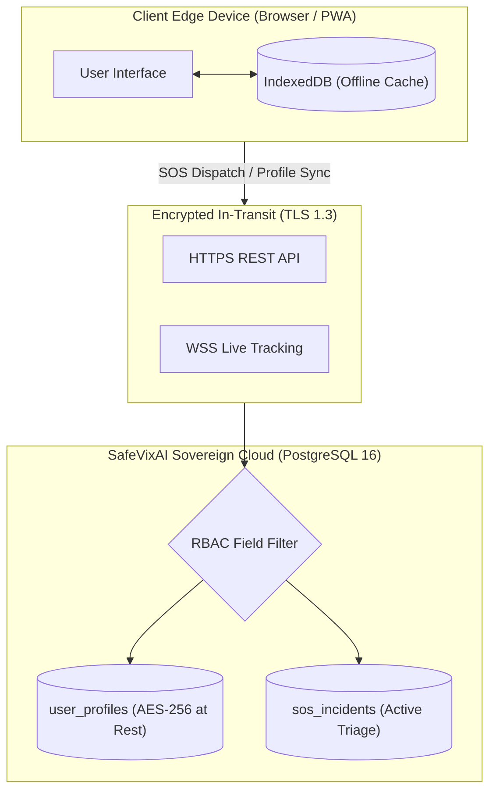

# Privacy Boundary & Data Protection Specification (SPEC)

> **Authority:** Authoritative Compliance & Architecture Specification  
> **Source of Truth:** `backend/models/user.py`, `backend/services/provider_encrypt.py`  
> **Applicable Laws:** Digital Personal Data Protection (DPDP) Act 2023 (India), EU General Data Protection Regulation (GDPR)  
> **Status:** Production Normative (v1.0.0-STABLE)

---

## 1. Architectural Data Boundary: Edge vs. Server

SafeVixAI operates an **Offline-First, Tiered Data Protection Architecture** that balances life-saving emergency dispatch availability with strict regulatory compliance:

### 1.1 Citizen Emergency Medical Data (Section 8 DPDP Act 2023)
- **Edge Storage (IndexedDB):** Blood group, emergency contacts, allergies, and medical notes are cached locally on the user's device in IndexedDB (`safevix_profile_store`) to ensure instantaneous retrieval even in zero-connectivity scenarios.
- **Server Storage (`user_profiles` table):**
  When network connectivity is present, the citizen's profile synchronizes to the backend PostgreSQL database via `POST /api/v1/users/profile` to enable remote paramedic dispatch lookup during an active SOS event.
- **Protection Measures in PostgreSQL:**
  1. **Encryption at Rest:** Storage volumes and sensitive profile columns are encrypted using AES-256 encryption.
  2. **Strict RBAC Access Gating:** Paramedics and field officers can ONLY access citizen blood group and allergies when an active SOS incident is assigned to their officer badge.
  3. **Multi-Tenant Isolation:** All user profile rows are partitioned by `org_id` (`backend/models/user.py` line 21).

---

## 2. Right to Erasure & Data Minimization (DPDP Section 12 & GDPR Art. 17)

Citizens retain full sovereignty over their personal data:
1. **Right to Erasure (`DELETE /api/v1/users/profile`):**
   Initiating profile deletion completely purges the citizen's record from `user_profiles` and triggers a client-side wipe of IndexedDB.
2. **Telemetry Minimization:**
   Public analytics and performance telemetry strip all IP addresses, device identifiers, and exact GPS coordinates (coordinates rounded to 3 decimal places / ~110m for privacy protection).
3. **No Third-Party Ad Trackers:**
   SafeVixAI contains zero commercial advertising or third-party behavioral trackers.
