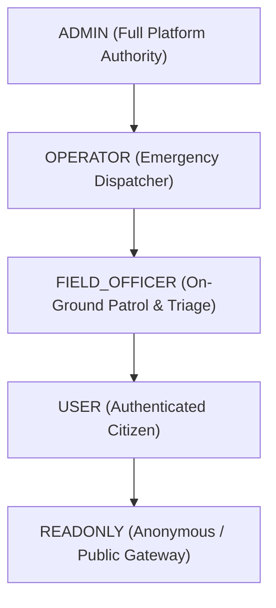

# RBAC Access Control Specification (SPEC)

> **Authority:** Authoritative System Specification  
> **Source of Truth:** `backend/core/rbac.py`  
> **Status:** Production Normative (v1.0.0-STABLE)

---

## 1. Role Hierarchy & Definitions

SafeVixAI enforces a strict 5-tier hierarchical Role-Based Access Control (RBAC) model implemented in `backend/core/rbac.py`.



### 1.1 Role Definitions

| Role Identifier | Code Enum (`Role`) | Description & Scope | Default Token TTL |
| :--- | :--- | :--- | :--- |
| **`admin`** | `Role.ADMIN` | Full root administrative access. Manages platform configuration, operators, database migrations, and audit logs. | 24 Hours |
| **`operator`** | `Role.OPERATOR` | Emergency Operations Center (EOC) dispatcher. Can triage RoadWatch reports, manage SOS dispatch queues, and assign field officers. | 24 Hours |
| **`field_officer`** | `Role.FIELD_OFFICER` | On-ground police/traffic/EMS officer. Can acknowledge dispatches, update live GPS tracking, and mark incidents resolved. | 24 Hours |
| **`user`** | `Role.USER` | Authenticated citizen. Can trigger emergency SOS, report road hazards, query Challan penalties, and manage personal profile. | 24 Hours |
| **`readonly`** | `Role.READONLY` | Read-only public access to non-sensitive geospatial data, safe routes, and public safety advisories. | Unauthenticated / Session |

---

## 2. Permission Hierarchy Matrix

SafeVixAI implements inclusive hierarchical inheritance: higher roles inherit all permissions granted to subordinate roles:

```python
ROLE_HIERARCHY = {
    Role.ADMIN: [Role.ADMIN, Role.OPERATOR, Role.FIELD_OFFICER, Role.USER, Role.READONLY],
    Role.OPERATOR: [Role.OPERATOR, Role.FIELD_OFFICER, Role.USER, Role.READONLY],
    Role.FIELD_OFFICER: [Role.FIELD_OFFICER, Role.USER, Role.READONLY],
    Role.USER: [Role.USER, Role.READONLY],
    Role.READONLY: [Role.READONLY],
}
```

---

## 3. Route Authorization Enforcement

Role constraints are enforced at the FastAPI router dependency layer using `require_role(required_role: Role)`. Any request lacking sufficient privileges returns HTTP 403 Forbidden:

```json
{
  "detail": "Insufficient permissions. Required role: operator"
}
```

| Route Group | Minimum Role Required | Permitted Roles | Description |
| :--- | :--- | :--- | :--- |
| `GET /api/v1/health` | `readonly` | All | Public liveness & readiness probes |
| `GET /api/v1/routes/safe` | `readonly` | All | Public illuminated routing queries |
| `POST /api/v1/auth/login` | `readonly` | All | Authentication & token generation |
| `POST /api/v1/sos/dispatch` | `user` | `user`, `field_officer`, `operator`, `admin` | Citizen SOS trigger & family alert |
| `POST /api/v1/roadwatch/report` | `user` | `user`, `field_officer`, `operator`, `admin` | Pothole/hazard civic reporting |
| `POST /api/v1/challan/predict` | `user` | `user`, `field_officer`, `operator`, `admin` | Fine calculation & risk analysis |
| `GET /api/v1/officer/assignments`| `field_officer` | `field_officer`, `operator`, `admin` | Patrol dispatch assignments |
| `PATCH /api/v1/sos/{id}/resolve`| `operator` | `operator`, `admin` | Close SOS incident & dispatch summary |
| `GET /api/v1/admin/audit-logs` | `admin` | `admin` | Security audit trail & operator actions |
