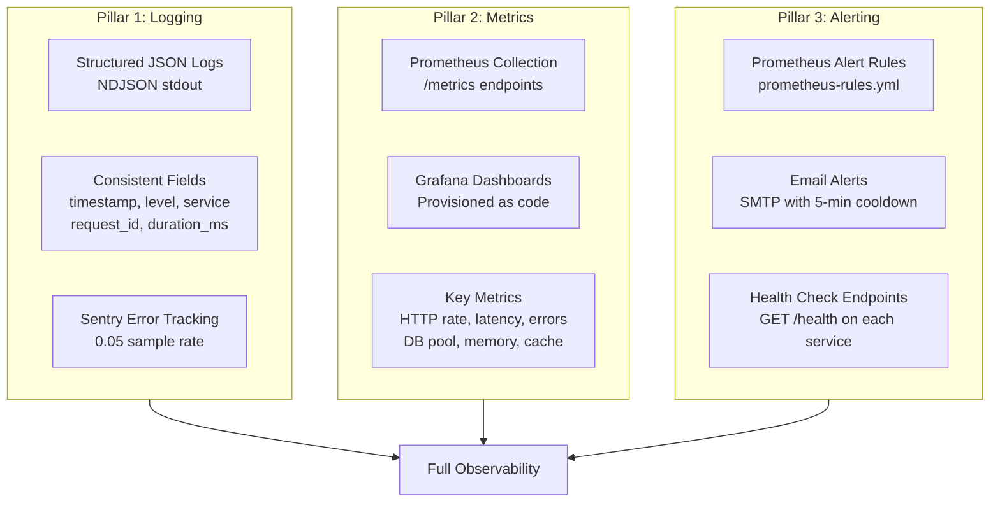
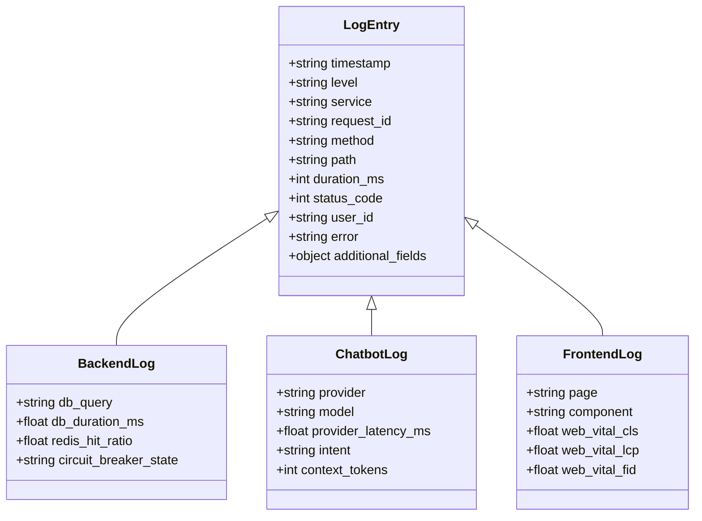

# Observability

> **Structured observability across all 3 services — metrics, logs, traces, alerting.**

SafeVixAI provides production-grade observability with zero-cost tooling: structured JSON logging, Prometheus metrics, Grafana dashboards, and email alerting.

## Three Pillars of Observability



## Structured Log Schema



---

## Quick Links

| Area | Documentation |
|------|---------------|
| Monitoring Setup | [`docs/MONITORING_SETUP.md`](observability/MONITORING_SETUP.md) |
| Grafana Dashboards | [`docs/observability/grafana-dashboard.json`](observability/observability/grafana-dashboard.json) |
| Prometheus Config | [`docs/observability/prometheus-config.yml`](observability/observability/prometheus-config.yml) |
| Telemetry Guide | [`docs/TELEMETRY.md`](observability/TELEMETRY.md) |
| Performance Benchmarks | [`docs/PERFORMANCE_BENCHMARKS.md`](PERFORMANCE_BENCHMARKS.md) |
| Error Codes | [`ERROR_CODES.md`](../api-reference/ERROR_CODES.md) |

---

### 1. Logging

All services emit structured JSON logs with consistent fields:

```json
{
  "timestamp": "2026-07-27T10:30:00Z",
  "level": "INFO",
  "service": "backend",
  "request_id": "abc-123",
  "method": "GET",
  "path": "/api/v1/emergency/nearby",
  "duration_ms": 45,
  "status_code": 200,
  "user_id": "usr_abc"
}
```

### 2. Metrics

| Metric | Type | Source |
|--------|------|--------|
| `http_requests_total` | Counter | Backend, Chatbot |
| `http_request_duration_seconds` | Histogram | Backend, Chatbot |
| `db_query_duration_seconds` | Histogram | Backend |
| `redis_hit_ratio` | Gauge | Backend |
| `circuit_breaker_state` | Gauge | Both |
| `provider_latency_seconds` | Histogram | Chatbot |
| `memory_usage_bytes` | Gauge | All |

### 3. Alerting

Email alerts via SMTP with 5-minute cooldown for:

- All 9 LLM providers failed
- External API failures
- Circuit breaker tripped
- Supabase connection lost
- Health summary (daily digest of provider status)

---

## Related

- [`MONITORING.md`](MONITORING.md) — metrics, dashboards, uptime
- [`OPERATIONS.md`](OPERATIONS.md) — runbooks, incident response
- [`docs/observability/README.md`](incident-response/README.md) — detailed observability guides
