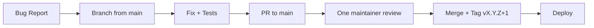

# SafeVixAI — Maintenance Handbook

**Version:** 1.0.0
**Date:** 2026-07-21

---

## 1. Versioning Policy

SafeVixAI follows Semantic Versioning 2.0.0:
- **MAJOR** (x.0.0): Breaking changes
- **MINOR** (0.x.0): New features, backward-compatible
- **PATCH** (0.0.x): Bug fixes, no breaking changes

All three services share the same version number (defined in `VERSION` at repository root).

## 2. Release Cadence

| Type | Frequency | Approver | Artifacts |
|------|-----------|----------|-----------|
| Patch | As needed | 1 maintainer | Container images + GitHub Release |
| Minor | Monthly | 2 maintainers | Container images + SBOM + Release |
| Major | Quarterly | Project Lead | Full release pipeline |
| Hotfix | Emergency | 1 maintainer + Project Lead | Container images + GitHub Release |

## 3. Hotfix Process



1. Branch from `main`: `git checkout -b hotfix/description`
2. Fix the issue and add regression tests
3. Open PR to `main` with `[HOTFIX]` prefix
4. Single maintainer review required
5. Squash-merge to `main`
6. Tag and deploy: `git tag v1.0.1 && git push origin v1.0.1`

## 4. Patch Strategy

- **P0 (Critical)**: Fix within 24 hours, hotfix process
- **P1 (High)**: Fix within 72 hours, included in next patch release
- **P2 (Medium)**: Fix within 7 days, included in next minor release
- **P3 (Low)**: Fix within 30 days, included in next minor release

## 5. Long-Term Support

| Version | Release | EOL | Support Type |
|---------|---------|-----|--------------|
| 1.0.x | 2026-07-20 | 2027-01-20 | Active (security + bug fixes) |
| <1.0 | — | — | Unsupported |

## 6. Dependency Updates

- **Dependabot**: Weekly scans for pip (backend, chatbot), npm (frontend), GitHub Actions
- **Update policy**: Patch updates auto-merged if tests pass; minor/major require manual review
- **Security patches**: Applied within 48 hours for critical, 7 days for high

## 7. Database Migration

```bash
cd backend
alembic upgrade head      # Apply all pending migrations
alembic downgrade -1      # Rollback last migration
alembic history           # View migration history
alembic current           # View current migration state
```

## 8. Cache Invalidation

```bash
# Flush Redis cache
redis-cli -a <password> FLUSHALL

# Or flush by pattern (via backend endpoint)
curl -X POST http://localhost:8000/admin/cache/purge \
  -H "Authorization: Bearer <admin_token>"
```

## 9. ChromaDB Rebuild

When adding new documents to the RAG vector store:
```bash
cd backend
python data/build_vectorstore.py    # Rebuilds backend vectorstore (~10 min)
```

For chatbot service (committed to git):
```bash
cd chatbot_service
python scripts/rebuild_chromadb.py
# Then commit the updated data/chroma_db/ directory
```

## 10. Health Check Verification

```bash
# Verify all services
curl http://localhost:3000           # Frontend
curl http://localhost:8000/health    # Backend
curl http://localhost:8010/health    # Chatbot
pg_isready -h localhost              # PostgreSQL
redis-cli ping                       # Redis
```

## 11. Troubleshooting Common Issues

| Symptom | Likely Cause | Solution |
|---------|-------------|----------|
| Backend 503 | PostgreSQL unavailable | Check `docker compose logs postgres` |
| Chatbot 503 | LLM API rate limit | Wait or switch providers |
| Frontend blank page | Build cache stale | Delete `.next/` and rebuild |
| Slow Challan calc | DuckDB-Wasm cold start | Pre-warm or use server-side |
| WebSocket drops | Connection timeout | Increase ping interval |
| Test failures | Isolation dependency | Run full suite, not single test |
