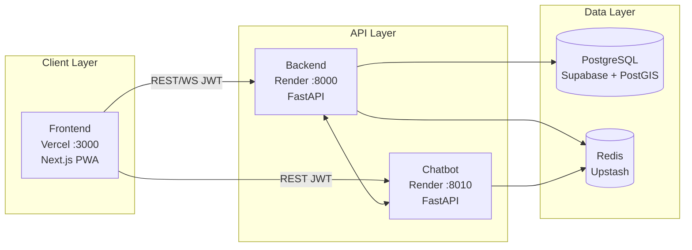
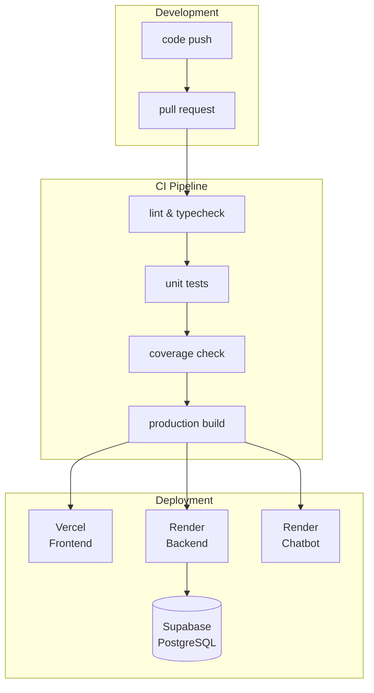

# Operations

> **Day-to-day operations, deployment procedures, scaling, and environment management.**

SafeVixAI runs on zero-cost infrastructure: Vercel (frontend), Render (backend + chatbot), Supabase (PostgreSQL), Upstash (Redis).

---

## Quick Links

| Area | Documentation |
|------|---------------|
| Deployment Guide | [`docs/Deployment.md`](deployment_guide.md) |
| Deployment Strategies | [`docs/DEPLOYMENT_STRATEGIES.md`](deployment_strategies.md) |
| Advanced Setup | [`docs/ADVANCED_SETUP.md`](advanced_setup.md) |
| Scaling Guide | [`docs/SCALING_GUIDE.md`](scaling_guide.md) |
| Docker Compose | [`docs/DOCKER_COMPOSE_GUIDE.md`](../developer-guide/docker_compose_guide.md) |
| Environment Config | [`docs/operations/environment-configuration.md`](environment_configuration.md) |
| Maintenance Guide | [`docs/operations/maintenance-guide.md`](routine_maintenance.md) |
| Monitoring Setup | [`docs/MONITORING_SETUP.md`](../spec/engineering/metrics.spec.md) |
| Runbooks | [`RUNBOOKS.md`](runbooks_overview.md) |
| Kubernetes | [`k8s/README.md`](../incident-response/response_protocol.md) |
| Terraform (AWS) | [`terraform/README.md`](../incident-response/response_protocol.md) |

---

## Service Architecture



## Deployment Workflow



---

## Deployment Commands

```bash
# Local full stack
docker compose up --build

# Backend
cd backend && uvicorn main:app --reload --port 8000

# Chatbot
cd chatbot_service && uvicorn main:app --reload --port 8010

# Frontend
cd frontend && npm run dev
```

---

## Environment Variables

| Service | Key Variables |
|---------|--------------|
| Backend | `DATABASE_URL`, `REDIS_URL`, `ADMIN_SECRET`, `OVERPASS_URLS` |
| Chatbot | `DEFAULT_LLM_PROVIDER`, `GROQ_API_KEY`, `GEMINI_API_KEY`, `CHROMA_PERSIST_DIR` |
| Frontend | `NEXT_PUBLIC_BACKEND_URL`, `NEXT_PUBLIC_CHATBOT_URL` |

Complete reference: [`CONFIGURATION.md`](../spec/engineering/env_configuration.spec.md)

---

## Related

- [`OBSERVABILITY.md`](observability.md) — metrics, logs, traces, alerting
- [`RUNBOOKS.md`](runbooks_overview.md) — incident response procedures
- [`MONITORING.md`](monitoring_overview.md) — dashboard setup
